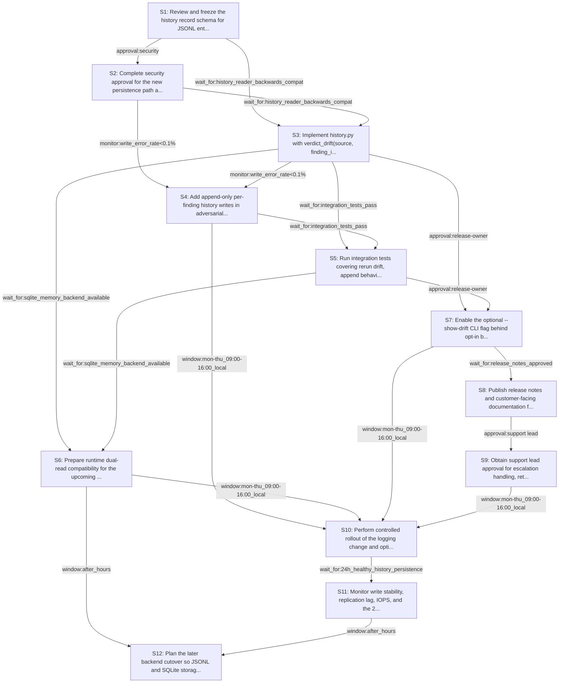

# Rollout Rehearsal — intent_adversarial_findings_history

> Intent: fixtures/intent_adversarial_findings_history.md · Stakeholders: 6 · Constraints: 26 · Steps: 12 · Model: gpt-5.4-mini

_Generated 2026-04-29T18:42:47Z_

## Summary

Ship append-only per-finding history logging and optional drift summaries with privacy, compatibility, and staged rollout controls.

## Stakeholder constraints

| Owner | Axis | Summary | Gate | Rollback | Blocking |
|---|---|---|---|---|---|
| BackendOwner | schema | Add history record schema before code writes JSONL entries | `wait_for:schema_fields_reviewed` | redeploy_previous | Y |
| BackendOwner | deploy | Ship log-writer only after readers tolerate absent drift files | `wait_for:history_reader_backwards_compat_verified` | redeploy_previous | Y |
| BackendOwner | deploy | Maintain dual-read compatibility during memory backend migration | `wait_for:sqlite_backend_write_path_ready` | redeploy_previous | Y |
| BackendOwner | api | Keep --show-drift optional and preserve existing CLI output | `none` | remove_flag_and_redeploy_previous | n |
| DataPlatform | data | Append-only history; never rewrite prior finding records | `none` | Stop appending new records; leave existing log files intact | Y |
| DataPlatform | data | Use small append batches to avoid IOPS spikes during debates | `monitor:write_iops<baseline+10%` | Reduce flush/batch size or disable per-finding append until IOPS normalizes | n |
| DataPlatform | ops | Do not introduce storage-format migration during business hours | `window:after_hours` | Keep writing the JSONL log in the existing filesystem location | Y |
| DataPlatform | data | Hold column/table drops until a quiet period after migration | `wait_for:7d_no_reads_or_writes` | Restore access to the old log/table and keep dual-read support | Y |
| DataPlatform | data | Keep replication lag within budget during history writes | `monitor:replication_lag<30s` | Throttle or pause history appends until lag recovers | Y |
| SRE | deploy | Roll out behind --show-drift with no default behavior change | `none` | disable --show-drift and redeploy_previous | Y |
| SRE | ops | Verify append-only log writes are stable before broad use | `monitor:write_error_rate<0.1%` | stop writing history log entries and redeploy_previous | Y |
| SRE | ops | Gate cutover on 24h of healthy history-log persistence | `wait_for:24h_healthy_history_persistence` | pause rollout and redeploy_previous | Y |
| SRE | deploy | Do not deploy during incident windows or Friday afternoon | `window:mon-thu_09:00-16:00_local` | abort deploy and redeploy_previous | Y |
| Security | security | Append-only writes; never mutate or delete prior verdict records | `none` | Disable history append path and redeploy_previous | Y |
| Security | security | Store only hashes/metadata; exclude finding bodies and transcripts | `approval:security` | Purge any non-hashed records from the log and redeploy_previous | Y |
| Security | comms | Notify downstream consumers before any visible drift-summary change | `window:prior_notice_before_release` | Remove the drift-summary output and redeploy_previous | Y |
| Security | security | Complete audit review for new persistence path before rollout | `approval:security` | Disable the new persistence path and redeploy_previous | Y |
| ProductPM | comms | Notify customers before any breaking drift-log behavior changes | `approval:comms lead` | disable the drift-summary output and stop writing new history records | Y |
| ProductPM | comms | Publish release notes for the new per-finding history log | `wait_for:release_notes_approved` | revert the release notes and remove mention of the history log from customer-facing docs | Y |
| ProductPM | ops | Support must be briefed on drift-log questions before launch | `approval:support lead` | pause rollout until support FAQ and escalation paths are updated | Y |
| ProductPM | business | Do not roll out during launch windows or major events | `window:outside_launch_window` | redeploy_previous | Y |
| ConsumerSubsystem | api | Keep old CLI behavior; drift output must be opt-in only | `approval:release-owner` | redeploy_previous | Y |
| ConsumerSubsystem | api | Dual-support JSONL and new SQLite memory store during migration | `wait_for:sqlite_memory_backend_available` | redeploy_previous | Y |
| ConsumerSubsystem | deploy | Maintain append-only log compatibility for at least one release | `window:1_release` | redeploy_previous | Y |
| ConsumerSubsystem | deploy | Add cutover tests for rerun drift, append, and backend fallback | `wait_for:integration_tests_pass` | redeploy_previous | Y |
| ConsumerSubsystem | deploy | Fallback to no-drift mode if history backend is unavailable | `monitor:history_write_error_rate<1%` | redeploy_previous | n |

## Rollout plan

| # | Action | Owner | Depends on | Gate | Rollback | Watch |
|---|---|---|---|---|---|---|
| S1 | Review and freeze the history record schema for JSONL entries under .mirofish_memory/security/<source-stem>.jsonl, including source, finding_id, severity, verdict, triager_sha256, maintainer_sha256, model, and timestamp. | BackendOwner | — | `wait_for:schema_fields_reviewed` | redeploy_previous | Schema review approval, field completeness, and no missing required attributes. |
| S2 | Complete security approval for the new persistence path and privacy rules, confirming only hashes/metadata are stored and no finding bodies or transcripts are persisted. | Security | S1 | `approval:security` | Disable the new persistence path and redeploy_previous | Security sign-off, field-level data classification, and confirmation that only hashes are logged. |
| S3 | Implement history.py with verdict_drift(source, finding_id) that reads append-only JSONL history and returns verdicts across runs without requiring existing drift files. | BackendOwner | S1, S2 | `wait_for:history_reader_backwards_compat_verified` | redeploy_previous | Reader can handle absent files, parse existing logs, and produce stable drift summaries. |
| S4 | Add append-only per-finding history writes in adversarial-security-sim/cli.py at the end of each finding debate, writing structured JSONL records with hashed agent outputs. | Security | S2, S3 | `monitor:write_error_rate<0.1%` | Disable history append path and redeploy_previous | Append success rate, JSONL validity, no overwrite behavior, and presence of only hashed/metadata fields. |
| S5 | Run integration tests covering rerun drift, append behavior, and backend fallback for both JSONL and the forthcoming SQLite memory store. | ConsumerSubsystem | S3, S4 | `wait_for:integration_tests_pass` | redeploy_previous | Test pass rate for drift reads, append compatibility, and fallback behavior under storage unavailability. |
| S6 | Prepare runtime dual-read compatibility for the upcoming SQLite memory backend so verdict_drift and append paths can work during migration without losing JSONL support. | mirofish_lab | S3, S5 | `wait_for:sqlite_memory_backend_available` | redeploy_previous | Both JSONL and SQLite paths resolve correctly, with no regression in drift reads or append writes. |
| S7 | Enable the optional --show-drift CLI flag behind opt-in behavior only, preserving existing default report output. | BackendOwner | S3, S5 | `approval:release-owner` | remove_flag_and_redeploy_previous | Default CLI output unchanged, drift output only appears when explicitly requested. |
| S8 | Publish release notes and customer-facing documentation for the new history log and --show-drift behavior, and brief support on drift-log questions. | ProductPM | S7 | `wait_for:release_notes_approved` | revert the release notes and remove mention of the history log from customer-facing docs | Release notes approval, support FAQ readiness, and updated customer documentation. |
| S9 | Obtain support lead approval for escalation handling, retention questions, and drift comparison explanations before launch. | ProductPM | S8 | `approval:support lead` | pause rollout until support FAQ and escalation paths are updated | Support readiness sign-off and updated escalation paths. |
| S10 | Perform controlled rollout of the logging change and optional drift summary during an allowed release window, keeping drift opt-in and avoiding incident/launch windows. | SRE | S4, S6, S7, S9 | `window:mon-thu_09:00-16:00_local` | abort deploy and redeploy_previous | Deployment timing, incident status, and unchanged default CLI behavior. |
| S11 | Monitor write stability, replication lag, IOPS, and the 24h end-to-end history persistence workflow after rollout; throttle or pause appends if thresholds are exceeded. | DataPlatform | S10 | `wait_for:24h_healthy_history_persistence` | Stop appending new records, throttle writes, or keep dual-read support as needed while preserving existing logs | write_iops<baseline+10%, replication_lag<30s, write_error_rate<0.1%, and healthy drift-read success over 24h. |
| S12 | Plan the later backend cutover so JSONL and SQLite storage coexist for at least one release, with old artifacts retained until the quiet period and no daytime migration. | mirofish_lab | S6, S11 | `window:after_hours` | Keep writing the JSONL log in the existing filesystem location | No daytime migration activity, dual-read continuity, and no drop of old storage artifacts before the quiet period. |

## Mermaid graph

## Conflicts (resolved by sequencer)

- between **BackendOwner, SRE**: BackendOwner requires waiting for history_reader_backwards_compat_verified before shipping the log-writer, while SRE requires a release gate that also keeps --show-drift opt-in and default output unchanged. Resolved by placing reader-compat work before any rollout and keeping the drift flag opt-in in S7.
- between **BackendOwner, ConsumerSubsystem**: BackendOwner wants dual-read compatibility only after sqlite_backend_write_path_ready, while ConsumerSubsystem requires dual-support JSONL and SQLite during migration and integration tests first. Resolved conservatively by doing JSONL reader work before backend cutover and delaying migration until both test and backend readiness are met.
- between **DataPlatform, SRE**: DataPlatform allows small append batches with only write_iops monitoring, but SRE requires write_error_rate<0.1% and a 24h healthy persistence gate before broad use. Resolved by using conservative batching and waiting for the stricter 24h stability gate.
- between **DataPlatform, mirofish_lab**: DataPlatform forbids storage-format migration during business hours and requires 7d no reads/writes before dropping old artifacts, while mirofish_lab needs the history log moved into the SQLite backend. Resolved by deferring cutover to an after-hours quiet period and keeping the filesystem log until the quiet period is satisfied.
- between **Security, ProductPM**: Security requires stored records to exclude finding bodies and transcripts, while ProductPM wants customer-facing release notes and support briefings about the new history log. Resolved by keeping release notes high-level and limiting operational details to hashes/metadata only.
- between **Security, ConsumerSubsystem**: Security requires approval for the new persistence path before rollout, while ConsumerSubsystem wants cutover tests and backend fallback validated for drift reads and append behavior. Resolved by sequencing security approval before implementation and running integration tests after the reader/writer paths are in place.
- between **SRE, ProductPM**: SRE requires deployment only in mon-thu 09:00-16:00 local and outside incident windows, while ProductPM forbids launch-window rollouts. Resolved by choosing the stricter combined release window and treating launch windows as excluded time.
- between **ProductPM, ConsumerSubsystem**: ProductPM wants notification before any breaking drift-log behavior changes, while ConsumerSubsystem requires drift output to remain opt-in only with old CLI behavior preserved. Resolved by keeping drift output opt-in and sending release notes before enabling the flag.
- between **ProductPM, SRE**: ProductPM requires support briefing and release-note approval before launch, while SRE requires rollout health gating and an allowed deployment window. Resolved by placing product communications before SRE deployment and using the SRE window as the final launch gate.
- between **DataPlatform, Security**: Both require append-only behavior, but Security additionally forbids mutation/deletion of prior verdict records while DataPlatform's rollback language could imply stopping writes without touching existing logs. Resolved by using a rollback that only stops future appends and preserves existing history intact.

## Open questions for the human

- Who is the single release owner for approving the optional --show-drift flag?
- Should the drift summary include any non-hashed metadata beyond the required fields?
- What exact release window should be used if the mon-thu local window conflicts with a customer launch freeze?
- Where will the security approval for the persistence path be recorded for auditability?
- How should the SQLite backend represent history records while preserving append-only semantics?
