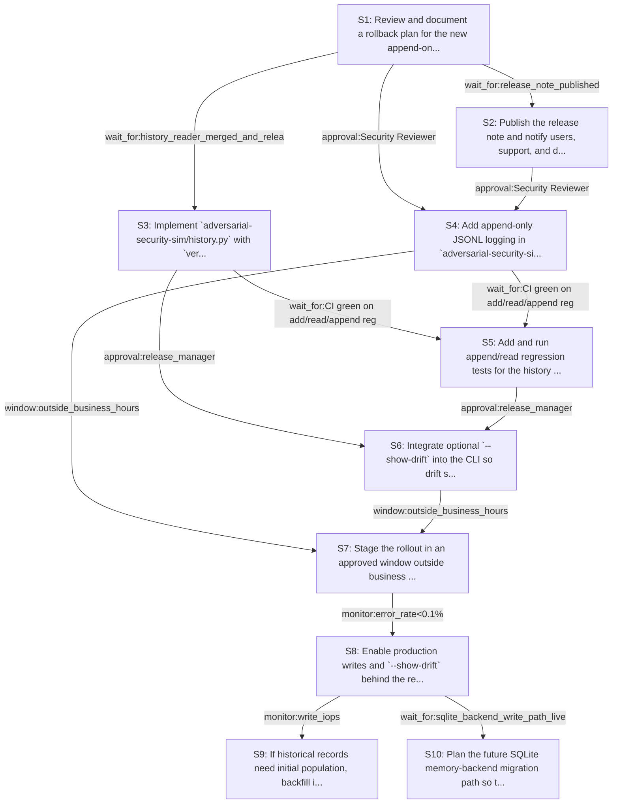

# Rollout Rehearsal — intent_adversarial_findings_history

> Intent: fixtures/intent_adversarial_findings_history.md · Stakeholders: 6 · Constraints: 26 · Steps: 10 · Model: gpt-5.4-mini

_Generated 2026-04-29T17:18:05Z_

## Summary

Add append-only per-finding JSONL history and optional drift lookup, while keeping normal CLI output unchanged.

## Stakeholder constraints

| Owner | Axis | Summary | Gate | Rollback | Blocking |
|---|---|---|---|---|---|
| BackendOwner | api | Keep CLI output unchanged unless --show-drift is set | `none` | redeploy_previous | Y |
| BackendOwner | api | Do not require history log for normal verdict generation | `none` | redeploy_previous | Y |
| BackendOwner | deploy | Ship history reader before any code that depends on drift data | `wait_for:history_reader_merged_and_released` | redeploy_previous | Y |
| BackendOwner | deploy | If storage backend changes, dual-write JSONL during cutover | `wait_for:sqlite_backend_write_path_live` | redeploy_previous | Y |
| DataPlatform | data | Write JSONL append-only; never rewrite prior history records | `none` | Stop appending to the new log and leave existing records untouched | Y |
| DataPlatform | data | Batch backfills to protect IOPS if historical logs are populated | `monitor:write_iops<baseline+20%` | Pause backfill jobs and resume with smaller batches | Y |
| DataPlatform | ops | Avoid schema or storage-layout changes during business hours | `window:outside_business_hours` | Defer deployment and keep using the current storage layout | Y |
| DataPlatform | data | Keep replication lag within budget during log writes | `monitor:replication_lag<30s` | Throttle or halt history writes until lag returns under budget | Y |
| DataPlatform | data | Drop any legacy storage only after a quiet period | `wait_for:quiet_period_7d` | Restore the old storage artifacts from backup if needed | n |
| SRE | ops | Gate rollout on clean write-path and drift read-path error rates | `monitor:error_rate<0.1%` | disable --show-drift and stop appending new JSONL records | Y |
| SRE | deploy | Ship drift logging behind a flag to avoid forced redeploys | `approval:release_manager` | turn off the feature flag and redeploy_previous | Y |
| SRE | ops | Require a rollback path before enabling new persistence writes | `wait_for:rollback_plan_reviewed` | switch log writes off and read existing records only | Y |
| SRE | deploy | Avoid rollout during incident windows or Friday afternoon | `window:business_hours_only` | pause rollout until next approved window | Y |
| Security | security | Append-only log must never overwrite prior verdict records | `none` | Disable history append and redeploy_previous | Y |
| Security | security | Hash agent outputs; do not persist full finding bodies | `approval:Security Reviewer` | Purge any plaintext bodies from log and redeploy_previous | Y |
| Security | comms | Notify downstream consumers before drift output becomes visible | `window:at least 5 business days after partner/customer notice` | Remove --show-drift output from default report flow | Y |
| Security | security | Require migration review before moving log to SQLite memory store | `approval:Compliance Reviewer` | Keep writing to current JSONL store; defer migration | Y |
| ProductPM | comms | Notify users before enabling drift logging or --show-drift | `approval:customer_comms_lead` | redeploy_previous | Y |
| ProductPM | comms | Publish release note on new persisted finding history | `wait_for:release_note_published` | disable_history_log_write | Y |
| ProductPM | ops | Ensure support is briefed on drift questions before rollout | `approval:support_lead` | suspend_rollout_until_briefed | Y |
| ProductPM | business | Do not roll out during launch windows or major events | `window:outside_launch_windows_and_major_events` | pause_rollout | Y |
| ProductPM | business | Assign an escalation owner for customer issues during rollout | `approval:escalation_owner_assigned` | rollback_feature_and_route_escalations_to_support | Y |
| ConsumerSubsystem | api | Keep old CLI behavior while --show-drift is added | `approval:release-owner` | redeploy_previous | Y |
| ConsumerSubsystem | api | Dual-support JSONL log and report path for one release | `window:one-release` | stop writing drift log and remove --show-drift usage | Y |
| ConsumerSubsystem | deploy | Ship drift helper only after append-and-read tests pass | `wait_for:CI green on add/read/append regression suite` | redeploy_previous | Y |
| ConsumerSubsystem | deploy | Fallback to no-drift mode if memory backend migration slips | `wait_for:mirofish_lab backend migration availability` | disable --show-drift and continue append-only logging locally | n |

## Rollout plan

| # | Action | Owner | Depends on | Gate | Rollback | Watch |
|---|---|---|---|---|---|---|
| S1 | Review and document a rollback plan for the new append-only security history log, including how to stop writes without altering existing records. | SRE | — | `wait_for:rollback_plan_reviewed` | switch log writes off and read existing records only | Rollback procedure approved; write-disable switch identified; no code changes yet. |
| S2 | Publish the release note and notify users, support, and downstream stakeholders about the new persisted finding history and optional drift output. | ProductPM | S1 | `wait_for:release_note_published` | disable_history_log_write | Release note published; customer/support notices sent; escalation owner assigned; support briefed. |
| S3 | Implement `adversarial-security-sim/history.py` with `verdict_drift(source, finding_id)` that reads append-only JSONL history and summarizes verdicts across runs. | BackendOwner | S1 | `wait_for:history_reader_merged_and_released` | redeploy_previous | Reader returns expected drift summaries on fixture logs; read-path error rate remains below threshold. |
| S4 | Add append-only JSONL logging in `adversarial-security-sim/cli.py` at the end of each finding debate, storing source, finding_id, severity, verdict, hashes, model, and timestamp without full finding text. | Security | S1, S2 | `approval:Security Reviewer` | Disable history append and redeploy_previous | Records append successfully; no plaintext bodies appear; write-path error rate stays under 0.1%; replication lag stays under 30s. |
| S5 | Add and run append/read regression tests for the history writer and verdict_drift helper, including privacy checks for hashed outputs only. | ConsumerSubsystem | S3, S4 | `wait_for:CI green on add/read/append regression suite` | redeploy_previous | CI passes on append, read, drift-summary, and privacy assertions. |
| S6 | Integrate optional `--show-drift` into the CLI so drift summary prints before the report only when explicitly requested, leaving default output unchanged. | BackendOwner | S3, S5 | `approval:release_manager` | turn off the feature flag and redeploy_previous | Default report output is unchanged; `--show-drift` prints only the drift summary; no extra output in normal runs. |
| S7 | Stage the rollout in an approved window outside business hours, launch windows, major events, incidents, and Friday afternoon, with log writes enabled only after readiness gates pass. | DataPlatform | S4, S6 | `window:outside_business_hours` | Defer deployment and keep using the current storage layout | Deployment timing is compliant; no business-hours storage-layout change; rollout stays within approved window. |
| S8 | Enable production writes and `--show-drift` behind the release gates, while monitoring write error rate, drift read error rate, replication lag, and CLI output stability. | SRE | S7 | `monitor:error_rate<0.1%` | disable --show-drift and stop appending new JSONL records | Write-path and read-path error rates remain below 0.1%; replication lag stays under 30s; normal CLI output remains unchanged. |
| S9 | If historical records need initial population, backfill in small batches into the JSONL log without rewriting existing entries. | DataPlatform | S8 | `monitor:write_iops<baseline+20%` | Pause backfill jobs and resume with smaller batches | IOPS stays within baseline+20%; append-only invariant holds; no replication-lag spikes. |
| S10 | Plan the future SQLite memory-backend migration path so the JSONL history can be dual-written during cutover, but keep the current JSONL store as the active path until the backend is live and reviewed. | Security | S8 | `wait_for:sqlite_backend_write_path_live` | Keep writing to current JSONL store; defer migration | Migration remains deferred until the SQLite write path is live; no storage-layout change is introduced prematurely. |

## Mermaid graph

## Conflicts (resolved by sequencer)

- between **BackendOwner, SRE, ProductPM, ConsumerSubsystem**: Multiple blockers require approvals, timing windows, and release-note/user-notice prerequisites before drift becomes visible. Resolved by sequencing reader, rollout comms, and approvals before enabling `--show-drift`; normal CLI output stays unchanged unless the flag is used.
- between **DataPlatform, Security**: History must be append-only and privacy-preserving, while future backend migration may change storage. Resolved by keeping JSONL as the active append-only log now and deferring any SQLite move until the backend write path is live and compliance-reviewed.

## Open questions for the human

- Who is the named release owner/customer_comms_lead for the approval gates?
- Who is the escalation owner assigned for customer issues?
- What exact hashes should be used for `triager_sha256` and `maintainer_sha256` if agent-output hashing format is not already standardized?
- Should initial backfill ever run, or is the rollout limited to new findings only?
