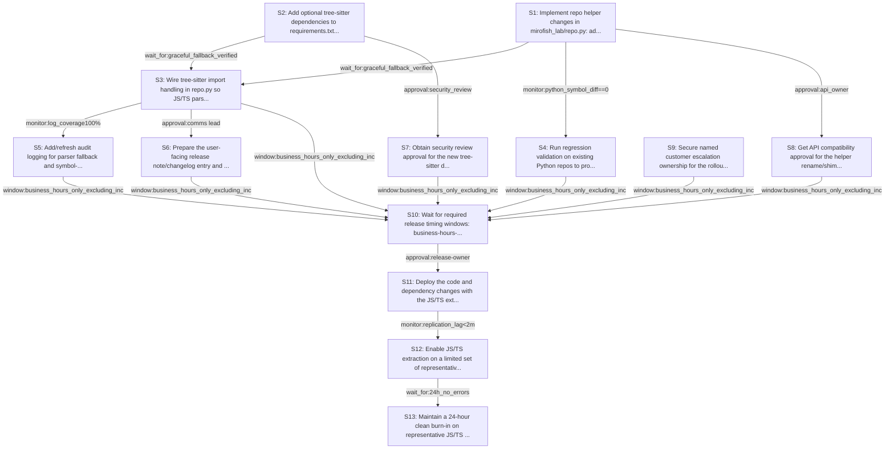

# Rollout Rehearsal — intent_blastradius_javascript_support

> Intent: fixtures/intent_blastradius_javascript_support.md · Stakeholders: 6 · Constraints: 24 · Steps: 13 · Model: gpt-5.4-mini

_Generated 2026-04-29T17:18:25Z_

## Summary

Add JS/TS symbol extraction with tree-sitter while preserving Python byte-identical output and safe fallback behavior.

## Stakeholder constraints

| Owner | Axis | Summary | Gate | Rollback | Blocking |
|---|---|---|---|---|---|
| BackendOwner | api | Keep existing .py symbol extraction output byte-identical | `none` | redeploy_previous | Y |
| BackendOwner | api | Preserve existing helper signatures for CLI compatibility | `none` | redeploy_previous | Y |
| BackendOwner | deploy | Add tree-sitter deps before code relies on JS/TS parsing | `wait_for:dependency_install_success` | revert dependency additions and redeploy_previous | Y |
| BackendOwner | deploy | Ship fallback logic before enabling JS/TS repo processing | `wait_for:graceful_fallback_verified` | redeploy_previous | Y |
| DataPlatform | data | Keep Python symbol extraction byte-identical for sample report | `none` | revert the symbol-extraction change for .py files to the prior ast.parse path | Y |
| DataPlatform | data | Backfill JS/TS symbol indexing in small batches to avoid IOPS spikes | `monitor:replication_lag<2m` | pause backfill and resume with a smaller batch size after lag returns to baseline | Y |
| DataPlatform | ops | Do not drop legacy source-file handling until a quiet period passes | `wait_for:7d_quiet_period` | restore the legacy python_files() path and keep old discovery code active | Y |
| DataPlatform | schema | Avoid storage schema/index changes during business hours | `window:after_hours` | defer schema migration and continue using the existing on-disk format | n |
| SRE | deploy | Ship behind a feature flag for JS/TS symbol extraction | `approval:release-owner` | disable the JS/TS extraction flag without redeploy | Y |
| SRE | ops | Hold rollout until Python symbol output is unchanged | `monitor:python_symbol_diff==0` | revert to previous release or disable new parser dispatch for .py | Y |
| SRE | ops | Require a 24h clean burn-in before expanding to JS/TS repos | `wait_for:24h_no_errors` | turn off JS/TS parsing flag and fall back to no-symbols path | Y |
| SRE | deploy | Do not cut over during incident windows or Friday afternoon | `window:business_hours_only_excluding_incident_windows` | postpone deployment and keep previous version active | Y |
| Security | security | Do not rotate or broaden any secret-bearing credentials in this change | `none` | Remove added dependencies and revert repo helper changes; no secret changes to undo | n |
| Security | security | Maintain audit logs for parser fallback and symbol-extraction failures | `monitor:log_coverage100%` | Disable JS/TS extraction path and redeploy_previous | Y |
| Security | comms | Notify users when JS/TS repos will now emit new blast-radius findings | `window:7d_notice` | Revert to Python-only extraction and redeploy_previous | Y |
| Security | security | Obtain security review before shipping new parser dependencies | `approval:security_review` | Remove tree-sitter dependencies and redeploy_previous | Y |
| ProductPM | comms | Warn users before JS/TS rollout that symbol extraction behavior changes | `approval:comms lead` | Remove the release-note entry and send a correction notice | Y |
| ProductPM | comms | Publish support guidance for no-symbol fallback on missing tree-sitter | `wait_for:support readiness confirmation` | Reinstate the prior support article and escalation script | Y |
| ProductPM | ops | Do not launch during active customer launch windows or major events | `window:outside launch windows and major events` | Pause rollout and revert to the pre-launch state | Y |
| ProductPM | business | Assign a named escalation owner for customer issues during rollout | `approval:customer escalations owner` | Reassign escalations back to the previous owner | Y |
| ConsumerSubsystem | api | Keep existing .py symbol output byte-identical | `wait_for:golden_diff_review` | redeploy_previous | Y |
| ConsumerSubsystem | api | Provide compatibility shim for old python_files() callers | `approval:api_owner` | restore python_files() wrapper and previous call signatures | Y |
| ConsumerSubsystem | deploy | Dual-support window must cover one release after cutover | `window:one_release_after_cutover` | redeploy_previous | n |
| ConsumerSubsystem | deploy | Ship graceful no-symbol fallback if tree-sitter import fails | `monitor:import_error_rate<1%` | disable JS/TS parsing path and revert to Python-only extraction | Y |

## Rollout plan

| # | Action | Owner | Depends on | Gate | Rollback | Watch |
|---|---|---|---|---|---|---|
| S1 | Implement repo helper changes in mirofish_lab/repo.py: add _LANG_PARSERS, dispatch extract_symbols() by suffix, add js_symbols()/ts_symbols(), and introduce source_files(langs=...) while keeping python_files() as a compatibility shim. | BackendOwner | — | `none` | restore the previous repo.py helper implementations and the original python_files() behavior | Verify .py extraction remains byte-identical via existing golden/sample report checks and that old call sites still resolve |
| S2 | Add optional tree-sitter dependencies to requirements.txt for tree-sitter, tree-sitter-python, tree-sitter-javascript, and tree-sitter-typescript. | BackendOwner | — | `wait_for:dependency_install_success` | revert dependency additions and redeploy_previous | Track pip install success across supported environments and confirm no new install-time failures |
| S3 | Wire tree-sitter import handling in repo.py so JS/TS parsing uses it when available, but falls back to no symbols with a clear warning when import/grammar loading fails. | BackendOwner | S1, S2 | `wait_for:graceful_fallback_verified` | disable the JS/TS parsing path and redeploy_previous | Watch parser import failures, warning log coverage, and confirm JS/TS inputs degrade to no-symbols instead of crashing |
| S4 | Run regression validation on existing Python repos to prove extract_symbols() and sample report output remain byte-identical after the dispatch change. | DataPlatform | S1 | `monitor:python_symbol_diff==0` | revert the symbol-extraction change for .py files to the prior ast.parse path | Compare Python symbol diffs against baseline and confirm reports/sample.md reproducibility is unchanged |
| S5 | Add/refresh audit logging for parser fallback and symbol-extraction failures so JS/TS no-symbol cases are traceable. | Security | S3 | `monitor:log_coverage100%` | disable JS/TS extraction path and redeploy_previous | Check logs for fallback events, parser failures, and coverage of emitted warnings |
| S6 | Prepare the user-facing release note/changelog entry and support guidance describing JS/TS support and no-symbol fallback behavior. | ProductPM | S3 | `approval:comms lead` | remove the release-note entry and send a correction notice | Confirm approved customer messaging and support runbook updates are published |
| S7 | Obtain security review approval for the new tree-sitter dependency set before release. | Security | S2 | `approval:security_review` | remove tree-sitter dependencies and redeploy_previous | Track security review decision and any dependency concerns |
| S8 | Get API compatibility approval for the helper rename/shim so existing CLI consumers keep working without signature changes. | ConsumerSubsystem | S1 | `approval:api_owner` | restore python_files() wrapper and previous call signatures | Verify internal callers still work with the compatibility shim |
| S9 | Secure named customer escalation ownership for the rollout period. | ProductPM | — | `approval:customer escalations owner` | reassign escalations back to the previous owner | Confirm escalation contact is assigned and published internally |
| S10 | Wait for required release timing windows: business-hours-only, outside incident/launch windows, not Friday afternoon, and after-hours only if any schema-related work is later introduced. | SRE | S3, S6, S7, S8, S9, S4, S5 | `window:business_hours_only_excluding_incident_windows` | postpone deployment and keep previous version active | Confirm rollout timing satisfies all required change windows and no incident/launch window overlaps exist |
| S11 | Deploy the code and dependency changes with the JS/TS extraction feature flag disabled by default, preserving Python-only behavior until approval to enable. | SRE | S10 | `approval:release-owner` | disable the JS/TS extraction flag without redeploy | Watch deployment health, import errors, and confirm Python behavior stays unchanged post-deploy |
| S12 | Enable JS/TS extraction on a limited set of representative repositories and backfill in small batches to avoid IOPS spikes. | DataPlatform | S11 | `monitor:replication_lag<2m` | pause backfill and resume with a smaller batch size after lag returns to baseline | Track replication lag, indexing throughput, and diff-to-symbol mapping correctness on JS/TS repos |
| S13 | Maintain a 24-hour clean burn-in on representative JS/TS repositories before broadening rollout. | SRE | S12 | `wait_for:24h_no_errors` | turn off JS/TS parsing flag and fall back to no-symbols path | Watch error rates, fallback frequency, and any parser regressions during the burn-in period |

## Mermaid graph

## Conflicts (resolved by sequencer)

- between **DataPlatform, ConsumerSubsystem**: One stakeholder requires a 7-day quiet period before dropping legacy source-file handling, while another wants a compatibility shim for old python_files() callers. Resolved conservatively by keeping a python_files() shim and not retiring legacy handling in this plan.
- between **BackendOwner, Security**: JS/TS support depends on adding tree-sitter dependencies, but security requires review before shipping them. Resolved by sequencing dependency installation before code reliance and gating release on security approval.
- between **SRE, ProductPM**: Rollout requires business-hour/quiet timing and avoiding launch windows, while customer comms require advance notice. Resolved by placing comms and approvals before deployment and deferring launch to a compliant window.

## Open questions for the human

- Which release-owner and API owner will provide the required approvals?
- Who is the named customer escalations owner?
- What representative JS/TS repositories should be used for the limited rollout and burn-in?
- Is there any actual schema work involved, or can the after-hours schema window be considered not applicable?
- Can the legacy python_files() wrapper remain indefinitely, or should it eventually be retired after the quiet-period constraint is satisfied?
