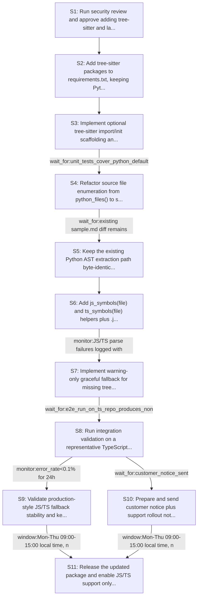

# Rollout Rehearsal — intent_blastradius_javascript_support

> Intent: fixtures/intent_blastradius_javascript_support.md · Stakeholders: 6 · Constraints: 26 · Steps: 11 · Model: gpt-5.4-mini

_Generated 2026-04-29T18:43:08Z_

## Summary

Add optional tree-sitter-based JS/TS extraction while preserving byte-identical Python behavior and safe fallback on import failure.

## Stakeholder constraints

| Owner | Axis | Summary | Gate | Rollback | Blocking |
|---|---|---|---|---|---|
| BackendOwner | deploy | Add tree-sitter deps before code that imports them | `none` | revert the code change that imports tree-sitter or redeploy_previous | Y |
| BackendOwner | deploy | Ship Python-path-preserving code before enabling JS/TS use | `wait_for:existing sample.md diff remains byte-identical for .py` | revert to the previous Python-only extraction implementation | Y |
| BackendOwner | deploy | Keep JS/TS parsing behind graceful fallback, not hard failure | `monitor:JS/TS parse failures logged with warning-only behavior` | disable JS/TS dispatch and return no symbols for those suffixes | Y |
| BackendOwner | deploy | Do not change CLI contract while helpers stay signature-compatible | `none` | redeploy_previous | n |
| DataPlatform | data | Keep existing .py symbol extraction byte-identical | `wait_for:sample_report_reproducibility_verified` | Revert to previous Python AST extraction path for .py files | Y |
| DataPlatform | data | Backfill/scan JS-TS symbols in small batches to avoid IOPS spikes | `monitor:storage_iops<baseline+20%` | Reduce batch size and rerun extraction in smaller chunks | Y |
| DataPlatform | ops | No schema or file-store layout changes during business hours | `window:outside_business_hours` | Delay rollout and keep current storage layout unchanged | Y |
| DataPlatform | data | Drop old symbol artifacts only after quiet period with no reads | `wait_for:7d_no_reads_on_deprecated_artifacts` | Restore deprecated artifacts from backup or prior versioned store | Y |
| SRE | deploy | Ship behind a runtime flag for JS/TS enablement | `none` | Disable the JS/TS path via the feature flag and continue using Python-only extraction | Y |
| SRE | deploy | Hold release outside incident windows and Friday afternoon | `window:Mon-Thu 09:00-15:00 local time, not during incident windows` | Abort the release and revert to the previous published version | Y |
| SRE | ops | Verify no regression in .py extraction before expanding | `monitor:sample.md diff == 0 and python extraction parity == 100%` | Revert to the previous repo helper implementation if Python output changes | Y |
| SRE | ops | Gate JS/TS rollout on stable error rate and warning count | `monitor:error_rate<0.1% for 24h` | Disable JS/TS parsing and fall back to no-symbols mode for non-Python files | Y |
| SRE | ops | Treat tree-sitter import failures as non-blocking with telemetry | `none` | Revert to Python-only extraction and suppress JS/TS parsing attempts | n |
| Security | security | Preserve Python symbol extraction byte-for-byte | `monitor:report_diff=0` | revert repo.py changes touching the Python AST path | Y |
| Security | security | Import failure must degrade to no-symbols with warning only | `wait_for:graceful_fallback_verified` | disable tree-sitter dispatch and redeploy_previous | Y |
| Security | comms | Notify users of externally visible JS/TS support change | `window:post-approval_release_note_before_deploy` | withdraw announcement and redeploy_previous | Y |
| Security | security | Complete security review before dependency rollout | `approval:security_review` | remove new tree-sitter dependencies and redeploy_previous | Y |
| ProductPM | comms | Announce JS/TS support and fallback behavior before release | `wait_for:customer_notice_sent` | revert release announcement and halt rollout | Y |
| ProductPM | comms | Provide support team with rollout notes and known limitations | `approval:support_lead` | redeploy_previous | Y |
| ProductPM | business | Do not roll out during launch windows or major customer events | `window:outside_launch_windows_and_major_events` | redeploy_previous | Y |
| ProductPM | ops | Assign explicit escalation owner for JS/TS extraction issues | `approval:oncall_owner_assigned` | redeploy_previous | Y |
| ConsumerSubsystem | api | Keep .py extraction output byte-identical during rollout | `wait_for:golden_diff.py_sample_matches_existing` | redeploy_previous | Y |
| ConsumerSubsystem | api | Maintain source_files() default behavior for Python-only runs | `wait_for:unit_tests_cover_python_default_unchanged` | restore python_files() behavior and redeploy_previous | Y |
| ConsumerSubsystem | deploy | Provide dual-support window for Python and JS/TS consumers | `window:2_release_cycles` | redeploy_previous | n |
| ConsumerSubsystem | api | Fallback JS/TS path must warn and return no symbols on import failure | `wait_for:integration_test_missing_treesitter_logs_warning_no_crash` | disable_js_ts_dispatch and redeploy_previous | Y |
| ConsumerSubsystem | deploy | Do not cut over until JS/TS repo extraction is validated end-to-end | `wait_for:e2e_run_on_ts_repo_produces_nonzero_symbols_and_diff_mappings` | switch rollout back to Python-only path and redeploy_previous | Y |

## Rollout plan

| # | Action | Owner | Depends on | Gate | Rollback | Watch |
|---|---|---|---|---|---|---|
| S1 | Run security review and approve adding tree-sitter and language grammar dependencies to requirements.txt. | Security | — | `approval:security_review` | remove new tree-sitter dependencies and redeploy_previous | Security approval record and dependency diff review |
| S2 | Add tree-sitter packages to requirements.txt, keeping Python code paths untouched. | BackendOwner | S1 | `none` | revert requirements.txt to the prior dependency set | Dependency install succeeds with pip install -r requirements.txt |
| S3 | Implement optional tree-sitter import/init scaffolding and parser registry in mirofish_lab/repo.py, with fallback to Python-only behavior if imports fail. | BackendOwner | S2 | `none` | disable JS/TS dispatch and return no symbols for those suffixes | Import failures emit warnings and do not crash Python-only runs |
| S4 | Refactor source file enumeration from python_files() to source_files(langs=...), preserving the default .py-only behavior. | BackendOwner | S3 | `wait_for:unit_tests_cover_python_default_unchanged` | restore python_files() behavior and redeploy_previous | Unit tests confirm default file traversal remains Python-only |
| S5 | Keep the existing Python AST extraction path byte-identical while wiring extract_symbols() dispatch to preserve .py behavior. | BackendOwner | S4 | `wait_for:existing sample.md diff remains byte-identical for .py` | revert to the previous Python-only extraction implementation | sample.md diff is zero and Python symbol output matches prior results |
| S6 | Add js_symbols(file) and ts_symbols(file) helpers plus .js/.ts/.tsx/.jsx dispatch and diff-to-symbol mapping based on tree-sitter keywords. | BackendOwner | S5 | `none` | disable JS/TS dispatch and return no symbols for those suffixes | JS/TS files produce symbols where parsers are available |
| S7 | Implement warning-only graceful fallback for missing tree-sitter or language wheels, returning no symbols for JS/TS rather than failing. | BackendOwner | S6 | `monitor:JS/TS parse failures logged with warning-only behavior` | disable JS/TS dispatch and return no symbols for those suffixes | Warnings are logged; Python runs continue; JS/TS missing-dependency cases do not crash |
| S8 | Run integration validation on a representative TypeScript repository to confirm nonzero symbols and working diff mappings. | ConsumerSubsystem | S7 | `wait_for:e2e_run_on_ts_repo_produces_nonzero_symbols_and_diff_mappings` | switch rollout back to Python-only path and redeploy_previous | E2E TS run yields symbols and symbol mapping coverage |
| S9 | Validate production-style JS/TS fallback stability and keep rollout behind runtime flag until error rate is stable. | SRE | S8 | `monitor:error_rate<0.1% for 24h` | Disable the JS/TS path via the feature flag and continue using Python-only extraction | Error rate, warning count, and no-crash behavior for JS/TS inputs |
| S10 | Prepare and send customer notice plus support rollout notes, including JS/TS support and fallback behavior. | ProductPM | S8 | `wait_for:customer_notice_sent` | revert release announcement and halt rollout | Notice delivery confirmation and support readiness sign-off |
| S11 | Release the updated package and enable JS/TS support only during approved rollout windows, after support and notification are complete. | SRE | S9, S10 | `window:Mon-Thu 09:00-15:00 local time, not during incident windows` | Abort the release and revert to the previous published version | Release window compliance, incident status, and post-release error/warning metrics |

## Mermaid graph

## Conflicts (resolved by sequencer)

- between **BackendOwner, ProductPM**: ProductPM requires customer notice before release and support approval/on-call readiness, while BackendOwner only requires preserving code behavior. Resolved by placing customer notice and support prep before rollout.
- between **BackendOwner, SRE**: SRE requires the JS/TS path to remain behind a runtime flag and stable for 24h before release, while BackendOwner wants code changes shipped without changing CLI. Resolved by implementing the runtime-flagged path and validating stability before release.
- between **DataPlatform, SRE**: DataPlatform requires small-batch JS/TS scanning to avoid IOPS spikes, while SRE requires a 24h stability gate. Resolved by validating in controlled runs before broader rollout.
- between **DataPlatform, ProductPM**: DataPlatform prohibits storage/layout changes during business hours, while ProductPM wants rollout within customer-notification and support windows. Resolved by scheduling rollout outside business hours and approved release windows.
- between **Security, ProductPM**: ProductPM wants announcement before release, while Security requires dependency rollout to complete security review first. Resolved by performing security review before any external announcement.
- between **ConsumerSubsystem, ProductPM**: ConsumerSubsystem requires end-to-end TS validation before cutover, while ProductPM wants support and customer notice prepared before release. Resolved by doing validation first, then communications, then release.
- between **ConsumerSubsystem, SRE**: ConsumerSubsystem allows a 2-release-cycle dual-support window, while SRE requires a 24h error-rate gate before release. Resolved by keeping the rollout gradual and gated by SRE monitoring.
- between **DataPlatform, Security**: DataPlatform wants deprecated artifact removal only after 7 days of no reads, while Security is focused on safe fallback and dependency rollout. No direct ordering conflict on the main rollout; artifact deletion is deferred and excluded from this plan.

## Open questions for the human

- Should JS/TS enablement remain behind a runtime feature flag after rollout, or be permanently on once stable?
- Which exact log level/message format should be used for tree-sitter import and parse fallback warnings?
- What representative TypeScript repository should be used for the e2e validation step?
- Who is the explicit on-call escalation owner for JS/TS extraction issues?
- Should deprecated symbol artifacts be removed in this rollout, or deferred until the 7-day no-reads condition is met?
