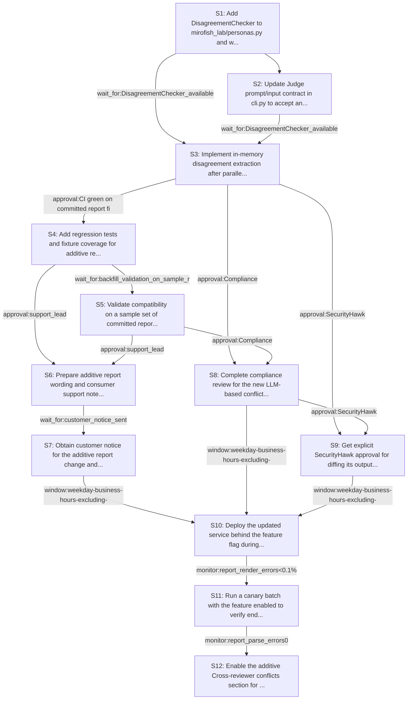

# Rollout Rehearsal — intent_pr_review_disagreement_detector

> Intent: fixtures/intent_pr_review_disagreement_detector.md · Stakeholders: 6 · Constraints: 24 · Steps: 12 · Model: gpt-5.4-mini

_Generated 2026-04-29T17:17:31Z_

## Summary

Add DisagreementChecker behind a flag, preserve old reports, and roll out additive conflict visibility without breaking existing consumers.

## Stakeholder constraints

| Owner | Axis | Summary | Gate | Rollback | Blocking |
|---|---|---|---|---|---|
| BackendOwner | api | Keep report format additive; preserve existing report readers | `none` | redeploy_previous | Y |
| BackendOwner | api | Judge input must accept conflicts without changing prior fields | `none` | redeploy_previous | Y |
| BackendOwner | deploy | Deploy persona and conflict parser before enabling section output | `wait_for:DisagreementChecker_available` | redeploy_previous | Y |
| BackendOwner | deploy | Rollback by disabling conflict section if report consumers break | `monitor:report_parse_errors0` | disable_conflict_section | n |
| DataPlatform | data | Keep existing report files readable; add conflicts section only | `wait_for:backfill_validation_on_sample_reports` | Remove the new section and regenerate reports in the prior format | Y |
| DataPlatform | data | Do not backfill or rewrite historical reports during rollout | `none` | Restore historical files from backup if any accidental rewrite occurs | Y |
| DataPlatform | ops | Avoid schema/table changes to report storage during business hours | `window:after_hours_only` | Revert the storage schema change and redeploy the previous migration state | n |
| DataPlatform | data | New conflict data must not increase write load materially | `monitor:write_iops<=baseline_plus_10%` | Disable persistence of conflict metadata and fall back to report-only output | n |
| SRE | deploy | Ship behind a feature flag for additive report section | `none` | disable the feature flag to skip DisagreementChecker and omit the new section | Y |
| SRE | ops | Validate on a canary batch before full rollout | `monitor:report_render_errors<0.1%` | roll back to the previous version and resume runs without conflict detection | Y |
| SRE | ops | Require no incident window and no Friday afternoon deploy | `window:weekday-business-hours-excluding-friday-afternoon-and-incident-windows` | redeploy_previous | Y |
| SRE | ops | Hold rollout until conflict section is empty or accurate | `monitor:empty_conflict_section_rate=100%` | disable DisagreementChecker and revert to judge-only reporting | n |
| Security | security | Do not weaken or overwrite reviewer security findings | `approval:SecurityHawk` | Remove DisagreementChecker from the review pipeline and restore Judge-only aggregation | Y |
| Security | security | Preserve audit trail for all review outputs and conflict entries | `monitor:audit_coverage100%` | Redeploy previous report renderer that emits only the original reviewer sections | Y |
| Security | comms | Notify consumers of additive report section before rollout | `window:customer_notice_before_release` | Delay enabling the new conflict section and ship the prior report format | Y |
| Security | security | Complete compliance review for new LLM-based conflict handling | `approval:Compliance` | Disable DisagreementChecker and revert to existing review flow | Y |
| ProductPM | comms | Notify report consumers before the additive report change ships | `wait_for:customer_notice_sent` | remove the new conflict section from generated reports | Y |
| ProductPM | comms | Publish support notes for the new conflict section and empty case | `approval:support_lead` | revert to the prior report wording without the conflict section | Y |
| ProductPM | business | Avoid rollout during launch windows or major customer events | `window:outside_launch_window` | redeploy_previous | Y |
| ProductPM | business | Assign an owner for customer escalations about changed reports | `approval:release_owner` | disable the conflict section in generated reports | Y |
| ConsumerSubsystem | api | Keep old report readers working with additive-only section | `approval:pr-review-rehearsal consumers` | remove the Cross-reviewer conflicts section and redeploy_previous | Y |
| ConsumerSubsystem | api | Ship DisagreementChecker behind a dual-read transition path | `wait_for:compatibility shim verified on committed reports` | bypass DisagreementChecker and feed Judge the pre-change reviewer outputs only | Y |
| ConsumerSubsystem | deploy | Add regression tests for conflict section and empty-conflict case | `approval:CI green on committed report fixtures` | revert the new tests and redeploy_previous | Y |
| ConsumerSubsystem | deploy | Define a no-risk fallback if the new agent slips the release | `window:until new agent is production-ready` | disable DisagreementChecker and keep the current Judge-only path | n |

## Rollout plan

| # | Action | Owner | Depends on | Gate | Rollback | Watch |
|---|---|---|---|---|---|---|
| S1 | Add DisagreementChecker to mirofish_lab/personas.py and wire a no-op/feature-flagged path in cli.py that can accept conflict data without changing existing reviewer or Judge fields. | BackendOwner | — | `none` | redeploy_previous | Persona registry loads, CLI accepts the new persona, and existing review flow still runs unchanged when the flag is off. |
| S2 | Update Judge prompt/input contract in cli.py to accept an additional conflicts payload while preserving all prior fields and existing prompt semantics. | BackendOwner | S1 | `none` | redeploy_previous | Judge receives the extra input slot, previous fields remain stable, and judge-only runs still produce the same shape. |
| S3 | Implement in-memory disagreement extraction after parallel_run(reviewers, ...) to produce {topic, reviewers_for, reviewers_against, evidence} entries, including an explicit empty-conflict case. | ConsumerSubsystem | S1, S2 | `wait_for:DisagreementChecker_available` | bypass DisagreementChecker and feed Judge the pre-change reviewer outputs only | Conflict list is derived only from reviewer outputs, no extra GitHub fetches occur, and empty cases render as an explicit no-conflicts result. |
| S4 | Add regression tests and fixture coverage for additive report rendering, old report readability, conflict extraction, and the honest empty-conflict section. | ConsumerSubsystem | S3 | `approval:CI green on committed report fixtures` | revert the new tests and redeploy_previous | Tests verify committed reports remain readable, the new section is additive only, and Judge input still accepts prior fields. |
| S5 | Validate compatibility on a sample set of committed reports without rewriting historical artifacts, confirming the new section can be added and omitted safely. | DataPlatform | S4 | `wait_for:backfill_validation_on_sample_reports` | Remove the new section and regenerate reports in the prior format | Sample reports parse successfully, historical files under reports/ are untouched, and no backfill or rewrite is performed. |
| S6 | Prepare additive report wording and consumer support notes for the new Cross-reviewer conflicts section, including the empty-case explanation. | ProductPM | S4, S5 | `approval:support_lead` | revert to the prior report wording without the conflict section | Support notes explain the new section clearly, and consumers have guidance for both conflict and no-conflict outputs. |
| S7 | Obtain customer notice for the additive report change and assign a release owner for escalations before enabling the new section. | ProductPM | S6 | `wait_for:customer_notice_sent` | remove the new conflict section from generated reports | Notice is sent before release, the escalation owner is assigned, and no production report shape change is enabled yet. |
| S8 | Complete compliance review for the new LLM-based conflict handling and ensure security findings are not weakened or overwritten. | Security | S3, S5 | `approval:Compliance` | Disable DisagreementChecker and revert to existing review flow | Compliance approves the new agent and Judge prompt change, and audit trail coverage remains intact. |
| S9 | Get explicit SecurityHawk approval for diffing its output against other reviewers and for feeding conflicts into Judge. | Security | S3, S8 | `approval:SecurityHawk` | Remove DisagreementChecker from the review pipeline and restore Judge-only aggregation | SecurityHawk signs off that its findings are preserved, not weakened, and conflict extraction respects security output. |
| S10 | Deploy the updated service behind the feature flag during an allowed window, after customer notice and compliance/security approvals are complete. | SRE | S7, S8, S9 | `window:weekday-business-hours-excluding-friday-afternoon-and-incident-windows` | disable the feature flag to skip DisagreementChecker and omit the new section | Deployment occurs outside incident windows and Friday afternoon, with the feature flag still off by default. |
| S11 | Run a canary batch with the feature enabled to verify end-to-end report rendering, audit coverage, and zero parse regressions before full rollout. | SRE | S10 | `monitor:report_render_errors<0.1%` | roll back to the previous version and resume runs without conflict detection | Watch report render errors, parse errors, audit coverage, and whether the conflicts section is empty or accurate. |
| S12 | Enable the additive Cross-reviewer conflicts section for all runs only after canary success, while keeping the old report shape readable and the fallback available. | SRE | S11 | `monitor:report_parse_errors0` | disable_conflict_section | Monitor report parse errors, empty-conflict rate, write IOPS, and consumer feedback on the new section. |

## Mermaid graph

## Conflicts (resolved by sequencer)

- between **SRE, BackendOwner**: SRE requires a feature-flagged rollout and canary validation before enabling output; BackendOwner requires the new judge input contract to accept conflicts. Resolved by wiring the contract first, then shipping disabled behind the flag, and only enabling after canary.
- between **DataPlatform, ProductPM**: DataPlatform forbids rewriting historical reports, while ProductPM wants released examples updated. Resolved by not touching historical artifacts and limiting any regeneration to future outputs and sample validation only.
- between **Security, ConsumerSubsystem**: ConsumerSubsystem wants a dual-read compatibility path, while Security requires audit preservation and no weakening of security findings. Resolved by preserving all prior fields, appending conflicts only, and keeping SecurityHawk sign-off before enablement.

## Open questions for the human

- What exact heuristic should DisagreementChecker use to decide that one reviewer 'implicitly endorsed' another's objection?
- What is the final customer-facing wording for the empty-conflict section?
- Which team owns the runtime feature flag and its default state at first release?
- Should the committed reports in reports/ be regenerated only for fixtures, or also for published examples once notice is sent?
