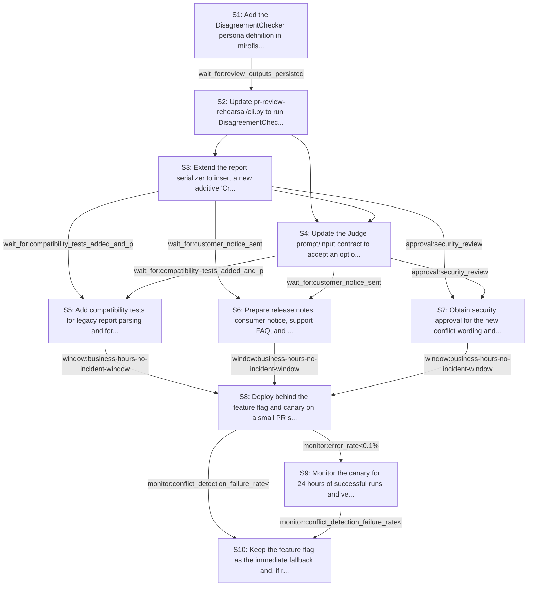

# Rollout Rehearsal — intent_pr_review_disagreement_detector

> Intent: fixtures/intent_pr_review_disagreement_detector.md · Stakeholders: 6 · Constraints: 24 · Steps: 10 · Model: gpt-5.4-mini

_Generated 2026-04-29T18:42:07Z_

## Summary

Add an in-memory DisagreementChecker, render an additive conflict section, and dual-wire Judge input while preserving old report compatibility.

## Stakeholder constraints

| Owner | Axis | Summary | Gate | Rollback | Blocking |
|---|---|---|---|---|---|
| BackendOwner | api | Keep report format additive; existing reports must still parse | `none` | redeploy_previous | Y |
| BackendOwner | api | Judge input must accept optional conflict list without breaking old path | `none` | redeploy_previous | Y |
| BackendOwner | deploy | Ship DisagreementChecker and report section before relying on its output | `wait_for:DisagreementChecker_present_in_deploy` | redeploy_previous | Y |
| BackendOwner | deploy | Deploy code that emits conflict list before any consumer treats it as required | `none` | redeploy_previous | Y |
| DataPlatform | data | Keep report format additive so existing report files still parse | `none` | Restore the previous report serializer and omit the new conflict section | Y |
| DataPlatform | data | Do not require any new stored fields for disagreement detection | `none` | Remove conflict persistence and derive all output only from in-memory review text | Y |
| DataPlatform | ops | Keep the added analysis batch bounded to avoid storage I/O spikes | `monitor:IOPS<baseline+10%` | Disable the conflict cache/write path and revert to transient in-memory processing | n |
| SRE | deploy | Ship behind a feature flag for the new conflict section | `none` | disable the feature flag and fall back to the existing review→judge flow | Y |
| SRE | ops | Canary on a small PR subset before broad enablement | `monitor:error_rate<0.1%` | disable the feature flag and route all runs to the previous flow | Y |
| SRE | ops | Wait for stable no-parse-failure runs before full rollout | `wait_for:24h_of_successful_runs` | revert to the previous report schema and Judge prompt | n |
| SRE | deploy | Avoid rollout during incident windows or weekend-change freeze | `window:business-hours-no-incident-window` | pause rollout and keep the prior deployment active | Y |
| Security | security | Keep audit trail of reviewer outputs and conflict list intact | `none` | Redeploy previous CLI version without the DisagreementChecker step | Y |
| Security | security | Add conflicts only after review artifacts are fully recorded | `wait_for:review_outputs_persisted` | Disable DisagreementChecker and preserve prior judge-only flow | Y |
| Security | comms | Notify consumers about additive report section before release | `window:notify_consumers_before_release` | Remove the new Cross-reviewer conflicts section from generated reports | Y |
| Security | security | Do not launch until review of conflict wording is approved | `approval:security_review` | Revert to the previous report template with no conflict section | Y |
| ProductPM | comms | Announce additive report section before rollout | `wait_for:customer_notice_sent` | remove the new conflict section from reports and prompts | Y |
| ProductPM | comms | Give advance notice for any report-format change | `window:outside_launch_window` | revert to the pre-change report template | Y |
| ProductPM | ops | Support team must have rollout briefing and FAQ | `approval:support_lead` | pause rollout until support brief is updated and re-issued | Y |
| ProductPM | business | Avoid rollout during launch windows or major events | `window:no_launch_window` | delay deployment until after the event window closes | Y |
| ProductPM | comms | Assign explicit owner for customer escalations | `approval:customer_escalation_owner` | escalate to rollback owner and suspend rollout | Y |
| ConsumerSubsystem | api | Keep report format additive; old reports must still parse | `wait_for:compatibility_tests_added_and_passing` | remove the new Cross-reviewer conflicts section and redeploy_previous | Y |
| ConsumerSubsystem | api | Dual-support Judge input until conflict payload is stable | `window:2 release cycles` | drop conflict list from Judge input and redeploy_previous | Y |
| ConsumerSubsystem | deploy | Ship a shim that tolerates missing conflict section in older runs | `approval:release_manager` | disable conflict-section rendering and redeploy_previous | n |
| ConsumerSubsystem | deploy | Fallback must be revertible to judge-only flow if rollout slips | `monitor:conflict_detection_failure_rate<1%` | skip DisagreementChecker step and redeploy_previous | Y |

## Rollout plan

| # | Action | Owner | Depends on | Gate | Rollback | Watch |
|---|---|---|---|---|---|---|
| S1 | Add the DisagreementChecker persona definition in mirofish_lab/personas.py and implement in-memory diffing of the four reviewer outputs into topic/reviewers_for/reviewers_against/evidence entries. | BackendOwner | — | `none` | Redeploy the previous personas file and remove the DisagreementChecker persona. | Persona loads successfully; checker returns a list from review text only with no new persisted fields. |
| S2 | Update pr-review-rehearsal/cli.py to run DisagreementChecker after parallel_run(reviewers, ...) and before Judge merge, using only the in-memory review outputs. | BackendOwner | S1 | `wait_for:review_outputs_persisted` | Disable DisagreementChecker and restore the prior reviewer->judge flow. | Checker executes only after reviewer artifacts are recorded; no extra GitHub fetches occur. |
| S3 | Extend the report serializer to insert a new additive 'Cross-reviewer conflicts' section between per-reviewer comments and implementer iteration, including an explicit empty-case message when no conflicts exist. | DataPlatform | S2 | `none` | Restore the previous report serializer and omit the conflict section. | Existing committed reports still parse; new section appears only as an additive block. |
| S4 | Update the Judge prompt/input contract to accept an optional conflict list while preserving the old path when the list is absent. | BackendOwner | S2, S3 | `none` | Redeploy the previous Judge prompt and drop the conflict payload. | Judge consumes conflict data when present and still works with legacy inputs. |
| S5 | Add compatibility tests for legacy report parsing and for Judge behavior with and without the conflict list. | ConsumerSubsystem | S3, S4 | `wait_for:compatibility_tests_added_and_passing` | Remove the new tests and revert to the previous test suite. | Tests confirm additive-only report shape and dual-support Judge input. |
| S6 | Prepare release notes, consumer notice, support FAQ, and escalation ownership for the new additive section. | ProductPM | S3, S4 | `wait_for:customer_notice_sent` | Withdraw the notice and revert to the pre-change report template. | Notice is sent before release; support materials reference the new conflict section. |
| S7 | Obtain security approval for the new conflict wording and the unchanged audit trail path. | Security | S3, S4 | `approval:security_review` | Revert to the previous report template with no conflict section. | Approved wording matches the report text; audit trail remains intact. |
| S8 | Deploy behind the feature flag and canary on a small PR subset during business hours, outside incident and launch windows. | SRE | S5, S6, S7 | `window:business-hours-no-incident-window` | Disable the feature flag and route all runs to the previous flow. | Canary error rate, parse failures, and conflict_detection_failure_rate stay within thresholds. |
| S9 | Monitor the canary for 24 hours of successful runs and verify no parse failures before broadening rollout. | SRE | S8 | `monitor:error_rate<0.1%` | Revert to the previous report schema and Judge prompt. | Track error rate, parse failures, and whether conflicts are surfaced correctly. |
| S10 | Keep the feature flag as the immediate fallback and, if rollout slips or conflict detection fails, revert to judge-only flow. | ConsumerSubsystem | S8, S9 | `monitor:conflict_detection_failure_rate<1%` | Skip DisagreementChecker and redeploy_previous. | Fallback remains available; judge-only path can be restored without schema changes. |

## Mermaid graph

## Conflicts (resolved by sequencer)

- between **SRE, ProductPM**: SRE requires rollout only in a business-hours/no-incident window, while ProductPM also requires a release-notice/launch-window constraint. Resolved by sequencing notice and approvals before the business-hours canary, and treating both windows as rollout prerequisites.
- between **SRE, ProductPM**: SRE wants a canary on a small PR subset before broad enablement; ProductPM requires customer notice/support prep before release. Resolved by doing notice/FAQ first, then canary.
- between **BackendOwner, ConsumerSubsystem**: BackendOwner wants the Judge to accept an optional conflict list immediately, while ConsumerSubsystem requires dual-support for two release cycles. Resolved conservatively by making the new payload optional and preserving the old path during rollout.

## Open questions for the human

- Who is the final release manager approver for the compatibility shim, if that shim is later needed?
- Should the empty-case message be a fixed sentence or templated per reviewer set?
- What exact wording should the customer notice and support FAQ use for the new conflict section?
