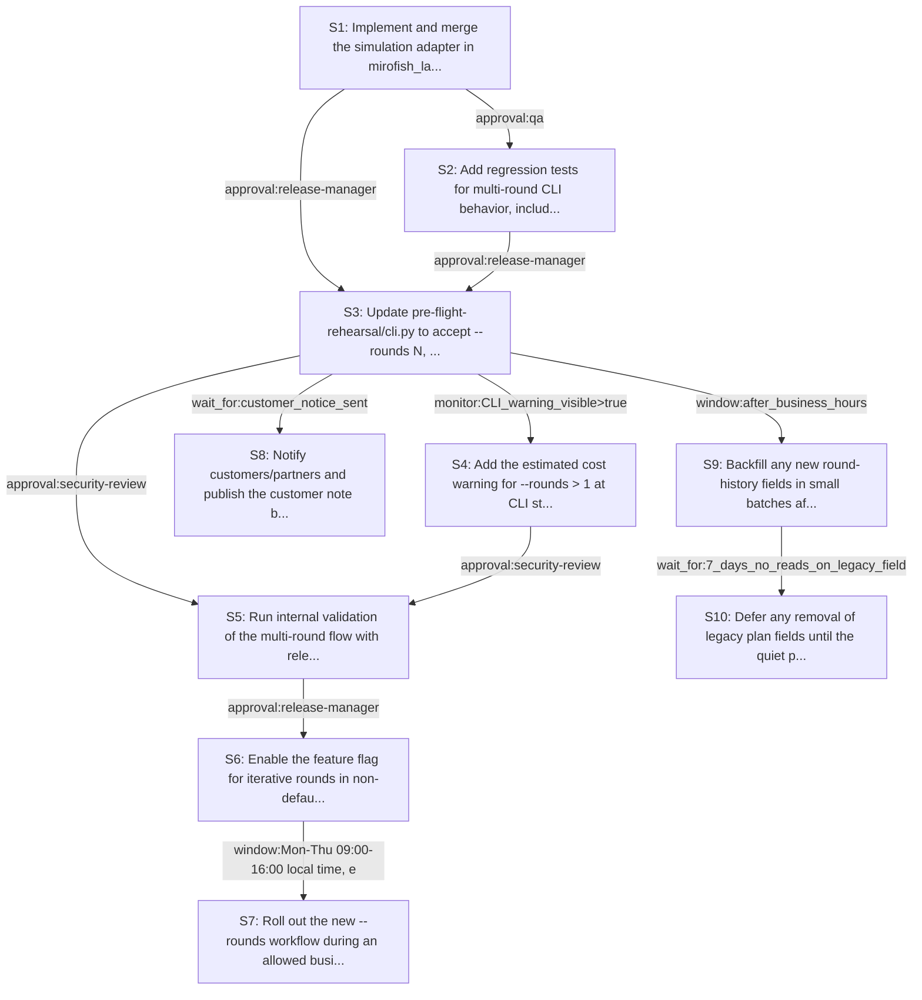

# Rollout Rehearsal — intent_preflight_iterative_refinement

> Intent: fixtures/intent_preflight_iterative_refinement.md · Stakeholders: 6 · Constraints: 25 · Steps: 10 · Model: gpt-5.4-mini

_Generated 2026-04-29T18:42:26Z_

## Summary

Add opt-in iterative refinement rounds with adapter support, cost warnings, tests, and safety gates while keeping rounds=1 identical.

## Stakeholder constraints

| Owner | Axis | Summary | Gate | Rollback | Blocking |
|---|---|---|---|---|---|
| BackendOwner | api | Keep --rounds=1 output and CLI behavior byte-for-byte identical | `none` | redeploy_previous | Y |
| BackendOwner | api | Preserve current report schema when rounds=1; add round labels only | `none` | remove new round labels and redeploy_previous | Y |
| BackendOwner | deploy | Ship simulation adapter before CLI calls revised round_table semantics | `wait_for:simulation_adapter_merged` | redeploy_previous | Y |
| BackendOwner | deploy | Guard iterative mode behind --rounds>1 until cost warning is verified | `monitor:CLI_warning_visible>true` | disable --rounds>1 path and redeploy_previous | n |
| DataPlatform | data | Keep round-1 output byte-for-byte identical to current reports | `none` | redeploy_previous | Y |
| DataPlatform | ops | Do not introduce schema or storage format changes mid-rollout | `window:after_business_hours` | revert schema migration and restore prior storage layout | Y |
| DataPlatform | data | Backfill any new round-history fields in small batches to protect IOPS | `monitor:replication_lag<30s` | pause backfill and resume from last completed batch | n |
| DataPlatform | ops | Delay dropping legacy plan fields until quiet period passes cleanly | `wait_for:7_days_no_reads_on_legacy_fields` | restore legacy column/file and re-enable writes if needed | Y |
| SRE | deploy | Keep default rounds=1 byte-for-byte identical to current CLI output | `none` | revert to the prior CLI behavior by forcing rounds=1 | Y |
| SRE | ops | Gate multi-round rollout on no recent error-budget regression | `monitor:error_rate<0.1% for 24h` | disable the new rounds path via feature flag and fall back to single-pass execution | Y |
| SRE | deploy | Use a feature flag for iterative rounds so cutover needs no redeploy | `approval:release-manager` | turn off the iterative-rounds flag and continue with the existing parallel-only pass | Y |
| SRE | ops | Avoid enabling rollout during incident windows or Friday afternoon | `window:Mon-Thu 09:00-16:00 local time, excluding incident windows` | pause rollout and revert users to the previous single-pass rehearsal flow | Y |
| Security | security | Do not expose secrets in round-by-round plan diffs or logs | `none` | Remove round-by-round diff sections and redact any secret-bearing content | Y |
| Security | security | Preserve audit trail for every persona revision across rounds | `approval:security-review` | Disable iterative rounds and revert to single-pass outputs | Y |
| Security | comms | Notify customers/partners before any visible report-format change | `window:before_external_release` | Hide iterative-round sections from externally distributed reports | n |
| Security | security | Review compliance impacts before enabling >1 rounds by default | `approval:compliance` | Keep default at --rounds 1 and require explicit opt-in for more | Y |
| ProductPM | comms | Warn users of added review time before enabling multi-round mode | `approval:support` | disable `--rounds > 1` and revert to single-pass output | Y |
| ProductPM | comms | Publish customer note before any change to report format or cadence | `wait_for:customer_notice_sent` | restore prior report layout and omit round-by-round sections | Y |
| ProductPM | ops | Do not launch during major events or launch windows | `window:outside_launch_window` | pause rollout and keep `--rounds 1` as the only supported mode | Y |
| ProductPM | business | Assign named escalation owner for report/comms issues during rollout | `approval:business_owner` | route escalations back to the prior release owner and suspend rollout | Y |
| ConsumerSubsystem | api | Keep rounds=1 output identical to current CLI behavior | `none` | redeploy_previous | Y |
| ConsumerSubsystem | api | Provide a revision adapter for round_table prior outputs | `wait_for:adapter_test_pass` | disable_round_table_revision_adapter | Y |
| ConsumerSubsystem | api | Add regression tests for multi-round report evolution | `approval:qa` | remove_multi_round_test_cases | Y |
| ConsumerSubsystem | deploy | Show cost warning before enabling rounds greater than one | `none` | disable_cost_warning_and_multi_round_flag | n |
| ConsumerSubsystem | deploy | Fallback to single-pass mode if iterative rounds slip | `wait_for:release_candidate_green` | force --rounds 1 | Y |

## Rollout plan

| # | Action | Owner | Depends on | Gate | Rollback | Watch |
|---|---|---|---|---|---|---|
| S1 | Implement and merge the simulation adapter in mirofish_lab/simulation.py so round_table can revise prior outputs instead of only making fresh contributions. | mirofish_lab | — | `wait_for:simulation_adapter_merged` | disable_round_table_revision_adapter | Adapter unit tests pass; revision input/output shapes match expected prior-output semantics. |
| S2 | Add regression tests for multi-round CLI behavior, including per-round labels, evolution visibility, and byte-for-byte identical output when --rounds is omitted or 1. | ConsumerSubsystem | S1 | `approval:qa` | remove_multi_round_test_cases | Snapshot tests confirm rounds=1 parity and rounds>1 emits labeled round sections. |
| S3 | Update pre-flight-rehearsal/cli.py to accept --rounds N, keep the default path unchanged, and wire iterative mode to the new revision adapter. | BackendOwner | S1, S2 | `approval:release-manager` | redeploy_previous | CLI parsing works; rounds=1 output remains byte-for-byte identical; rounds>1 invokes revision mode. |
| S4 | Add the estimated cost warning for --rounds > 1 at CLI startup and ensure iterative mode is still opt-in. | ConsumerSubsystem | S3 | `monitor:CLI_warning_visible>true` | disable_cost_warning_and_multi_round_flag | Warning text appears before execution; users can see the estimated additional LLM calls/cost. |
| S5 | Run internal validation of the multi-round flow with release-manager and security review signoff, confirming no secrets appear in round-by-round diffs or logs. | Security | S3, S4 | `approval:security-review` | Disable iterative rounds and revert to single-pass outputs | Redaction checks pass; audit trail records each persona revision without exposing sensitive content. |
| S6 | Enable the feature flag for iterative rounds in non-default paths after validation, keeping rounds=1 as the only byte-for-byte identical baseline. | SRE | S5 | `approval:release-manager` | turn off the iterative-rounds flag and continue with the existing parallel-only pass | Feature flag state is correct; canary runs show no error-budget regression and default behavior is unchanged. |
| S7 | Roll out the new --rounds workflow during an allowed business window, outside incidents and launch windows, with no recent error-budget regression. | SRE | S6 | `window:Mon-Thu 09:00-16:00 local time, excluding incident windows` | pause rollout and revert users to the previous single-pass rehearsal flow | Error rate remains below threshold for 24h; no incident windows overlap; rollout progress is steady. |
| S8 | Notify customers/partners and publish the customer note before any externally visible report-format change, including per-round plan sections. | ProductPM | S3 | `wait_for:customer_notice_sent` | restore prior report layout and omit round-by-round sections | Notice delivery confirmed; support and business owners are assigned for rollout questions. |
| S9 | Backfill any new round-history fields in small batches after business hours, while keeping legacy storage formats intact. | DataPlatform | S3 | `window:after_business_hours` | pause backfill and resume from last completed batch | Replication lag stays under 30s; IOPS remain within limits; no schema/storage-format drift appears mid-rollout. |
| S10 | Defer any removal of legacy plan fields until the quiet period has passed and no reads are observed on those fields for 7 days. | DataPlatform | S9 | `wait_for:7_days_no_reads_on_legacy_fields` | restore legacy column/file and re-enable writes if needed | Legacy-field read telemetry remains at zero; cutover readiness is tracked before cleanup. |

## Mermaid graph

## Conflicts (resolved by sequencer)

- between **BackendOwner, ProductPM**: BackendOwner wants the default path unchanged and only add labels, while ProductPM requires a customer notice before any report-format change. Resolved by keeping rounds=1 identical and scheduling customer notice before exposing multi-round reports externally.
- between **BackendOwner, Security**: BackendOwner wants round labels in reports, while Security forbids exposing secrets in round-by-round diffs/logs. Resolved by adding labels only with redaction/audit checks before rollout.
- between **BackendOwner, DataPlatform**: BackendOwner wants report changes in CLI output, while DataPlatform blocks schema/storage format changes mid-rollout. Resolved by limiting initial work to CLI/reporting and deferring storage cleanup/backfill.
- between **BackendOwner, SRE**: BackendOwner wants iterative mode available after adapter integration, while SRE requires a feature flag, release-manager approval, and controlled rollout windows. Resolved by implementing behind a flag and delaying enablement until approvals/windows are satisfied.
- between **BackendOwner, ConsumerSubsystem**: BackendOwner wants adapter-first integration, while ConsumerSubsystem requires tests and a revision adapter before rollout. Resolved by sequencing adapter, tests, then CLI wiring.
- between **BackendOwner, Security**: BackendOwner wants per-round evolution visibility, while Security requires an audit trail and approval before enabling >1 rounds by default. Resolved by keeping opt-in rounds only and gating activation on security review.
- between **DataPlatform, SRE**: DataPlatform allows backfill only after business hours, while SRE restricts rollout to Mon-Thu 09:00-16:00 and non-incident windows. Resolved by separating backfill from rollout and scheduling each within its own allowed window.
- between **DataPlatform, ProductPM**: DataPlatform delays legacy-field cleanup until 7 days of no reads, while ProductPM wants customer-visible changes preceded by notice. Resolved by notifying first and postponing cleanup until telemetry proves the old fields are unused.
- between **SRE, ProductPM**: SRE forbids rollout during incident/Friday windows and requires error-budget stability, while ProductPM adds launch-window and customer-notice timing constraints. Resolved by choosing the stricter combined rollout window after notice is sent.
- between **SRE, Security**: SRE requires feature-flagged cutover and approval, while Security requires compliance review before enabling >1 rounds by default. Resolved by treating multi-round as opt-in under flag and not changing default behavior.
- between **SRE, ConsumerSubsystem**: SRE wants fallback to single-pass if iterative rounds slip, while ConsumerSubsystem wants the revision adapter available before release. Resolved by keeping the single-pass fallback and only enabling iterative mode after adapter tests pass.
- between **ProductPM, Security**: ProductPM wants customer-facing plan changes announced ahead of visibility, while Security wants secret-safe round-by-round diffs and auditability. Resolved by requiring redaction and security review before external disclosure.

## Open questions for the human

- What exact text and formula should the cost warning use for estimated additional LLM calls?
- What qualifies as 'effectively the same plan' for per-persona convergence detection?
- Should the Judge consume all intermediate rounds or only the final version plus evolution summary?
- Are externally shared reports and internal rehearsal reports generated by the same formatter or separate paths?
- Do we need a dedicated release flag name and owner for the iterative-rounds mode?
