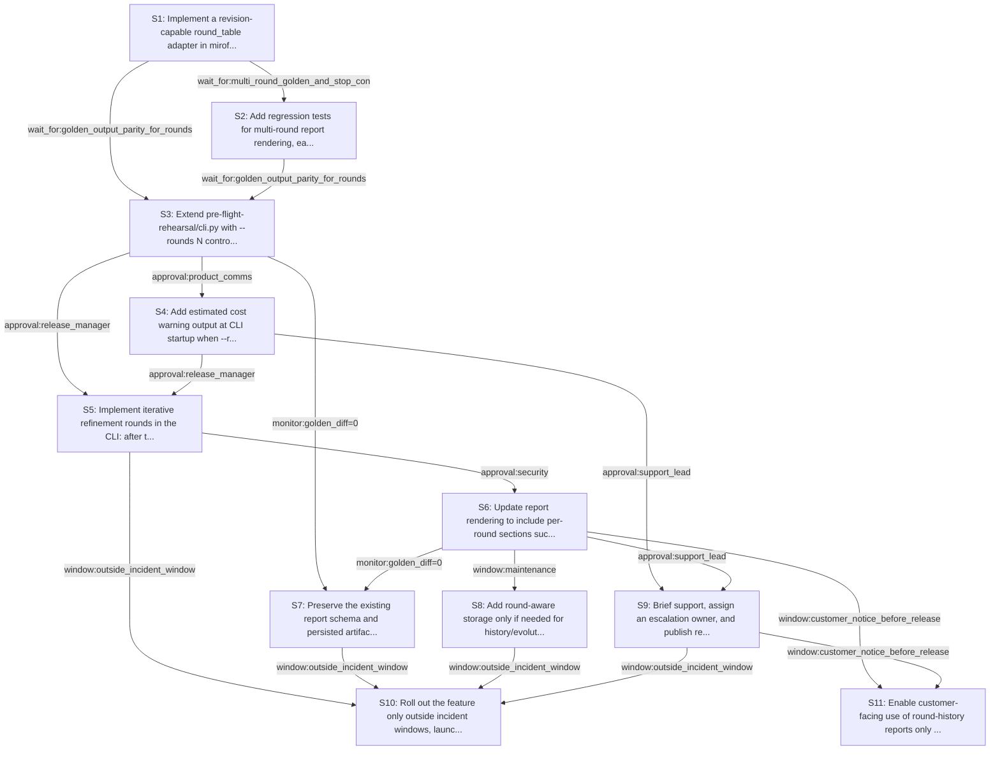

# Rollout Rehearsal — intent_preflight_iterative_refinement

> Intent: fixtures/intent_preflight_iterative_refinement.md · Stakeholders: 6 · Constraints: 26 · Steps: 11 · Model: gpt-5.4-mini

_Generated 2026-04-29T17:17:48Z_

## Summary

Add optional iterative plan refinement behind --rounds, preserving byte-for-byte round-1 behavior and adding cost warnings, audit trail, and early-stop convergence.

## Stakeholder constraints

| Owner | Axis | Summary | Gate | Rollback | Blocking |
|---|---|---|---|---|---|
| BackendOwner | api | Keep default --rounds 1 byte-for-byte identical output | `none` | revert to the prior single-pass CLI path | Y |
| BackendOwner | api | Preserve existing report schema when rounds is 1 | `none` | redeploy_previous | Y |
| BackendOwner | deploy | Ship simulation adapter before CLI reads revision semantics | `wait_for:simulation_adapter_merged` | revert the CLI to the pre-rounds implementation | Y |
| BackendOwner | deploy | Deploy CLI cost-warning logic before enabling rounds>1 | `wait_for:cost_warning_verified` | disable rounds>1 flag handling | n |
| DataPlatform | data | Keep round-1 outputs byte-for-byte identical to current reports | `none` | revert to the previous single-pass report generator | Y |
| DataPlatform | data | Use bounded backfill batch sizes if historical rehearsal data is reprocessed | `monitor:IOPS<baseline+10%` | pause backfill and resume with smaller batches | Y |
| DataPlatform | ops | Run schema-altering storage migrations only in the maintenance window | `window:maintenance` | drop the new storage objects and keep the old schema | Y |
| DataPlatform | data | Do not drop legacy plan columns until replication lag stays quiet | `monitor:replication_lag<5s` | restore the old columns/tables from backup or re-add them | n |
| SRE | deploy | Keep round-1 output byte-for-byte identical to current behavior | `monitor:golden_diff=0` | redeploy_previous | Y |
| SRE | ops | Warn on higher token/cost burn before enabling extra rounds | `none` | disable --rounds>1 and revert to default single-pass | n |
| SRE | deploy | Ship iterative rounds behind a flag with default-off behavior | `approval:release_manager` | set --rounds 1 and redeploy_previous | Y |
| SRE | ops | Do not cut over during an incident or active deploy freeze window | `window:outside_incident_window` | pause rollout and hold at current version | Y |
| Security | security | Keep all rehearsal plan contents inside the existing trust boundary | `none` | Disable multi-round sharing and revert to isolated first-pass plans | Y |
| Security | security | Preserve audit trail for each round's inputs and outputs | `approval:security` | Remove round-by-round transcript from reports and restore single-pass logs | Y |
| Security | comms | Notify customers before any externally visible report format change | `window:customer_notice_before_release` | Revert to the prior report layout without round history | Y |
| Security | comms | Allow partner review for new round-history visibility in outputs | `approval:partner_comms` | Suppress round-diff sections in externally shared reports | n |
| ProductPM | comms | Warn users before enabling multi-round plan generation | `approval:product_comms` | disable --rounds values greater than 1 | Y |
| ProductPM | comms | Publish release notes describing changed report evolution | `wait_for:release_notes_published` | remove the release note and reissue the prior docs | Y |
| ProductPM | business | Do not launch during active launch windows or major events | `window:no_launch_windows_or_major_events` | redeploy_previous | Y |
| ProductPM | business | Support must be briefed on rounds, cost, and stopping rules | `approval:support_lead` | pause rollout until support briefing is complete | Y |
| ProductPM | comms | Assign a named owner for customer escalation handling | `approval:escalation_owner` | revoke rollout ownership and halt customer exposure | Y |
| ConsumerSubsystem | api | Keep default round-1 behavior byte-for-byte identical | `wait_for:golden_output_parity_for_rounds_1` | redeploy_previous | Y |
| ConsumerSubsystem | api | Provide a compatibility shim for revision-style round_table input | `approval:api_consumer_owner` | disable_round_table_adapter_and_use_fresh_contribution_path | Y |
| ConsumerSubsystem | deploy | Require a dual-support window before making rounds>1 the norm | `window:2_release_cycles` | redeploy_previous | n |
| ConsumerSubsystem | deploy | Add pre-cutover tests for multi-round report and early-stop behavior | `wait_for:multi_round_golden_and_stop_condition_tests` | redeploy_previous | Y |
| ConsumerSubsystem | deploy | If new rounds path slips, preserve single-pass CLI as fallback | `none` | redeploy_previous | n |

## Rollout plan

| # | Action | Owner | Depends on | Gate | Rollback | Watch |
|---|---|---|---|---|---|---|
| S1 | Implement a revision-capable round_table adapter in mirofish_lab/simulation.py so each implementer can revise from prior outputs rather than only contribute fresh content. | mirofish_lab | — | `approval:api_consumer_owner` | disable_round_table_adapter_and_use_fresh_contribution_path | Adapter output shape, revision prompts, and parity of single-pass behavior when not used. |
| S2 | Add regression tests for multi-round report rendering, early-stop convergence per persona, and round-1 golden parity. | BackendOwner | S1 | `wait_for:multi_round_golden_and_stop_condition_tests` | revert the new test cases and keep the prior regression suite | Golden diffs for rounds=1, convergence stop cases, and transcript completeness across rounds. |
| S3 | Extend pre-flight-rehearsal/cli.py with --rounds N control flow that keeps the current single-pass path unchanged for N=1. | BackendOwner | S1, S2 | `wait_for:golden_output_parity_for_rounds_1` | revert to the prior single-pass CLI path | Byte-for-byte stdout/stderr parity for --rounds 1 and correct branching only when N>1. |
| S4 | Add estimated cost warning output at CLI startup when --rounds > 1, including the expectation that extra rounds increase LLM calls. | SRE | S3 | `approval:product_comms` | disable --rounds>1 and revert to default single-pass | Presence and wording of the warning, plus no warning for --rounds 1. |
| S5 | Implement iterative refinement rounds in the CLI: after the initial parallel pass, run additional rounds where each persona sees the merged plan set, can revise, and stops early if two consecutive rounds are effectively identical for that persona. | BackendOwner | S3, S4 | `approval:release_manager` | set --rounds 1 and redeploy_previous | Per-persona round counts, stop-trigger events, and unchanged single-pass semantics when N=1. |
| S6 | Update report rendering to include per-round sections such as 'Plan: Minimalist (round 1)' and 'Plan: Minimalist (round 2)', plus explicit evolution visibility for the Judge input. | BackendOwner | S5 | `approval:security` | Remove round-by-round transcript from reports and restore single-pass logs | Report section ordering, round labels, and audit trail completeness for every emitted round. |
| S7 | Preserve the existing report schema and persisted artifacts exactly when --rounds 1, including judge payloads and output formatting. | DataPlatform | S3, S6 | `monitor:golden_diff=0` | revert to the previous single-pass report generator | Golden diff checks on rendered reports and persisted artifacts for round-1 runs. |
| S8 | Add round-aware storage only if needed for history/evolution tracking, keeping any schema changes within the maintenance window and with bounded backfill batches. | DataPlatform | S6 | `window:maintenance` | drop the new storage objects and keep the old schema | Schema migration success, IOPS during backfill, and whether legacy columns remain intact. |
| S9 | Brief support, assign an escalation owner, and publish release notes explaining the new multi-round behavior, cost warnings, and stopping rules. | ProductPM | S4, S6 | `approval:support_lead` | pause rollout until support briefing is complete | Support readiness signoff, named escalation owner, and release note publication status. |
| S10 | Roll out the feature only outside incident windows, launch windows, and major events, with the new behavior staying behind the --rounds flag. | SRE | S5, S7, S8, S9 | `window:outside_incident_window` | pause rollout and hold at current version | Incident status, deploy freeze status, and whether the flag remains default-off. |
| S11 | Enable customer-facing use of round-history reports only after customer notice and partner review approvals are satisfied. | ProductPM | S6, S9 | `window:customer_notice_before_release` | Revert to the prior report layout without round history | Customer notice timing, partner review approval, and whether externally shared reports include round evolution sections. |

## Mermaid graph

## Conflicts (resolved by sequencer)

- between **BackendOwner, Security**: BackendOwner requires byte-for-byte identical round-1 behavior, while Security requires an audit trail for each round's inputs and outputs. Resolved by keeping round-1 unchanged and only adding round transcript visibility on the multi-round path.
- between **BackendOwner, ProductPM**: ProductPM requires release notes and customer notice before externally visible report changes, while the CLI change can be implemented earlier. Resolved by staging code behind the flag and gating external exposure on comms approvals.
- between **DataPlatform, SRE**: Round-history storage changes, if needed, must happen in a maintenance window, while CLI behavior can be rolled out outside incident windows. Resolved by separating code rollout from any storage migration and sequencing storage work only if required.

## Open questions for the human

- What threshold should define 'effectively the same plan' for convergence detection?
- Should the cost warning be a fixed message or include estimated dollar/token values?
- Is round-aware storage actually required, or can round history live only in ephemeral reports and logs?
- Who is the intended named escalation owner for customer support?
