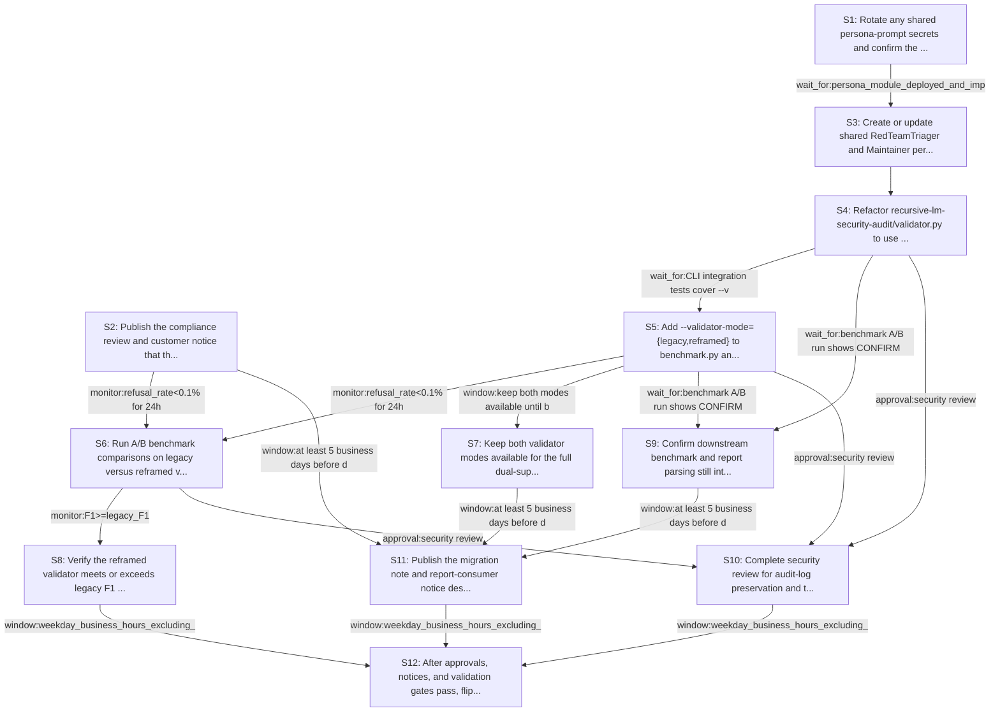

# Rollout Rehearsal — intent_rlm_validator_persona_swap

> Intent: fixtures/intent_rlm_validator_persona_swap.md · Stakeholders: 6 · Constraints: 22 · Steps: 12 · Model: gpt-5.4-mini

_Generated 2026-04-29T17:17:11Z_

## Summary

Add reframed RedTeamTriager/Maintainer validator path behind a flag, keep verdict taxonomy unchanged, and validate parity, F1, and token cost before defaulting.

## Stakeholder constraints

| Owner | Axis | Summary | Gate | Rollback | Blocking |
|---|---|---|---|---|---|
| BackendOwner | api | Keep verdict outputs as CONFIRMED/DOWNGRADED/DISMISSED | `none` | redeploy_previous | Y |
| BackendOwner | api | Preserve legacy validator mode during A/B rollout | `wait_for:reframed_mode_matches_legacy_on_ground_truth` | disable reframed mode and route all runs to legacy | Y |
| BackendOwner | deploy | Ship shared persona prompts before switching validator import path | `wait_for:persona_module_deployed_and_importable` | revert validator to embedded legacy prompts | Y |
| BackendOwner | api | Do not change verdict taxonomy or report schema fields | `none` | redeploy_previous | Y |
| SRE | deploy | Ship reframed validator behind --validator-mode flag only | `none` | Set --validator-mode=legacy to restore the prior validator path without redeploying | Y |
| SRE | ops | Compare refusal rate and verdict mix before default flip | `monitor:refusal_rate<0.1% for 24h` | Disable reframed mode and revert benchmark invocations to legacy mode | Y |
| SRE | ops | Require no accuracy regression on flowise manual verification | `monitor:F1>=legacy_F1` | Flip validator-mode back to legacy if reframed F1 drops below baseline | Y |
| SRE | deploy | Keep prompt rewrite within current token budget envelope | `monitor:token_usage<=110%` | Reinstate the original prosecution/defense prompts and seed template | n |
| SRE | deploy | Avoid validator rollout during incident windows or Friday afternoon | `window:weekday_business_hours_excluding_incidents` | Hold default flip and continue operating in legacy mode | Y |
| Security | security | Preserve existing finding audit logs across legacy and reframed modes | `approval:security review` | redeploy_previous | Y |
| Security | security | Rotate any shared persona-prompt secrets before importing shared module | `wait_for:secret-rotation-complete` | revoke new credentials and revert to legacy-local prompts | Y |
| Security | comms | Notify report consumers of reframed mode and unchanged verdict labels | `window:at least 5 business days before default flip` | keep legacy mode as default and withdraw change notice | Y |
| Security | security | Complete compliance review for prompt framing change before defaulting | `approval:compliance` | revert default to legacy framing and disable reframed flag by default | Y |
| ProductPM | comms | Notify report consumers of unchanged verdict taxonomy | `wait_for:customer_notice_sent` | reissue comms clarifying legacy validator mode remains available | Y |
| ProductPM | comms | Publish migration note before defaulting to reframed mode | `approval:comms_lead` | keep default on legacy mode and postpone reframed default change | Y |
| ProductPM | ops | Support must have escalation playbook for refusal-rate changes | `approval:support_manager` | disable reframed mode and revert to legacy validator mode | Y |
| ProductPM | business | Avoid launch windows and major events during A/B rollout | `window:outside_launch_window_and_major_event` | pause rollout until the next approved non-peak window | Y |
| ConsumerSubsystem | api | Keep verdict outputs stable across legacy and reframed modes | `wait_for:benchmark A/B run shows CONFIRMED/DOWNGRADED/DISMISSED parity` | redeploy_previous | Y |
| ConsumerSubsystem | api | Ship --validator-mode flag before default switch | `wait_for:CLI integration tests cover --validator-mode={legacy,reframed}` | remove new flag and redeploy_previous | Y |
| ConsumerSubsystem | deploy | Maintain dual-support window for legacy and reframed validator | `window:keep both modes available until benchmark A/B completes` | force legacy mode and redeploy_previous | Y |
| ConsumerSubsystem | deploy | Block default flip until F1 meets or exceeds legacy | `monitor:flowise-manual-verification F1>=legacy` | set default back to legacy and redeploy_previous | Y |
| ConsumerSubsystem | deploy | Hold rollout if token spend rises beyond 10 percent | `monitor:per-finding token usage<=110% of baseline` | switch validator-mode to legacy and redeploy_previous | Y |

## Rollout plan

| # | Action | Owner | Depends on | Gate | Rollback | Watch |
|---|---|---|---|---|---|---|
| S1 | Rotate any shared persona-prompt secrets and confirm the shared persona module can be safely imported in the target environment. | Security | — | `wait_for:secret-rotation-complete` | revoke new credentials and revert to legacy-local prompts | Secret rotation completion status, import success for mirofish_lab/personas.py, no auth/import errors |
| S2 | Publish the compliance review and customer notice that the validator will gain a reframed mode while keeping CONFIRMED/DOWNGRADED/DISMISSED unchanged. | ProductPM | — | `approval:compliance` | revert default to legacy framing and disable reframed flag by default | Compliance approval, customer notice sent, communications acknowledged |
| S3 | Create or update shared RedTeamTriager and Maintainer persona prompts in mirofish_lab/personas.py, including the audit-level plausibility seed prompt text. | BackendOwner | S1 | `wait_for:persona_module_deployed_and_importable` | revert validator to embedded legacy prompts | Persona module deploy status, importability, prompt text diff, token length of prompts |
| S4 | Refactor recursive-lm-security-audit/validator.py to use the shared RedTeamTriager/Maintainer prompts and the new audit-level seed prompt, while leaving the verdict prompt and labels unchanged. | BackendOwner | S3 | `none` | redeploy_previous | Validator output still emits CONFIRMED/DOWNGRADED/DISMISSED, prompt selection path, token usage per finding |
| S5 | Add --validator-mode={legacy,reframed} to benchmark.py and batch_runner.py, wiring legacy to the current validator path and reframed to the new persona-based path. | BackendOwner | S4 | `wait_for:CLI integration tests cover --validator-mode={legacy,reframed}` | remove new flag and redeploy_previous | CLI parsing tests, mode routing, report schema compatibility, log labels for chosen mode |
| S6 | Run A/B benchmark comparisons on legacy versus reframed validator mode using the flowise-manual-verification.md ground truth and existing audit reports. | SRE | S5, S2 | `monitor:refusal_rate<0.1% for 24h` | Disable reframed mode and revert benchmark invocations to legacy mode | Refusal rate, verdict distribution, CONFIRMED/DOWNGRADED/DISMISSED parity, F1 vs legacy, per-finding token usage |
| S7 | Keep both validator modes available for the full dual-support window and only use reframed mode in explicit A/B runs. | ConsumerSubsystem | S5 | `window:keep both modes available until benchmark A/B completes` | force legacy mode and redeploy_previous | Mode availability, accidental defaulting, report parsing stability, rollback readiness |
| S8 | Verify the reframed validator meets or exceeds legacy F1 on flowise-manual-verification.md and stays within the token budget envelope. | SRE | S6 | `monitor:F1>=legacy_F1` | Flip validator-mode back to legacy if reframed F1 drops below baseline | F1 score, false positives/negatives, per-finding token usage <=110% baseline |
| S9 | Confirm downstream benchmark and report parsing still interpret existing audit reports as CONFIRMED/DOWNGRADED/DISMISSED with no schema changes. | ConsumerSubsystem | S4, S5 | `wait_for:benchmark A/B run shows CONFIRMED/DOWNGRADED/DISMISSED parity` | redeploy_previous | Report parser output, label counts, schema validation, backward compatibility across existing reports |
| S10 | Complete security review for audit-log preservation and the framing change before any default flip. | Security | S4, S5, S6 | `approval:security review` | redeploy_previous | Security signoff, audit log continuity, no missing or renamed fields in validator/benchmark outputs |
| S11 | Publish the migration note and report-consumer notice describing the reframed mode, unchanged verdict taxonomy, and the fact that legacy mode remains available. | ProductPM | S2, S7, S9 | `window:at least 5 business days before default flip` | keep legacy mode as default and withdraw change notice | Notice publication date, audience acknowledgment, business-day timing, support playbook readiness |
| S12 | After approvals, notices, and validation gates pass, flip the benchmark default to reframed mode only during an approved business-hours window outside incidents and major events. | SRE | S8, S10, S11 | `window:weekday_business_hours_excluding_incidents` | Set --validator-mode=legacy to restore the prior validator path without redeploying | Default mode selection, incident status, launch-window compliance, support escalation health |

## Mermaid graph

## Conflicts (resolved by sequencer)

- between **BackendOwner, SRE**: Prompt budget is a soft constraint while F1 parity and refusal-rate reduction are hard blockers. The rollout keeps the persona rewrite minimal and measures token usage during A/B rather than expanding prompt scope.
- between **ProductPM, SRE**: Product wants prior notice and support readiness before default flip, while SRE requires the reframed mode to remain behind a flag during A/B. The plan keeps reframed mode opt-in until all notices, approvals, and validation gates are satisfied.

## Open questions for the human

- Should the shared persona prompts be imported from mirofish_lab/personas.py immediately in validator.py, or should validator.py keep a local fallback copy during the dual-support window?
- What exact benchmark set defines the 24h refusal-rate measurement for the reframed mode?
- Who owns the final approval to switch the benchmark default after the A/B phase: SRE, Security, or ProductPM?
