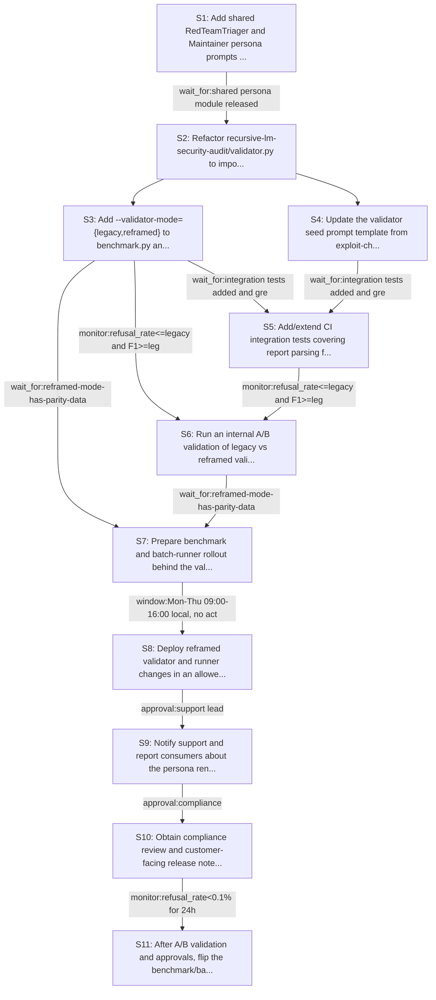

# Rollout Rehearsal — intent_rlm_validator_persona_swap

> Intent: fixtures/intent_rlm_validator_persona_swap.md · Stakeholders: 6 · Constraints: 25 · Steps: 11 · Model: gpt-5.4-mini

_Generated 2026-04-29T18:41:51Z_

## Summary

Introduce reframed validator personas with a legacy/reframed flag, keep verdict labels stable, and gate default flip on tests, A/B metrics, and approvals.

## Stakeholder constraints

| Owner | Axis | Summary | Gate | Rollback | Blocking |
|---|---|---|---|---|---|
| BackendOwner | api | Keep verdict outputs exactly CONFIRMED/DOWNGRADED/DISMISSED | `none` | revert verdict prompt changes and redeploy previous validator | Y |
| BackendOwner | api | Add --validator-mode with legacy and reframed behaviors | `none` | remove new flag and redeploy previous benchmark runners | Y |
| BackendOwner | deploy | Deploy shared persona prompts before switching validator import | `wait_for:shared persona module released and importable` | pin validator to local legacy prompts and redeploy previous version | Y |
| BackendOwner | deploy | Default stay legacy until reframed mode is A/B validated | `wait_for:A/B run completes with refusal and verdict metrics reviewed` | flip default back to legacy mode and redeploy runners | Y |
| DataPlatform | data | Preserve CONFIRMED/DOWNGRADED/DISMISSED report compatibility | `none` | Restore the legacy verdict formatter so existing reports emit the prior labels unchanged | Y |
| DataPlatform | data | Backfill any persisted validator metadata in small batches | `monitor:replication_lag<2m` | Pause backfill and revert any partially migrated rows to the previous schema/value set | Y |
| DataPlatform | ops | Run schema-affecting changes only in an off-hours window | `window:off-hours` | Revert the storage change and disable the migration job until the next maintenance window | Y |
| DataPlatform | data | Drop legacy validator-mode storage only after a quiet period | `wait_for:7d_no_legacy_reads` | Restore the dropped column/table/key from backup or replica and re-enable legacy reads | Y |
| SRE | ops | A/B validator-mode behind a flag before default flip | `wait_for:reframed-mode-has-parity-data` | switch --validator-mode back to legacy | Y |
| SRE | ops | Require error-rate and refusal-rate parity before defaulting | `monitor:refusal_rate<0.1% for 24h` | revert default to legacy mode without redeploying the benchmark runner | Y |
| SRE | deploy | Do not cut over during incident windows or Friday afternoon | `window:Mon-Thu 09:00-16:00 local, no active incident` | flip validator-mode to legacy and disable reframed default | Y |
| SRE | ops | Preserve rollback path for shared persona module import | `approval:maintainer` | restore inline legacy prosecution/defense prompts and seed prompt | n |
| Security | security | Rotate any persona prompt secrets before shared import | `wait_for:secret-rotation-complete` | restore prior persona prompt bundle and revoke newly-issued prompt credentials | Y |
| Security | security | Preserve full audit trail for legacy and reframed runs | `monitor:audit-trail_coverage>=100%` | disable reframed mode and rerun the affected findings with legacy framing | Y |
| Security | comms | Notify customers of any externally visible framing change | `window:notify>=14d_before_default_flip` | keep --validator-mode=legacy as the default until notice window closes | Y |
| Security | comms | Obtain compliance review before production default changes | `approval:compliance` | revert default to legacy mode and freeze release pending review | Y |
| ProductPM | comms | Notify audit-report consumers of persona rename before default flip | `wait_for:customer-facing release note approval` | revert default validator mode to legacy and restore prior terminology in docs | Y |
| ProductPM | comms | Give advance notice to support before A/B rollout begins | `approval:support lead` | pause reframed mode rollout until support is briefed and ready | Y |
| ProductPM | ops | Do not start rollout during launch windows or major events | `window:outside launch window / major event blackout` | disable reframed mode in active jobs and continue with legacy mode only | Y |
| ProductPM | business | Assign a named escalation owner for misparsed report complaints | `approval:designated rollout owner` | route escalations to legacy-mode owner and stop default flip | Y |
| ConsumerSubsystem | api | Keep legacy validator mode as default during A/B window | `window:two release cycles` | redeploy_previous | Y |
| ConsumerSubsystem | api | Ship compatibility shim for legacy prose-to-verdict parsing | `wait_for:compatibility shim tests passing` | redeploy_previous | Y |
| ConsumerSubsystem | deploy | Do not flip default until refusal-rate and F1 A/B pass | `monitor:refusal_rate<=legacy and F1>=legacy` | redeploy_previous | Y |
| ConsumerSubsystem | deploy | Add pre-cutover tests for report parsing and verdict parity | `wait_for:integration tests added and green` | redeploy_previous | Y |
| ConsumerSubsystem | deploy | Have legacy validator fallback if reframed mode is delayed | `approval:release manager` | redeploy_previous | n |

## Rollout plan

| # | Action | Owner | Depends on | Gate | Rollback | Watch |
|---|---|---|---|---|---|---|
| S1 | Add shared RedTeamTriager and Maintainer persona prompts to mirofish_lab/personas.py, including the audit-level seed prompt fragment for validator debates. | BackendOwner | — | `wait_for:secret-rotation-complete` | Restore the prior persona prompt bundle and revoke newly-issued prompt credentials. | Secret rotation completion, importability of the new persona module, and prompt checksum/version. |
| S2 | Refactor recursive-lm-security-audit/validator.py to import the shared personas, swap prosecution/defense framing for RedTeamTriager/Maintainer, and keep the verdict prompt and CONFIRMED/DOWNGRADED/DISMISSED labels unchanged. | BackendOwner | S1 | `wait_for:shared persona module released and importable` | Pin validator to local legacy prompts and redeploy the previous validator version. | Validator import success, unchanged verdict label emission, token count per finding, and no parser regressions. |
| S3 | Add --validator-mode={legacy,reframed} to benchmark.py and batch_runner.py, wiring mode selection to the existing validator implementation without changing report label parsing. | BackendOwner | S2 | `none` | Remove the new flag and redeploy the previous benchmark runners. | CLI help output, mode propagation in logs, and parity of legacy behavior when the flag is set to legacy. |
| S4 | Update the validator seed prompt template from exploit-chain framing to audit-level plausibility analysis while preserving the downstream verdict classifier and report taxonomy. | BackendOwner | S2 | `none` | Restore the legacy seed prompt and redeploy the prior validator prompt bundle. | Refusal rate on critical findings, average prompt token length, and verdict distribution stability. |
| S5 | Add/extend CI integration tests covering report parsing for existing audits and ground-truth parity on flowise-manual-verification.md for both legacy and reframed modes. | ConsumerSubsystem | S3, S4 | `wait_for:integration tests added and green` | Redeploy previous test suite and revert the runner changes. | Test pass/fail status, parsed labels from sample reports, and F1 comparison against legacy. |
| S6 | Run an internal A/B validation of legacy vs reframed validator mode on representative findings, capturing refusal rate, F1, and verdict distribution. | ConsumerSubsystem | S3, S5 | `monitor:refusal_rate<=legacy and F1>=legacy` | Switch --validator-mode back to legacy and rerun affected findings. | Refusal rate, F1 on flowise ground truth, CONFIRMED/DOWNGRADED/DISMISSED counts, and token spend per finding. |
| S7 | Prepare benchmark and batch-runner rollout behind the validator-mode flag with legacy as the default during the A/B window, and preserve full audit trail logging for both modes. | SRE | S3, S6 | `wait_for:reframed-mode-has-parity-data` | Switch --validator-mode back to legacy and preserve existing logs for rerun. | Mode adoption rate, audit-trail coverage, and any logging gaps between legacy and reframed runs. |
| S8 | Deploy reframed validator and runner changes in an allowed production window, with a fallback to legacy mode if incidents occur. | SRE | S7 | `window:Mon-Thu 09:00-16:00 local, no active incident` | Flip validator-mode to legacy and disable reframed default. | Incident status, job error rate, refusal rate, and deployment health during the window. |
| S9 | Notify support and report consumers about the persona rename and any externally visible framing changes; assign a named escalation owner for misparsed report complaints. | ProductPM | S8 | `approval:support lead` | Pause reframed mode rollout and keep legacy terminology/defaults active. | Support readiness, customer acknowledgement, and escalation routing correctness. |
| S10 | Obtain compliance review and customer-facing release note approval before any default flip to reframed mode. | Security | S9 | `approval:compliance` | Revert default to legacy mode and freeze release pending review. | Compliance sign-off, release note approval status, and any required wording changes. |
| S11 | After A/B validation and approvals, flip the benchmark/batch default from legacy to reframed and keep legacy available as a fallback during the transition period. | BackendOwner | S10 | `monitor:refusal_rate<0.1% for 24h` | Revert the default to legacy mode without redeploying the benchmark runner. | 24h refusal rate, error rate, F1, and final default mode in runtime configs. |

## Mermaid graph

## Conflicts (resolved by sequencer)

- between **BackendOwner, DataPlatform**: Backend wants shared persona import before validator switch; DataPlatform requires any schema/storage migration for validator-mode only in off-hours and with backfill/quiet-period gates. Resolved by avoiding storage changes in the plan and keeping persona changes code-only.
- between **BackendOwner, SRE**: Backend prefers default to remain legacy until A/B validation completes, while SRE requires A/B behind a flag and parity data before defaulting. Resolved by making legacy the interim default and gating the flip on parity data.
- between **BackendOwner, Security**: Backend wants prompt import after module release, while Security requires prompt secrets rotated before shared import. Resolved by placing secret rotation and persona module release ahead of validator import.
- between **BackendOwner, ProductPM**: Backend wants the flag and reframed mode added promptly, but ProductPM requires advance notice and support briefing before A/B rollout begins. Resolved by sequencing notifications before production rollout.
- between **BackendOwner, ConsumerSubsystem**: Backend wants verdict labels and parsing unchanged, while ConsumerSubsystem wants a compatibility shim and pre-cutover tests. Resolved by keeping labels identical and adding tests before the default flip.
- between **SRE, Security**: SRE allows rollout only in a Mon-Thu business window, while Security requires full audit-trail preservation and a 24h refusal-rate monitor before defaulting. Resolved by using the narrower business window and keeping monitoring active across the A/B period.
- between **SRE, ProductPM**: SRE prohibits cutover during incident windows and Friday afternoon, while ProductPM also blocks rollout during launch windows/major events. Resolved by requiring both blackout constraints to be clear before rollout.
- between **Security, ProductPM**: Security requires compliance approval and customer notice before default flip, while ProductPM requires support approval and release-note approval before rollout. Resolved by treating all approvals/notices as prerequisites to the flip.
- between **DataPlatform, ConsumerSubsystem**: DataPlatform wants any legacy storage dropped only after 7 days with no legacy reads, while ConsumerSubsystem requires legacy fallback during the A/B window. Resolved by not dropping any legacy storage in this rollout.

## Open questions for the human

- What exact prompt text should be imported from adversarial-security-sim, and should any local fallback remain in validator.py?
- Do validator-mode selections need to be persisted, and if so, where should that metadata live?
- Which team owns the named escalation owner for report parsing complaints?
- Should the default flip wait for both compliance approval and the 14-day customer notice window to complete, or is one sufficient?
- Are there any existing stored run artifacts that require backfill, or can we avoid schema changes entirely?
