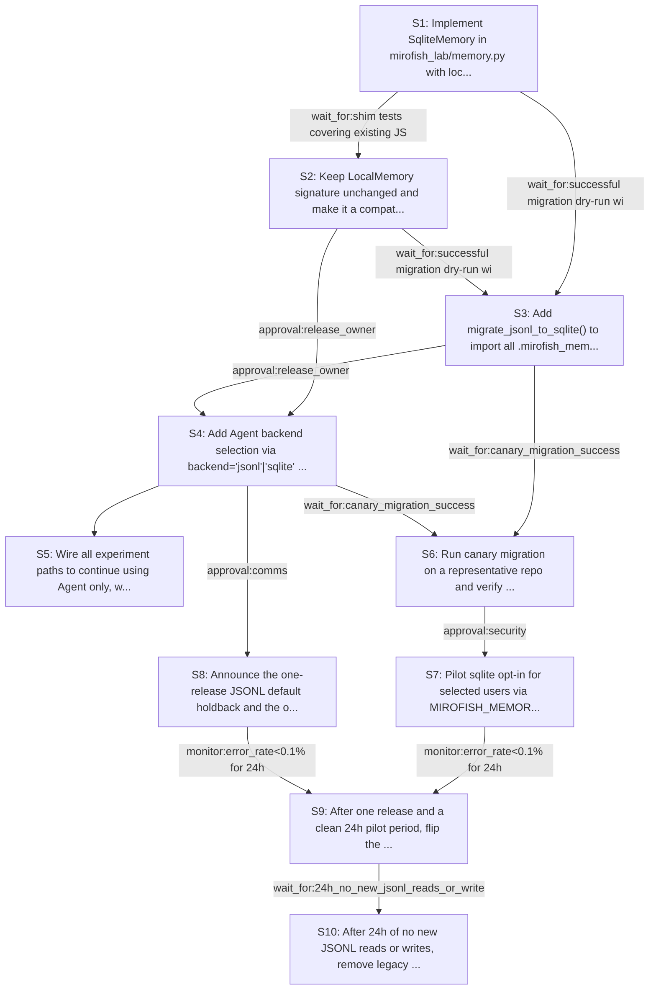

# Rollout Rehearsal — intent_sqlite_memory_migration

> Intent: fixtures/intent_sqlite_memory_migration.md · Stakeholders: 6 · Constraints: 26 · Steps: 10 · Model: gpt-5.4-mini

_Generated 2026-04-29T16:47:59Z_

## Summary

Add SQLite-backed memory with safe migration and opt-in rollout while preserving JSONL access for one release.

## Stakeholder constraints

| Owner | Axis | Summary | Gate | Rollback | Blocking |
|---|---|---|---|---|---|
| backend services | deploy | Ship SQLite read/write only after schema migration exists | `wait_for:migrate_jsonl_to_sqlite_available` | revert to JSONL-only LocalMemory path | Y |
| backend services | deploy | Default backend stays JSONL for one release after merge | `approval:release_owner` | redeploy_previous | Y |
| backend services | api | Keep LocalMemory signature and JSONL compatibility intact | `none` | restore prior LocalMemory implementation | Y |
| backend services | api | Agent backend kwarg must preserve existing default behavior | `none` | redeploy_previous | Y |
| backend services | deploy | Fail loud on SQLite write errors; never silently drop memory | `none` | switch backend env var back to jsonl and redeploy | Y |
| storage-layer | data | Backfill JSONL in small batches to avoid IOPS spikes | `monitor:disk_iops<baseline+20%` | Delete imported rows from memory.db and rerun migration with smaller batch size | Y |
| storage-layer | schema | No schema changes during business hours; do DDL off-peak | `window:off-peak-maintenance` | Drop the newly created table or revert the schema migration | Y |
| storage-layer | data | Do not drop JSONL until SQLite import has been quiet | `wait_for:24h_no_new_jsonl_reads_or_writes` | Restore JSONL files from backup and re-enable LocalMemory shim | Y |
| storage-layer | ops | Keep replication lag within budget during migration writes | `monitor:replication_lag<30s` | Pause migration, throttle writes, and resume from last committed batch | Y |
| ops | ops | Roll out SQLite behind env-var opt-in, keep JSONL default for one release | `approval:release-owner` | Unset MIROFISH_MEMORY_BACKEND / set backend back to jsonl | Y |
| ops | ops | Do not flip default until sqlite runs clean for 24h on pilot users | `monitor:error_rate<0.1% for 24h` | Keep default on jsonl and disable sqlite opt-in by env var | Y |
| deploy | deploy | Gate migration helper rollout until import succeeds on a canary repo | `wait_for:canary_migration_success` | Delete memory.db and rerun using JSONL backend only | Y |
| ops | ops | Avoid cutover during incident windows or Friday afternoon | `window:Mon-Thu 09:00-16:00 local time, no active incident` | Postpone release and keep existing JSONL path active | n |
| security | security | Migrate JSONL into SQLite with no audit-trail gaps | `wait_for:successful migration dry-run with record counts matching` | redeploy_previous | Y |
| security | security | Rotate any memory-store access secrets before opt-in rollout | `approval:security` | redeploy_previous | Y |
| security | comms | Notify users of one-release JSONL default before behavior change | `window:publish notice at least one release before default flip` | redeploy_previous | Y |
| security | security | Preserve write-failure visibility; no silent memory loss | `monitor:write_failure_rate<=0` | redeploy_previous | Y |
| comms-business | comms | Announce JSONL-to-SQLite opt-in and one-release default holdback | `approval:comms` | Revert default backend announcement and keep jsonl as default | Y |
| comms-business | comms | Notify users before any breaking memory-default change | `wait_for:customer_notice_sent` | Postpone backend default change until notice is sent | Y |
| comms-business | ops | Avoid rollout during launch windows or major events | `window:outside_launch_window` | Delay rollout to the next acceptable release window | Y |
| comms-business | ops | Support team must have escalation playbook before opt-in launch | `approval:support_lead` | Pause opt-in rollout until support is briefed and ready | Y |
| comms-business | business | Assign explicit escalation owner for memory migration issues | `approval:product_owner` | Route escalations back to the prior stable backend path | n |
| internal-api-deploy-stakeholder | api | Keep jsonl default for one release, with opt-in sqlite path | `window:one release after merge` | Set MIROFISH_MEMORY_BACKEND=jsonl and redeploy_previous | Y |
| internal-api-deploy-stakeholder | api | Preserve LocalMemory signature and read old JSONL during transition | `wait_for:shim tests covering existing JSONL reads` | Restore prior LocalMemory implementation and redeploy_previous | Y |
| internal-api-deploy-stakeholder | deploy | Do not cut over until migration helper preserves all existing records | `wait_for:migration test suite passes on representative repos` | Rerun migration into JSONL-only path and redeploy_previous | Y |
| internal-api-deploy-stakeholder | deploy | Fail rollout if sqlite writes can drop records or stay silent | `wait_for:write-failure test raises loudly` | Disable sqlite backend via env var and redeploy_previous | Y |

## Rollout plan

| # | Action | Owner | Depends on | Gate | Rollback | Watch |
|---|---|---|---|---|---|---|
| S1 | Implement SqliteMemory in mirofish_lab/memory.py with local-only sqlite3 persistence, explicit write errors, and a single inspectable table. | backend services | — | `window:off-peak-maintenance` | Remove SqliteMemory code and restore the prior JSONL-only memory path. | Table creation succeeds in .mirofish_memory/memory.db; writes raise on failure; no silent drops. |
| S2 | Keep LocalMemory signature unchanged and make it a compatibility shim that reads existing JSONL files while writing new entries through the SQLite path. | backend services | S1 | `wait_for:shim tests covering existing JSONL reads` | Restore prior LocalMemory implementation. | Existing JSONL records remain readable through LocalMemory; new writes land in SQLite. |
| S3 | Add migrate_jsonl_to_sqlite() to import all .mirofish_memory JSONL files into SQLite in small batches with loud error handling. | storage-layer | S1, S2 | `wait_for:successful migration dry-run with record counts matching` | Delete imported rows from memory.db and rerun migration with smaller batch size. | Record counts match on dry-run; disk IOPS and replication lag stay within budget; write failures surface immediately. |
| S4 | Add Agent backend selection via backend="jsonl"|"sqlite" kwarg and MIROFISH_MEMORY_BACKEND env var, keeping jsonl as the default. | backend services | S2, S3 | `approval:release_owner` | Unset MIROFISH_MEMORY_BACKEND and revert Agent default to jsonl. | Agent instantiates the requested backend; default behavior remains unchanged for existing callers. |
| S5 | Wire all experiment paths to continue using Agent only, with no per-experiment code changes required. | backend services | S4 | `none` | Redeploy previous experiment integration that uses Agent without backend selection. | pr-review-rehearsal, pre-flight-rehearsal, adversarial-security-sim, and blast-radius-prediction still run through Agent successfully. |
| S6 | Run canary migration on a representative repo and verify imported records are queryable from SQLite. | deploy | S3, S4 | `wait_for:canary_migration_success` | Delete memory.db and rerun using JSONL backend only. | Canary repo sees prior reviewer comments in SQLite; migration completes without record-count mismatch. |
| S7 | Pilot sqlite opt-in for selected users via MIROFISH_MEMORY_BACKEND=sqlite while keeping the global default on jsonl. | ops | S6 | `approval:security` | Switch backend env var back to jsonl and redeploy. | Pilot write error rate is 0; concurrent runs no longer corrupt logs; support readiness and escalation handling are in place. |
| S8 | Announce the one-release JSONL default holdback and the opt-in sqlite path before any later default change. | comms-business | S4 | `approval:comms` | Revert the default-backend announcement and keep jsonl as default. | Notice is published and acknowledged before any future default flip. |
| S9 | After one release and a clean 24h pilot period, flip the default backend to sqlite while retaining JSONL read compatibility. | ops | S7, S8 | `monitor:error_rate<0.1% for 24h` | Keep default on jsonl and disable sqlite opt-in by env var. | Pilot error rate stays below threshold; no active incidents; rollout occurs outside restricted windows. |
| S10 | After 24h of no new JSONL reads or writes, remove legacy JSONL files from .mirofish_memory. | storage-layer | S9 | `wait_for:24h_no_new_jsonl_reads_or_writes` | Restore JSONL files from backup and re-enable LocalMemory shim. | No JSONL access occurs during the quiet period; SQLite remains the only active store. |

## Mermaid graph

## Conflicts (resolved by sequencer)

- between **backend services, ops, comms-business, internal-api-deploy-stakeholder**: Default backend must stay JSONL for one release and requires notice/approval, while SQLite opt-in and later default flip need gating. Resolved by keeping jsonl default in S4, running opt-in only in S7, and deferring default flip to S9 after notice and pilot success.
- between **storage-layer, backend services**: Schema creation and migration must happen off-peak, but the implementation work itself has no strict time window. Resolved by making only the table-creation/migration execution steps gated by the off-peak window; code implementation can occur earlier.
- between **security, storage-layer**: Migration must preserve audit trail and avoid silent failures while also throttling bulk inserts to protect replication lag and IOPS. Resolved by requiring dry-run validation, small batches, and explicit error propagation before canary and pilot rollout.

## Open questions for the human

- Who is the named release_owner for approving the backend-selection rollout?
- Who signs off for security approval before pilot opt-in?
- What is the exact off-peak-maintenance window for initial schema creation?
- What batching size should migrate_jsonl_to_sqlite() use by default?
- How will the 24h no-new-JSONL-access condition be measured and by what tool?
- Who is the support_lead and escalation owner for customer issues?
- When does the one-release holdback end in calendar terms?
