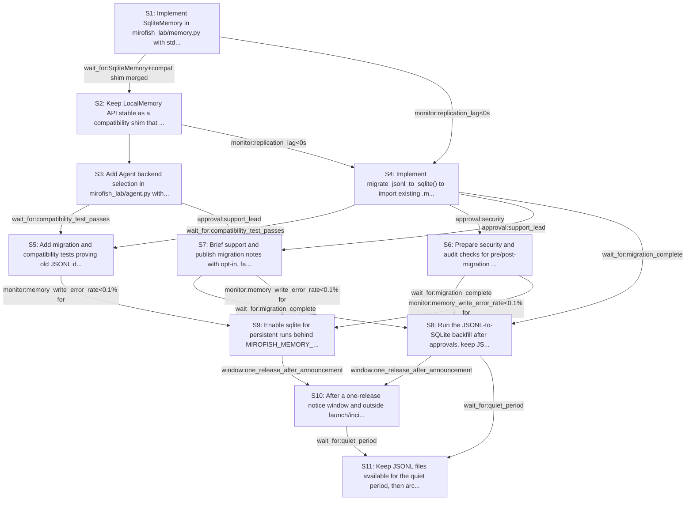

# Rollout Rehearsal — intent_sqlite_memory_migration

> Intent: fixtures/intent_sqlite_memory_migration.md · Stakeholders: 6 · Constraints: 25 · Steps: 11 · Model: gpt-5.4-mini

_Generated 2026-04-29T18:43:32Z_

## Summary

Add SQLite-backed memory with JSONL compatibility, migration helper, and opt-in rollout while preserving legacy access and safe fallback.

## Stakeholder constraints

| Owner | Axis | Summary | Gate | Rollback | Blocking |
|---|---|---|---|---|---|
| BackendOwner | api | Keep Agent backend default jsonl for one release | `none` | revert default backend selection to jsonl | Y |
| BackendOwner | api | Read legacy JSONL when sqlite backend is enabled | `wait_for:migration_helper_added` | disable sqlite backend selection and fall back to jsonl | Y |
| BackendOwner | deploy | Add sqlite write path before flipping any readers to it | `wait_for:sqlite_backend_merged` | redeploy_previous | Y |
| BackendOwner | deploy | Do not remove JSONL compatibility until one release later | `window:one_release` | restore LocalMemory JSONL read support | Y |
| DataPlatform | data | Backfill JSONL into SQLite in small batches to avoid IOPS spikes | `monitor:replication_lag<0s` | Stop the migration and delete the partially imported memory.db, then rerun with smaller batches | Y |
| DataPlatform | data | Do not drop or overwrite JSONL until SQLite import is complete | `wait_for:migration_complete` | Restore JSONL-only reads and ignore memory.db until import completes | Y |
| DataPlatform | schema | Make SQLite schema changes only in a planned maintenance window | `window:business-hours-closed` | Revert to the prior SQLite schema and reapply migrations later | n |
| DataPlatform | data | Keep old JSONL files for a quiet period before deletion | `wait_for:quiet_period` | Restore archived JSONL files from backup if rollback is needed | Y |
| SRE | ops | Ship sqlite backend behind env var, keep jsonl default one release | `none` | Unset MIROFISH_MEMORY_BACKEND or set it back to jsonl | Y |
| SRE | ops | Require a failed-write path that raises and preserves old backend access | `none` | Switch backend to jsonl and disable sqlite writes | Y |
| SRE | deploy | Cut over only after sqlite canary shows stable error rate for 24h | `monitor:memory_write_error_rate<0.1% for 24h` | Flip MIROFISH_MEMORY_BACKEND back to jsonl | Y |
| SRE | deploy | Do not enable the sqlite default during incident windows or Friday PM | `window:avoid Fridays 12:00-17:00 local time and active incident windows` | Postpone rollout and keep jsonl default | Y |
| Security | security | Rotate any secrets exposed in JSONL before SQLite cutover | `approval:security` | Purge imported records and restore JSONL-only reads | Y |
| Security | security | Audit trail must cover pre/post-migration writes | `wait_for:audit-log-parity-check` | Disable SQLite backend and replay from preserved JSONL sources | Y |
| Security | comms | Notify users/partners before default backend changes | `window:7d-prelaunch-notice` | Restore `MIROFISH_MEMORY_BACKEND=jsonl` as the default | Y |
| Security | comms | Provide migration notice with opt-in and fallback guidance | `approval:comms` | Post a correction notice and defer auto-switching behavior | n |
| ProductPM | comms | Notify users before backend default changes from JSONL to SQLite | `wait_for:customer_notice_sent` | revert default backend to jsonl and reissue comms | Y |
| ProductPM | comms | Give one-release lead time before any breaking memory behavior | `window:one_release_after_announcement` | restore JSONL compatibility path as the default | Y |
| ProductPM | ops | Do not roll out during launch windows or major events | `window:outside_launch_window_and_major_event` | pause rollout and keep users on jsonl backend | Y |
| ProductPM | ops | Support team must be briefed on migration and fallback steps | `approval:support_lead` | revert to jsonl default and disable migration guidance until briefed | Y |
| ProductPM | business | Assign explicit escalation owner for migration failures | `approval:product_owner` | route escalations to named owner and halt broader rollout | Y |
| ConsumerSubsystem | api | Keep LocalMemory API stable while sqlite backend lands | `wait_for:SqliteMemory+compat shim merged` | redeploy_previous | Y |
| ConsumerSubsystem | api | Default stays jsonl for one release; sqlite is opt-in | `window:one_release_after_cutover` | redeploy_previous | Y |
| ConsumerSubsystem | api | Ship migration test proving old JSONL reads in sqlite | `wait_for:compatibility_test_passes` | redeploy_previous | Y |
| ConsumerSubsystem | deploy | If sqlite backend fails in prod, fall back to jsonl env var | `monitor:sqlite_write_error_rate>0` | set MIROFISH_MEMORY_BACKEND=jsonl and redeploy_previous | Y |

## Rollout plan

| # | Action | Owner | Depends on | Gate | Rollback | Watch |
|---|---|---|---|---|---|---|
| S1 | Implement SqliteMemory in mirofish_lab/memory.py with stdlib sqlite3, persistent writes that raise on failure, and a stable schema for one inspectable table. | BackendOwner | — | `window:business-hours-closed` | Revert to the prior memory.py implementation and remove the SQLite write path. | Table creation success, write success/failure rate, and basic read/write round-trip tests. |
| S2 | Keep LocalMemory API stable as a compatibility shim that can read existing JSONL files and route new writes through the SQLite backend when selected. | BackendOwner | S1 | `wait_for:SqliteMemory+compat shim merged` | Restore LocalMemory JSONL read support and disable SQLite writes. | Legacy JSONL reads still work, new writes land in memory.db, and constructor signatures remain unchanged. |
| S3 | Add Agent backend selection in mirofish_lab/agent.py with backend="jsonl" default, env-var override via MIROFISH_MEMORY_BACKEND, and opt-in sqlite wiring. | BackendOwner | S2 | `none` | Revert default backend selection to jsonl and unset or ignore MIROFISH_MEMORY_BACKEND. | Backend selection path, default resolution, and Agent construction success for both backends. |
| S4 | Implement migrate_jsonl_to_sqlite() to import existing .mirofish_memory JSONL records into memory.db in small batches without deleting source files. | DataPlatform | S1, S2 | `monitor:replication_lag<0s` | Stop migration, delete the partially imported memory.db, and rerun with smaller batches. | Batch throughput, import completeness, duplicate handling, and source JSONL preservation during import. |
| S5 | Add migration and compatibility tests proving old JSONL data is visible after sqlite opt-in and that failed SQLite writes raise loudly. | ConsumerSubsystem | S3, S4 | `wait_for:compatibility_test_passes` | Redeploy previous memory behavior and keep sqlite disabled. | Test coverage for restart persistence, legacy read visibility, and write-failure behavior. |
| S6 | Prepare security and audit checks for pre/post-migration writes, secret rotation approval, and parity of imported records. | Security | S4 | `approval:security` | Purge imported records and restore JSONL-only reads. | Security approval status, audit-log parity results, and any sensitive fields found in imported records. |
| S7 | Brief support and publish migration notes with opt-in, fallback, and escalation-owner guidance. | ProductPM | S3, S4 | `approval:support_lead` | Revert to jsonl default and disable migration guidance until briefed. | Support readiness signoff, published guidance, and named escalation owner availability. |
| S8 | Run the JSONL-to-SQLite backfill after approvals, keep JSONL files intact, and only consider cleanup after a quiet period. | DataPlatform | S4, S6, S7 | `wait_for:migration_complete` | Restore JSONL-only reads and ignore memory.db until import completes. | Import completion, record counts match, no source-file deletion, and low IOPS during batch import. |
| S9 | Enable sqlite for persistent runs behind MIROFISH_MEMORY_BACKEND=sqlite for a canary cohort and monitor write stability for 24h. | SRE | S5, S6, S7 | `monitor:memory_write_error_rate<0.1% for 24h` | Flip MIROFISH_MEMORY_BACKEND back to jsonl. | SQLite write error rate, restart persistence, canary success rate, and any fallback events. |
| S10 | After a one-release notice window and outside launch/incident windows, make sqlite the default while keeping JSONL compatibility for the deprecation window. | ProductPM | S8, S9 | `window:one_release_after_announcement` | Restore MIROFISH_MEMORY_BACKEND=jsonl as the default and reissue communications. | Default-backend adoption, support tickets, launch-window compliance, and remaining JSONL usage. |
| S11 | Keep JSONL files available for the quiet period, then archive or delete them only after migration and stability criteria are satisfied. | DataPlatform | S8, S10 | `wait_for:quiet_period` | Restore archived JSONL files from backup if rollback is needed. | Quiet-period completion, archive integrity, and ability to restore old files if required. |

## Mermaid graph

## Conflicts (resolved by sequencer)

- between **BackendOwner, ConsumerSubsystem**: BackendOwner requires JSONL default for one release while ConsumerSubsystem also requires the default stay jsonl for one release; these are aligned, so no rollout conflict. Resolved by keeping jsonl default until the one-release window completes.
- between **DataPlatform, BackendOwner**: DataPlatform wants JSONL preserved until migration completes and then kept for a quiet period, while BackendOwner wants backward compatibility maintained for one release. Resolved by retaining JSONL source files through migration and only cleaning them up after the quiet period.
- between **SRE, ProductPM**: SRE requires no rollout during launch windows/major events, while ProductPM requires one-release lead time and notification before default changes. Resolved by scheduling the default flip only after notice and outside restricted windows.
- between **Security, ProductPM**: Security requires secret rotation and audit parity before cutover, while ProductPM requires support briefing and escalation readiness before broader rollout. Resolved by gating canary and default flip on both security and support readiness.
- between **DataPlatform, ConsumerSubsystem**: DataPlatform wants small-batch backfill and no JSONL deletion until import completes, while ConsumerSubsystem wants a compatibility test proving old JSONL reads in sqlite. Resolved by running compatibility tests before migration cleanup and preserving source files through validation.
- between **SRE, BackendOwner**: SRE requires failed SQLite writes to raise and preserve old backend access, while BackendOwner wants the sqlite backend added before readers are flipped. Resolved by implementing write failures as loud errors while keeping jsonl fallback available during opt-in.
- between **Security, DataPlatform**: Security requires audit-log parity and secret rotation before cutover, while DataPlatform wants migration batches and JSONL coexistence. Resolved by running migration in batches with preserved source JSONL until audit approval is obtained.
- between **ProductPM, ConsumerSubsystem**: ProductPM requires one-release lead time before breaking memory behavior, while ConsumerSubsystem requires the sqlite default remain opt-in for one release after cutover. Resolved by keeping sqlite opt-in until the announced default-flip window closes.

## Open questions for the human

- What exact schema should the single SQLite table use for persona, timestamp, tags, and payload fields?
- What constitutes 'quiet_period' length before JSONL cleanup?
- Who is the named escalation owner for migration failures?
- What is the exact customer_notice_sent process and who sends it?
- Should memory.db be created automatically on first sqlite opt-in or only via explicit migration helper?
- What batch size should migrate_jsonl_to_sqlite() use by default?
