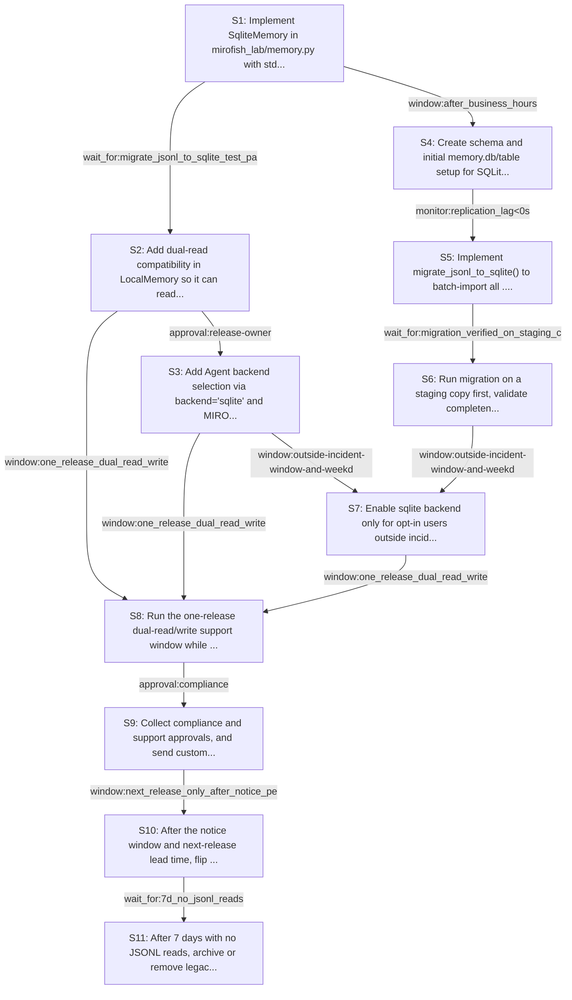

# Rollout Rehearsal — intent_sqlite_memory_migration

> Intent: fixtures/intent_sqlite_memory_migration.md · Stakeholders: 6 · Constraints: 25 · Steps: 11 · Model: gpt-5.4-mini

_Generated 2026-04-29T17:19:07Z_

## Summary

Add SQLite-backed memory with backward-compatible JSONL reads/writes, staged migration, and one-release opt-in rollout.

## Stakeholder constraints

| Owner | Axis | Summary | Gate | Rollback | Blocking |
|---|---|---|---|---|---|
| BackendOwner | api | Keep LocalMemory API stable while adding SqliteMemory backend | `none` | Redeploy previous memory.py with LocalMemory-only implementation | Y |
| BackendOwner | api | Default backend stays jsonl until the one-release opt-in window ends | `window:one release` | Reset default backend to jsonl and remove sqlite opt-in path | Y |
| BackendOwner | deploy | Deploy schema/code that can read both JSONL and SQLite before switch | `wait_for:backward-compatible dual-read release deployed` | Redeploy previous release with JSONL-only backend | Y |
| BackendOwner | data | Migrate JSONL into SQLite without dropping unread JSONL history | `monitor:import_completeness=100%` | Re-run migration from JSONL into a fresh SQLite database | Y |
| BackendOwner | deploy | Write to SQLite must fail loud; do not silently fall back or drop records | `none` | Redeploy previous JSONL write path | Y |
| DataPlatform | data | Backfill JSONL in small batches to avoid IOPS spikes | `monitor:replication_lag<0s` | delete imported rows from memory.db for the last batch and resume from prior checkpoint | Y |
| DataPlatform | schema | Do not create or alter the SQLite schema during business hours | `window:after_business_hours` | drop the newly created SQLite table and restore JSONL-only writes | Y |
| DataPlatform | ops | Keep old JSONL files until quiet period confirms no lagging readers | `wait_for:7d_no_jsonl_reads` | restore JSONL files from backup and re-enable JSONL reads | Y |
| DataPlatform | data | Verify SQLite writes are durable before switching persistent storage | `monitor:sqlite_write_errors=0` | switch backend back to JSONL and replay unsaved records from the error queue | Y |
| SRE | deploy | Keep JSONL as default for one release behind env flag | `approval:release-owner` | Unset MIROFISH_MEMORY_BACKEND and keep using jsonl backend | Y |
| SRE | ops | Do not enable sqlite cutover during incident windows | `window:outside-incident-window-and-weekday-hours` | Disable MIROFISH_MEMORY_BACKEND=sqlite and revert to jsonl | Y |
| SRE | ops | Require post-cutover error rate under 0.1% before wider use | `monitor:memory_write_error_rate<0.1% for 24h` | Switch backend back to jsonl and quarantine memory.db | Y |
| SRE | ops | Validate migration on a copy before promoting sqlite backend | `wait_for:migration_verified_on_staging_copy` | Discard sqlite DB and rerun from original JSONL files | Y |
| Security | security | Migrate JSONL before switching defaults; preserve audit trail | `wait_for:migration_dry_run_complete` | redeploy_previous | Y |
| Security | security | Keep both old and new memory writable during cutover | `window:one_release_dual_read_write` | switch_backend=jsonl | Y |
| Security | security | Obtain compliance review for data retention and access path | `approval:compliance` | disable_backend_flag | Y |
| Security | comms | Notify users before any visible backend-default change | `window:14d_customer_notice` | keep_default=jsonl | Y |
| ProductPM | comms | Announce backend default change before any user-visible switch | `wait_for:customer_notice_sent` | revert default backend to jsonl and reissue correction notice | Y |
| ProductPM | comms | Give one release of lead time before making sqlite the default | `window:next_release_only_after_notice_period` | keep default backend on jsonl for another release cycle | Y |
| ProductPM | ops | Support must have migration and rollback playbook before rollout | `approval:support_lead` | disable sqlite default and instruct users to stay on jsonl | Y |
| ProductPM | business | Do not roll out during launch windows or major customer events | `window:no_launch_window_or_major_event` | pause rollout and preserve jsonl as the active default | Y |
| ConsumerSubsystem | api | Keep LocalMemory API stable while adding sqlite backend | `none` | Remove backend="sqlite" path and leave LocalMemory signature unchanged | Y |
| ConsumerSubsystem | api | Ship JSONL-to-SQLite shim before switching defaults | `wait_for:migrate_jsonl_to_sqlite_test_pass` | redeploy_previous | Y |
| ConsumerSubsystem | deploy | Maintain one-release dual-support window for jsonl and sqlite | `window:one_release` | Keep MIROFISH_MEMORY_BACKEND default at jsonl | Y |
| ConsumerSubsystem | deploy | Fallback to jsonl if sqlite backend is not ready on release day | `wait_for:sqlite_backend_release_ready` | Set MIROFISH_MEMORY_BACKEND=jsonl and redeploy_previous | n |

## Rollout plan

| # | Action | Owner | Depends on | Gate | Rollback | Watch |
|---|---|---|---|---|---|---|
| S1 | Implement SqliteMemory in mirofish_lab/memory.py with stdlib sqlite3, preserving LocalMemory's public API and adding loud failures on write errors. | BackendOwner | — | `none` | Remove SqliteMemory and restore LocalMemory-only implementation. | Unit tests for API compatibility, write failures raising exceptions, and basic read/write round trips. |
| S2 | Add dual-read compatibility in LocalMemory so it can read any existing JSONL files while routing new writes through the SQLite path when configured. | ConsumerSubsystem | S1 | `wait_for:migrate_jsonl_to_sqlite_test_pass` | Remove SQLite write routing and keep JSONL-only LocalMemory behavior. | Verify old JSONL records remain readable and new records persist via the SQLite backend. |
| S3 | Add Agent backend selection via backend="sqlite" and MIROFISH_MEMORY_BACKEND, with jsonl remaining the default for one release. | BackendOwner | S2 | `approval:release-owner` | Unset MIROFISH_MEMORY_BACKEND support and force the jsonl backend default. | Confirm constructor behavior, env-var selection, and default jsonl behavior in tests. |
| S4 | Create schema and initial memory.db/table setup for SQLite, honoring the after-hours restriction and keeping JSONL writes available during the dual-support window. | DataPlatform | S1 | `window:after_business_hours` | Drop the newly created SQLite table and restore JSONL-only writes. | Watch schema creation logs, table presence, and any DDL errors during the after-hours window. |
| S5 | Implement migrate_jsonl_to_sqlite() to batch-import all .mirofish_memory/*.jsonl records into SQLite without deleting source files. | DataPlatform | S4 | `monitor:replication_lag<0s` | Delete the last imported batch from memory.db and resume from the prior checkpoint. | Track batch import counts, completeness, lag, and per-batch error rates. |
| S6 | Run migration on a staging copy first, validate completeness, then promote the SQLite database for production-like use. | SRE | S5 | `wait_for:migration_verified_on_staging_copy` | Discard the SQLite DB copy and rerun from original JSONL files. | Compare record counts and sampled records between JSONL and SQLite; confirm import completeness is 100%. |
| S7 | Enable sqlite backend only for opt-in users outside incident windows and weekday-hours constraints, keeping jsonl as default. | SRE | S3, S6 | `window:outside-incident-window-and-weekday-hours` | Disable MIROFISH_MEMORY_BACKEND=sqlite and revert to jsonl. | Monitor sqlite_write_errors, memory_write_error_rate, and any user-facing persistence failures. |
| S8 | Run the one-release dual-read/write support window while retaining JSONL files and preserving both access paths. | Security | S2, S3, S7 | `window:one_release_dual_read_write` | Switch backend=jsonl and stop relying on SQLite for persistent writes. | Check that JSONL remains readable, SQLite writes are durable, and no records are silently dropped. |
| S9 | Collect compliance and support approvals, and send customer notice before any user-visible default flip to sqlite. | ProductPM | S8 | `approval:compliance` | Disable the backend flag and keep jsonl as default. | Track approval status, notice delivery confirmation, and support playbook readiness. |
| S10 | After the notice window and next-release lead time, flip the default backend to sqlite for all Agent entrypoints while leaving jsonl opt-out available for one release. | ProductPM | S9 | `window:next_release_only_after_notice_period` | Revert default backend to jsonl and reissue correction notice. | Monitor memory_write_error_rate under 0.1% for 24h and confirm sqlite_write_errors remain at 0. |
| S11 | After 7 days with no JSONL reads, archive or remove legacy JSONL files from .mirofish_memory and finalize SQLite as the active store. | DataPlatform | S10 | `wait_for:7d_no_jsonl_reads` | Restore JSONL files from backup and re-enable JSONL reads. | Confirm no lingering JSONL access, successful archival, and continued SQLite query/write health. |

## Mermaid graph

## Conflicts (resolved by sequencer)

- between **DataPlatform, Security**: DataPlatform requires schema creation after business hours, while Security requires a dual-read/write coexistence window during cutover. Resolved by creating schema after hours first, then keeping JSONL and SQLite writable during the one-release transition window.
- between **ProductPM, SRE**: ProductPM requires customer notice and next-release lead time before default flip, while SRE requires the cutover not occur during incident windows or launch/major-event windows. Resolved by making the default flip contingent on both notice timing and an allowed operational window.
- between **BackendOwner, ConsumerSubsystem**: Both require API stability while adding sqlite support. Resolved by preserving LocalMemory's signature and introducing backend selection only through an additive Agent kwarg and env var.

## Open questions for the human

- Should the SQLite table name preserve the current persona-name-as-table-key model exactly, or is a single table with a persona column acceptable?
- What exact file layout should the batch migration use for checkpoints if it is interrupted?
- Should LocalMemory dual-read both JSONL and SQLite in all modes, or only during the one-release transition window?
- Who owns the customer notice content and exact release timing for the one-release opt-in period?
