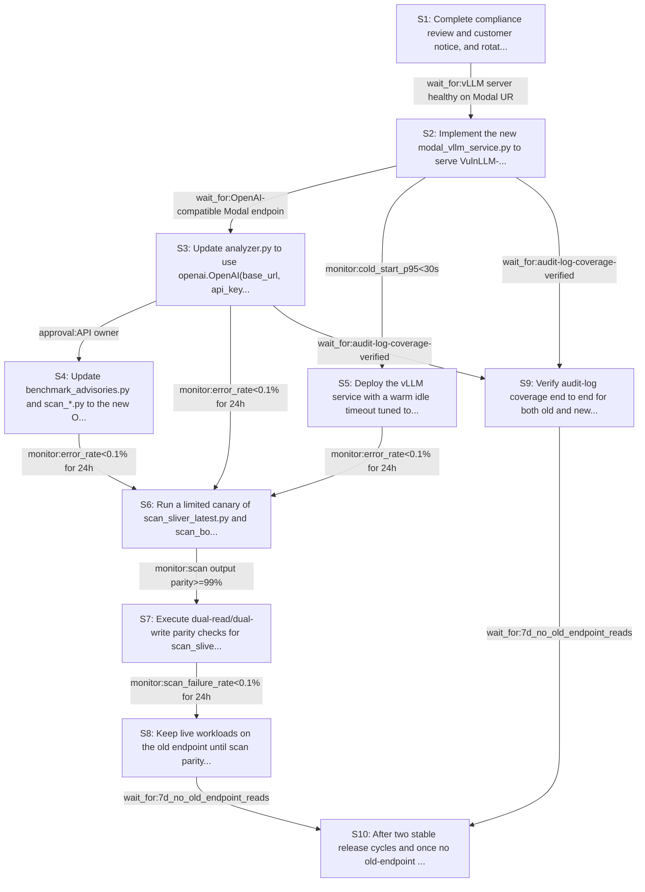

# Rollout Rehearsal — intent_vulnllm_modal_to_vllm

> Intent: fixtures/intent_vulnllm_modal_to_vllm.md · Stakeholders: 6 · Constraints: 21 · Steps: 10 · Model: gpt-5.4-mini

_Generated 2026-04-29T17:16:54Z_

## Summary

Roll out a Modal vLLM OpenAI-compatible analyzer with canarying, parity checks, warm-start tuning, and fast rollback while keeping scan outputs stable.

## Stakeholder constraints

| Owner | Axis | Summary | Gate | Rollback | Blocking |
|---|---|---|---|---|---|
| BackendOwner | api | Keep verdict JSON shape/backward compatibility for scan scripts | `wait_for:OpenAI-compatible Modal endpoint returns identical verdict fields` | redeploy_previous | Y |
| BackendOwner | deploy | Deploy vLLM service before switching analyzer to new base_url | `wait_for:vLLM server healthy on Modal URL` | redeploy_previous | Y |
| BackendOwner | deploy | Run dual-write/dual-read window via old endpoint until parity proven | `monitor:scan output parity>=99%` | point analyzer.py back to bespoke modal_service.py endpoint | Y |
| BackendOwner | api | Reject malformed vLLM responses instead of defaulting a verdict | `none` | redeploy_previous | Y |
| DataPlatform | data | Keep scan outputs stable across old and new model runs | `monitor:diff_rate<1%` | point analyzer back to the previous Modal endpoint and rerun scans from the last known-good checkpoint | Y |
| DataPlatform | data | Use bounded batch sizes to avoid IOPS spikes during backfill | `monitor:replication_lag<5s` | pause backfill jobs and resume with the last successful batch watermark | Y |
| DataPlatform | ops | Do not run schema-affecting DDL during business hours | `window:after-hours-only` | revert the migration by dropping the newly added columns/tables in a follow-up after-hours change | Y |
| DataPlatform | data | Drop legacy analyzer tables only after a quiet period | `wait_for:7d_no_old_endpoint_reads` | restore the dropped schema objects from backup or migration scripts | Y |
| SRE | deploy | Canary the new vLLM service before flipping scans over | `monitor:error_rate<0.1% for 24h` | Point analyzer back to the existing Modal endpoint | Y |
| SRE | deploy | Keep a fast rollback path via env-based service switch | `none` | Restore previous OPENAI_BASE_URL and LLM_MODEL_NAME values | Y |
| SRE | ops | Avoid cutover during incident windows or Friday afternoon | `window:Mon-Thu 09:00-16:00 local time, no active incident` | Pause rollout and leave traffic on the existing endpoint | Y |
| SRE | ops | Verify cold-start tuning keeps common scans off the idle path | `monitor:p95_startup_latency<35s over 24h` | Increase idle timeout or revert to prior endpoint behavior | Y |
| SRE | ops | Protect scan throughput after cutover with error-budget gating | `monitor:scan_failure_rate<0.1% for 24h` | Disable the new OpenAI client path and reroute to the old service | Y |
| Security | security | Rotate any embedded OpenAI/Modal credentials before cutover | `wait_for:secret-rotation-complete` | revoke new credentials and restore prior secret set | Y |
| Security | security | Preserve end-to-end audit logs for old and new request paths | `wait_for:audit-log-coverage-verified` | redeploy_previous | Y |
| Security | comms | Notify customers before any externally visible verdict behavior change | `window:customer_notice_before_cutover` | redeploy_previous | Y |
| Security | security | Complete compliance review of Modal-hosted model endpoint before rollout | `approval:compliance` | disable new Modal endpoint and restore bespoke service | Y |
| ConsumerSubsystem | api | Keep old /analyze semantics until scan scripts are migrated | `wait_for:scan_sliver_latest and scan_bottle parity checks` | revert analyzer.py to direct HTTP calls against modal_service.py | Y |
| ConsumerSubsystem | api | Ship OpenAI-client compatibility shim for existing env vars | `approval:API owner` | restore bespoke request builder and modal_service.py endpoint usage | Y |
| ConsumerSubsystem | deploy | Maintain dual support until vLLM endpoint proves stable in prod | `window:2 release cycles` | redeploy_previous | Y |
| ConsumerSubsystem | deploy | Do not cut over until a warm-start idle timeout is validated | `monitor:cold_start_p95<30s` | increase idle timeout and keep old endpoint active | n |

## Rollout plan

| # | Action | Owner | Depends on | Gate | Rollback | Watch |
|---|---|---|---|---|---|---|
| S1 | Complete compliance review and customer notice, and rotate any embedded OpenAI/Modal credentials before changing traffic paths. | Security | — | `approval:compliance` | Revoke new credentials and restore prior secret set; postpone rollout notice state. | Approval status, secret rotation completion, and customer notice acknowledgement. |
| S2 | Implement the new modal_vllm_service.py to serve VulnLLM-R-7B on A10G with OpenAI-compatible responses and preserve audit logging on request/error paths. | BackendOwner | S1 | `wait_for:vLLM server healthy on Modal URL` | Disable the new Modal endpoint and restore the bespoke service. | Modal app health, request success/error logs, and OpenAI-compatible response shape. |
| S3 | Update analyzer.py to use openai.OpenAI(base_url, api_key), keep env-based service selection for fast rollback, and reject malformed vLLM responses instead of defaulting verdicts. | BackendOwner | S2 | `wait_for:OpenAI-compatible Modal endpoint returns identical verdict fields` | Restore previous OPENAI_BASE_URL and LLM_MODEL_NAME values and redeploy the prior analyzer client path. | Verdict field presence/shape, explicit parse errors, and base_url/model selection from env. |
| S4 | Update benchmark_advisories.py and scan_*.py to the new OpenAI client shape while preserving JSON verdict compatibility for downstream consumers. | ConsumerSubsystem | S3 | `approval:API owner` | Restore bespoke request builder and modal_service.py endpoint usage. | Script output schema, client invocation success, and any drift in JSON fields. |
| S5 | Deploy the vLLM service with a warm idle timeout tuned to avoid common cold starts while staying within cost envelope. | SRE | S2 | `monitor:cold_start_p95<30s` | Increase idle timeout or revert to prior endpoint behavior. | p95 startup latency, GPU uptime/idle time, and Modal spend per scan. |
| S6 | Run a limited canary of scan_sliver_latest.py and scan_bottle.py against the new endpoint while keeping the old endpoint available for rollback. | SRE | S3, S4, S5 | `monitor:error_rate<0.1% for 24h` | Point analyzer back to the existing Modal endpoint. | Scan failure rate, request error rate, and endpoint health during canary. |
| S7 | Execute dual-read/dual-write parity checks for scan_sliver_latest.py and scan_bottle.py outputs, comparing old and new runs without changing live consumers. | DataPlatform | S6 | `monitor:scan output parity>=99%` | Point analyzer.py back to the bespoke modal_service.py endpoint and rerun from the last known-good checkpoint. | Per-file verdict diffs, parity percentage, and diff rate across the two scans. |
| S8 | Keep live workloads on the old endpoint until scan parity and stability gates are met, then switch scan_sliver_latest.py and scan_bottle.py fully to the new client path. | SRE | S7 | `monitor:scan_failure_rate<0.1% for 24h` | Disable the new OpenAI client path and reroute to the old service. | Production scan failure rate, error budget burn, and any verdict drift. |
| S9 | Verify audit-log coverage end to end for both old and new request paths, including malformed-response errors, and confirm no silent fallback behavior. | Security | S2, S3 | `wait_for:audit-log-coverage-verified` | Redeploy previous service/client versions. | Log completeness across client, service, and error paths. |
| S10 | After two stable release cycles and once no old-endpoint reads remain for 7 days, retire legacy analyzer tables or columns if any were added for comparison metadata. | DataPlatform | S8, S9 | `wait_for:7d_no_old_endpoint_reads` | Restore the dropped schema objects from backup or migration scripts. | Legacy read counts, quiet-period duration, and schema references. |

## Mermaid graph

## Conflicts (resolved by sequencer)

- between **BackendOwner, SRE**: One constraint wants a 24h error-rate canary before flipping scans, while another requires two release cycles of dual support and a 7-day no-old-endpoint-read quiet period before retiring legacy paths. We chose the more conservative path: canary first, then dual-support/stability gates, then retirement.
- between **BackendOwner, ConsumerSubsystem**: API migration wanted the analyzer switched to OpenAI-compatible calls, but scan scripts must keep old /analyze semantics until parity checks pass. We staged script migration after analyzer parity validation and retained rollback to the bespoke endpoint.
- between **DataPlatform, SRE**: Live workload stability and output parity had to be maintained while also validating cold-start behavior. We sequenced warm-start tuning and service canarying before parity comparisons and production cutover.

## Open questions for the human

- What exact Modal idle_timeout value should be used to balance the 30s cold start and the cost envelope?
- What base_url and api_key/env var mapping should be used for the OpenAI client in CI and production?
- How should 'identical verdict fields' be defined for tokenizer-driven drift: strict byte equality or normalized JSON equality?
- Are any database schema changes actually needed for migration/comparison metadata, or can this be completed without DDL?
