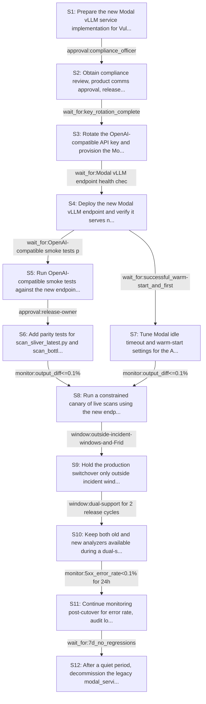

# Rollout Rehearsal — intent_vulnllm_modal_to_vllm

> Intent: fixtures/intent_vulnllm_modal_to_vllm.md · Stakeholders: 6 · Constraints: 24 · Steps: 12 · Model: gpt-5.4-mini

_Generated 2026-04-29T18:41:31Z_

## Summary

Roll out a Modal vLLM OpenAI-compatible analyzer with parity checks, guarded cutover, and rollback to the legacy service.

## Stakeholder constraints

| Owner | Axis | Summary | Gate | Rollback | Blocking |
|---|---|---|---|---|---|
| BackendOwner | api | Keep analyzer request/response contract backward-compatible | `none` | redeploy_previous | Y |
| BackendOwner | api | Accept OpenAI-style non-streaming chat/completions responses only | `none` | redeploy_previous | Y |
| BackendOwner | deploy | Deploy vLLM service before switching analyzer to new base_url | `wait_for:Modal vLLM endpoint health check succeeds` | redeploy_previous | Y |
| BackendOwner | deploy | Keep old and new analyzers available during cutover window | `window:until scan_sliver_latest.py and scan_bottle.py pass on new endpoint` | switch analyzer base_url back to legacy endpoint | Y |
| DataPlatform | data | Preserve analyzer verdict outputs during service cutover | `monitor:output_diff<=0.1%` | route analyzer back to the previous service and re-run affected scans | Y |
| DataPlatform | data | Do not drop legacy service artifacts until post-cutover quiet period | `wait_for:7d_no_regressions` | restore the legacy Modal service and its prior endpoint implementation | Y |
| DataPlatform | ops | Throttle any backfill or reprocessing to avoid IOPS spikes | `monitor:storage_iops<70%` | pause reprocessing and resume with smaller batch sizes | n |
| DataPlatform | data | Keep replication lag within budget during model-serving cutover | `monitor:replication_lag<5m` | switch traffic back to the prior replica/source and drain the new path | Y |
| SRE | deploy | Roll out behind a switchable base_url/model config | `none` | Repoint the analyzer to the previous Modal raw endpoint and redeploy_previous | Y |
| SRE | deploy | Do not cut over during incident windows or Friday afternoon | `window:outside-incident-windows-and-Friday-afternoon` | Keep traffic on the current raw Modal endpoint | Y |
| SRE | ops | Require stable error rate before shifting scan traffic | `monitor:5xx_error_rate<0.1% for 24h` | Disable the new endpoint via config and route scans back to the prior service | Y |
| SRE | ops | Verify cold-start behavior before enabling regular scans | `wait_for:successful_warm-start_and_first-request_latency_benchmark` | Increase idle timeout or revert to previous service settings | Y |
| Security | security | Rotate OpenAI-compatible API key before cutover | `wait_for:key_rotation_complete` | Revoke the new key and redeploy_previous | Y |
| Security | security | Preserve audit logs for old and new inference paths | `monitor:audit_log_coverage>=100%` | Disable the new endpoint and restore previous logging path | Y |
| Security | comms | Notify external users before any verdict-format or endpoint change | `window:at_least_7d_notice` | Postpone rollout and keep the existing endpoint active | Y |
| Security | security | Obtain compliance review for new hosted model endpoint | `approval:compliance_officer` | Block deployment and revert to the prior service | Y |
| ProductPM | comms | Notify scan-script users before any change to verdict shape | `approval:product_comms_owner` | redeploy_previous | Y |
| ProductPM | comms | Send rollout notice with lead time before breaking API cutover | `wait_for:customer_notice_sent_7d_prior` | redeploy_previous | Y |
| ProductPM | ops | Do not cut over during launch windows or major events | `window:outside_launch_windows_and_major_events` | redeploy_previous | Y |
| ProductPM | ops | Support team must be briefed with escalation owner on rollout day | `approval:support_lead` | redeploy_previous | Y |
| ConsumerSubsystem | api | Keep old /analyze contract until analyzer is migrated | `window:dual-support for 2 release cycles` | revert analyzer.py to direct HTTP calls against modal_service.py | Y |
| ConsumerSubsystem | api | Provide OpenAI-compatible shim for existing verdict mapping | `wait_for:OpenAI-compatible smoke tests passing` | restore bespoke modal_service.py endpoints | Y |
| ConsumerSubsystem | deploy | Add pre-cutover parity tests for scan_sliver_latest and bottle | `approval:release-owner` | redeploy_previous | Y |
| ConsumerSubsystem | deploy | Hold rollback path to previous Modal service if new API slips | `window:cutover after vLLM service is healthy in prod` | redeploy_previous | Y |

## Rollout plan

| # | Action | Owner | Depends on | Gate | Rollback | Watch |
|---|---|---|---|---|---|---|
| S1 | Prepare the new Modal vLLM service implementation for VulnLLM-R-7B on A10G, keeping the legacy modal_service.py intact. | BackendOwner | — | `none` | Delete the new service module changes and keep serving from modal_service.py. | Code review status, build/lint success, and confirmation that legacy endpoints remain deployed. |
| S2 | Obtain compliance review, product comms approval, release-owner approval, support-lead briefing, and customer notice lead time before any externally visible cutover. | Security | S1 | `approval:compliance_officer` | Block deployment and keep the legacy endpoint active until approvals are complete. | Approval records, notice sent timestamp, support briefing completion, and release-owner signoff. |
| S3 | Rotate the OpenAI-compatible API key and provision the Modal vLLM endpoint credentials for the new service. | Security | S2 | `wait_for:key_rotation_complete` | Revoke the new key and restore the prior credential set. | Key rotation completion, auth failures, and audit-log continuity. |
| S4 | Deploy the new Modal vLLM endpoint and verify it serves non-streaming OpenAI chat/completions responses for VulnLLM-R-7B. | BackendOwner | S3 | `wait_for:Modal vLLM endpoint health check succeeds` | Redeploy the previous Modal raw endpoint service. | Health check success, 5xx rate, response schema validity, and audit-log coverage. |
| S5 | Run OpenAI-compatible smoke tests against the new endpoint and validate verdict mapping for the existing analyzer contract. | ConsumerSubsystem | S4 | `wait_for:OpenAI-compatible smoke tests passing` | Restore bespoke modal_service.py endpoints and direct-call path. | Smoke-test pass rate, malformed-response errors, and verdict shape consistency. |
| S6 | Add parity tests for scan_sliver_latest.py and scan_bottle.py, then run them against the new client without switching production traffic. | ConsumerSubsystem | S5 | `approval:release-owner` | Redeploy_previous and keep the legacy client path for the scan scripts. | Output diffs, regression failures, and benchmark results. |
| S7 | Tune Modal idle timeout and warm-start settings for the A10G service, then benchmark cold-start and first-request latency. | SRE | S4 | `wait_for:successful_warm-start_and_first-request_latency_benchmark` | Increase idle timeout or revert to previous service settings. | Cold-start latency, warm-start success rate, first-request latency, and GPU availability. |
| S8 | Run a constrained canary of live scans using the new endpoint while keeping the legacy analyzer available for immediate fallback. | BackendOwner | S6, S7 | `monitor:output_diff<=0.1%` | Switch analyzer base_url back to the legacy endpoint and rerun affected scans. | scan_sliver_latest.py and scan_bottle.py diffs, 5xx rate, and malformed-response errors. |
| S9 | Hold the production switchover only outside incident windows, Friday afternoon, launch windows, and major events, then repoint analyzer.py to the Modal vLLM base_url behind config. | SRE | S8 | `window:outside-incident-windows-and-Friday-afternoon` | Disable the new endpoint via config and route scans back to the prior service. | Traffic split, error rate, latency, and rollback readiness. |
| S10 | Keep both old and new analyzers available during a dual-support cutover period and monitor live scans until the new endpoint is stable. | BackendOwner | S9 | `window:dual-support for 2 release cycles` | Switch analyzer base_url back to the legacy endpoint. | Production scan success, drift in verdict outputs, and client error logs. |
| S11 | Continue monitoring post-cutover for error rate, audit log coverage, replication lag, and output parity before retiring the legacy endpoint. | DataPlatform | S10 | `monitor:5xx_error_rate<0.1% for 24h` | Route analyzer back to the previous service and re-run affected scans. | 5xx rate, audit-log completeness, replication lag, storage IOPS, and output diffs. |
| S12 | After a quiet period, decommission the legacy modal_service.py endpoints and remove old endpoint artifacts once regressions have stayed clear. | DataPlatform | S11 | `wait_for:7d_no_regressions` | Restore the legacy Modal service and its prior endpoint implementation. | Regression reports, support tickets, and residual traffic to legacy endpoints. |

## Mermaid graph

## Conflicts (resolved by sequencer)

- between **BackendOwner, DataPlatform**: BackendOwner wants legacy and new analyzers available only until live scans pass on the new endpoint; DataPlatform requires keeping legacy service artifacts until 7 days of no regressions. Resolved by keeping dual support through the quiet period before decommissioning.
- between **BackendOwner, SRE**: BackendOwner's cutover sequence allows activation after health checks, while SRE forbids cutover during incident windows or Friday afternoon. Resolved by scheduling switchover only in approved windows.
- between **BackendOwner, Security**: BackendOwner wants deployment order driven by endpoint health, while Security requires API key rotation and compliance review before cutover. Resolved by gating deployment on compliance and key rotation first.
- between **BackendOwner, ProductPM**: BackendOwner's rollout can proceed once the service is healthy, but ProductPM requires 7-day customer notice, support briefing, and no launch-window cutover. Resolved by delaying production switchover until notices and briefings are complete.
- between **DataPlatform, SRE**: DataPlatform wants output preservation and replication-lag monitoring during cutover, while SRE wants stable error rate and warm-start benchmarking before regular scans. Resolved by making canary, warm-start, and post-cutover monitoring sequential gates.
- between **DataPlatform, Security**: DataPlatform requires audit-log coverage and quiet-period retention of old artifacts, while Security requires preserving audit logs across both paths and compliance review before hosting the new model. Resolved by preserving logs through the full migration and deferring artifact removal.
- between **DataPlatform, ProductPM**: DataPlatform's short canary/output-diff gate could move faster than ProductPM's 7-day notice and launch-window restrictions. Resolved by making external notice and rollout-window constraints precede cutover.
- between **DataPlatform, ConsumerSubsystem**: DataPlatform wants output parity preserved during live scans, while ConsumerSubsystem wants pre-cutover parity tests and OpenAI shim validation first. Resolved by running parity tests before any live traffic shift.
- between **SRE, Security**: SRE requires cold-start and error-rate validation before enabling regular scans, while Security requires key rotation and compliance review before cutover. Resolved by sequencing security prerequisites before service validation and traffic promotion.
- between **SRE, ProductPM**: SRE's rollout window excludes incidents and Friday afternoons, while ProductPM excludes launch windows and major events. Resolved by taking the intersection of all no-cutover windows.
- between **Security, ProductPM**: Security requires compliance review and audit-log preservation, while ProductPM requires notice, support briefing, and a 7-day lead time before externally visible changes. Resolved by treating all as mandatory pre-cutover gates.
- between **Security, ConsumerSubsystem**: Security wants preserved audit logs and compliant hosted model handling, while ConsumerSubsystem wants the OpenAI-compatible shim and smoke tests before migration. Resolved by validating compatibility before production switchover and retaining logs throughout.
- between **ProductPM, ConsumerSubsystem**: ProductPM requires advance notice before verdict-shape changes, while ConsumerSubsystem requires parity tests and dual support for two release cycles. Resolved by keeping dual support and notifying users before external behavior changes.

## Open questions for the human

- What exact OpenAI request schema should analyzer.py use for verdict extraction: chat.completions or responses-style compatibility only?
- What idle timeout value best balances cold-start avoidance with cost targets on A10G?
- Which notice channel and template will satisfy the 7-day customer notice requirement?
- Who owns the release-owner and support-lead approvals in practice?
- What is the final cutoff for considering output diffs 'close enough' if tokenizer changes slightly alter bytes?
