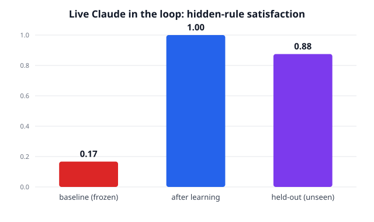
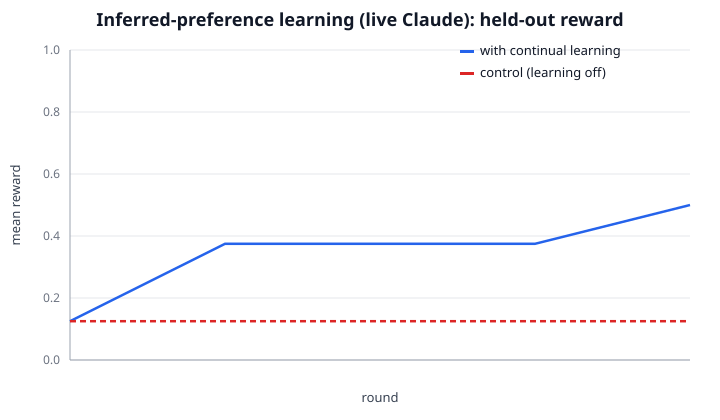
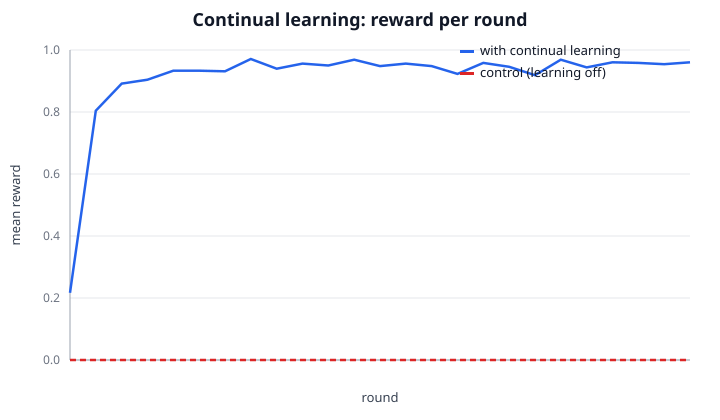

# Trajectory-CL — an open continual-learning engine

A working, **dependency-free** re-implementation of the core idea behind
[trajectory.ai](https://trajectory.ai/): a platform that makes a deployed AI
product **get smarter from being used** instead of staying frozen after training.

> trajectory.ai's thesis: *"The smartest thing we have ever built is the one that
> does not get smarter from being used."* Their core primitive is the **trajectory**
> = **trace** (what the agent did) + **telemetry** (how the user reacted — accepts,
> edits, corrections). Most stacks log the trace and throw the telemetry away. The
> telemetry is the learning signal. ([manifesto](https://trajectory.ai/field-notes/manifesto),
> [docs](https://docs.trajectory.ai/introduction))

This project rebuilds that loop end-to-end from public research, and — crucially —
ships a **reproducible experiment that proves the model measurably improves from
usage**, runnable offline with `python experiment.py`.

## The same four-stage loop trajectory.ai describes

| trajectory.ai stage | this engine | file |
|---|---|---|
| **Instrument** — capture signals from the product | `Recorder` SDK + typed `Trajectory` primitive | `sdk.py`, `schema.py` |
| **Understand** — mine patterns from real usage | edits → natural-language lessons + (chosen,rejected) pairs | `miner.py` |
| **Steer** — approve changes, full auditability | approval gate + append-only audit log | `governance.py` |
| **Learn** — improve continuously, deploy | retrieval memory (non-parametric) + DPO export (parametric) | `memory.py`, `learner.py`, `backends.py` |

```
 product usage                learning engine                       improved product
┌────────────┐   trajectory  ┌──────────┐  lessons  ┌──────────┐   ┌────────────────┐
│ agent acts │──(trace +     │  miner   │──────────▶│ approval │──▶│ retrieval memory│
│ user reacts│   telemetry)─▶│ understand│           │  gate    │   │  injected into  │
│ (edit/accept)              └──────────┘            │ (steer)  │   │  the next call  │
└────────────┘                                       └──────────┘   └────────┬───────┘
       ▲                                                                      │
       └──────────────── the model now applies what it learned ◀─────────────┘
```

## Three proofs

### 1. Live, with the real Claude model in the loop (`run_claude_real.py`)

The strongest proof: a **real LLM** driving the loop, scored by **code**. It shells
out to the `claude` CLI (`claude -p`, using the session's own auth — *no API key*),
so every draft is generated **live** by a fresh Claude instance that has never seen
the hidden rules. The user's preferences here are deliberately **idiosyncratic**
(things a strong model does *not* do by default — e.g. sign off with `Onwards,`,
add a `P.S.`, never use `[placeholder]` brackets, stay under 70 words), because
Claude's *defaults* are already good. That's exactly trajectory.ai's point: a frozen
model with great defaults still doesn't match *this* user until it learns from usage.

Measured live (fraction of the user's hidden rules satisfied, scored mechanically):

| Phase | Mean reward |
|---|---|
| Baseline — frozen Claude, no lessons | **0.17** |
| After learning from the user's edits | **1.00** |
| Held-out, never-seen tasks | **0.88** |



Real before/after, verbatim from the run (`artifacts/real-llm/claude-run.md`):

```
BASELINE (0/4):  "Hi [Client Name], ... Best regards, [Your Name]"   (placeholders, wrong signoff, no P.S., too long)
AFTER  (4/4):    "Hi Sarah, ... Onwards, Giuseppe   P.S. Happy to jump on a call!"
```

```bash
python run_claude_real.py          # ~14 live claude -p calls, no key needed
# or, against the Claude API with a key (fully uncontaminated, fresh instance):
export ANTHROPIC_API_KEY=...; python experiment_real.py
```

In proof #1 the code oracle hands the engine the exact violated rules. That tests
the *retrieval + apply* mechanism with a clean signal — and it works perfectly
(1.00). Proof #2 makes it harder and more honest.

### 2. Live + the engine must INFER the preferences itself (`run_inferred_real.py`)

Here the engine is **never told the rules**. It sees only how the user edited a
draft (before → after) and an LLM **infers the latent preference from the diff**
(`llm_miner.py`), CIPHER-style: after each edit it re-infers a context's
preferences from *all* of that context's edits, so recurring preferences stand out
and one-off noise washes out. Inferred lessons then steer future drafts; the code
oracle scores held-out tasks.

| Held-out reward | value |
|---|---|
| Baseline (frozen Claude) | **0.12** |
| After inferring preferences from edits | **0.50** |



A **+0.38 gain driven entirely by preferences the engine discovered on its own.**
From the diff alone it correctly recovered, in its own words, things like *"sign off
with 'Onwards, Giuseppe', never 'Best regards'"*, *"use concrete details instead of
placeholders"*, and *"put one emoji at the end of the line"* (full side-by-side of
true-vs-inferred rules in `artifacts/real-llm/inferred-run.md`).

**Honest finding:** inference is lossy. It reliably recovers visible preferences
(sign-off, placeholders, emoji) but misses ones that are hard to see in a couple of
edits (a specific `@oncall` mention, a hard <70-word limit) or that it hedges into
optional ("add a P.S. *when appropriate*" → sometimes skipped). That gap between
**1.00 with a clean signal (#1)** and **0.50 from self-inference (#2)** is the real,
quantified cost of learning from raw usage — exactly the problem trajectory.ai's
infrastructure exists to chip away at.

```bash
python run_inferred_real.py        # ~26 live claude -p calls, no key needed
```

### 3. Offline, zero-dependency, deterministic (`experiment.py`)

```bash
python experiment.py     # controlled A/B over 8 seeds, writes artifacts/
python tests.py          # 11 sanity/regression checks
python demo_sdk.py       # readable end-to-end walkthrough on one domain
```

`experiment.py` runs a clean **A/B with a control group** in a testbed with
*hidden* per-domain user preferences the model does not know (the setup from
[PRELUDE/CIPHER, Gao et al. 2024](https://arxiv.org/abs/2404.15269)):

- **Treatment** — the full engine: act with retrieved lessons, then learn from telemetry.
- **Control** — the *identical* model, but frozen (no retrieval, no learning).

Both arms see the same task stream. Measured result (averaged over 8 seeds, in
[`artifacts/`](artifacts/)):

| Metric | Control (frozen) | Treatment (continual learning) |
|---|---|---|
| Reward, round 1 | 0.000 | 0.217 |
| Reward, final round | **0.000** | **0.960** |
| Held-out (unseen) queries | 0.000 | 0.915 |

**+0.96 reward** over the frozen control, and **0.915 on queries it never saw in
training** — so it learned transferable preferences, not memorized strings.



### Why the proof is honest, not rigged

The policy backend (`MockLLM`) has **no built-in knowledge** of the hidden
preferences. Its *only* way to satisfy them is to follow lessons handed to it in
context — and those lessons exist *only* if the engine mined them from user edits.
So every point of improvement is causally produced by the learning loop. The
control arm proves the baseline never moves on its own; the held-out test proves
it generalizes. The whole thing is deterministic and seeded, so anyone can
reproduce the exact numbers.

## Two ways "Learn" turns signal into improvement

1. **Non-parametric (default, no GPU):** approved lessons enter a retrieval
   memory and are injected into the model's context at inference time. Works with
   any closed model. Grounded in [ExpeL](https://arxiv.org/abs/2308.10144) and
   [Voyager](https://arxiv.org/abs/2305.16291).
2. **Parametric (export path):** the same edits become `(chosen, rejected)` pairs
   exported to `artifacts/preferences.dpo.jsonl`, ready for offline
   [DPO](https://arxiv.org/abs/2305.18290) fine-tuning — how the signal becomes
   weight updates.

## Run against a real LLM

Three real backends are included; the loop is identical, lessons go in the system prompt:

```bash
# A) Claude via the local CLI — no API key (uses the session's own auth):
python run_claude_real.py

# B) Claude API:
export ANTHROPIC_API_KEY=...; python experiment_real.py

# C) Any OpenAI-compatible endpoint:
export OPENAI_API_KEY=...;   python experiment_real.py --backend openai --model gpt-4o-mini
```

## Research foundations

Every design choice is backed by a stored paper. See
[`papers/RESEARCH.md`](papers/RESEARCH.md) for the annotated bibliography — the
PDFs themselves are checked in under [`papers/`](papers/) (continual-learning
survey, PRELUDE/CIPHER, ExpeL, Reflexion, Self-Refine, Voyager, DPO, InstructGPT,
Deep RL from Human Preferences).

## Files

| File | Purpose |
|---|---|
| `schema.py` | The `Trajectory` primitive (trace + telemetry) and JSONL store |
| `sdk.py` | `Recorder` — instrument a product, capture trajectories + telemetry |
| `miner.py` | Mine edits into lessons and (chosen,rejected) preference pairs (structural) |
| `llm_miner.py` | **LLM-based** preference inference from edit diffs + aggregation + consolidation |
| `governance.py` | Approval gate + append-only audit log (steer + auditability) |
| `memory.py` | Retrieval memory of learned lessons (non-parametric learning) |
| `backends.py` | `MockLLM` (offline) + real backends: `ClaudeCLIBackend`, `AnthropicLLM`, `OpenAILLM` |
| `learner.py` | The ingest → mine → govern → learn → retrieve orchestrator |
| `environment.py` | Offline testbed with hidden preferences + user-edit oracle |
| `text_rules.py` | Objective, code-checkable rules over **real text** (the live oracle) |
| `experiment.py` | The offline controlled proof; writes `artifacts/` |
| `run_claude_real.py` | **Live proof #1** — real Claude in the loop via `claude -p` (oracle-fed lessons) |
| `run_inferred_real.py` | **Live proof #2** — real Claude; engine must infer the rules itself |
| `experiment_real.py` | Same loop against the Claude/OpenAI API (needs a key) |
| `tests.py` / `demo_sdk.py` | Regression checks / readable walkthrough |
| `papers/` | Stored research PDFs + `RESEARCH.md` bibliography |

## Limitations (honest scope)

- The **live** proof (`run_claude_real.py`) uses a real model but a *simulated*
  user: the oracle is the code rule-checker, so the "edits" are programmatic. The
  user signal in a real product is noisier and is inferred by an LLM, not regexes.
- The held-out live score is 0.88, not 1.0 — real models slip (e.g. one draft ran
  a few words over the length limit). That's reported as-is, not hidden.
- The offline proof (`experiment.py`) trades the real model for a deterministic
  one so the exact numbers reproduce with zero installs; it isolates the learning
  *mechanism* from model variance.
- This is a playground experiment, not the trajectory.ai product — no weight
  hosting, no managed infra. It reproduces the *idea* and proves it works.
