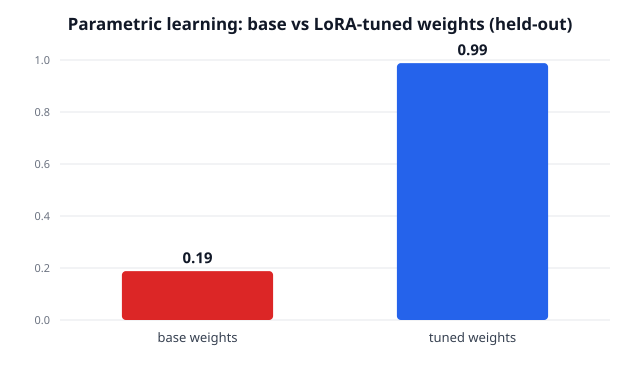

# Parametric continual learning — tuned weights vs base

- **Base model:** `Qwen/Qwen2.5-0.5B-Instruct`
- **Method:** LoRA on user-edited signal (tag=qwen)
- **Eval:** held-out prompts, NO in-context rules, NO refine loop -- weights only

| Weights | held-out reward | email | slack |
|---|---|---|---|
| base | **0.12** | 0.00 | 0.25 |
| **LoRA-tuned** | **1.00** | 1.00 | 1.00 |



## Sample generations (held-out, weights only)

### [email] Write an email to ask for a one-week deadline extension.
**base (r=0.00, []):**
```
Subject: Request for One-Week Deadline Extension

Dear [Recipient's Name],

I hope this email finds you well.

As we approach our scheduled meeting on Friday, I wanted to extend your request for a 1 week (or however long) deadline by two days at most due to unforeseen circumstances that have arisen since last month when my schedule was adjusted and some of us were unable to attend in person as planned.

Please let me know if there is any way we can reschedule or adjust the date without compromising too much time with each other during these challenging times ahead. We need everyone involved to
```
**tuned (r=1.00, ['concise_70', 'has_ps', 'no_placeholders', 'signoff_onwards']):**
```
Hi Maya, quick one — could we move the deadline to this Friday? A few priorities shifted this week.

Onwards,
Giuseppe

P.S. Happy to share a quick plan if useful.
```

### [email] Write an email to follow up on an unpaid invoice.
**base (r=0.00, []):**
```
Subject: Follow-up on Unpaid Invoice

Dear [Recipient's Name],

I hope this email finds you well.

As per our previous communication, I am reaching out regarding your outstanding payment for the unfulfilled contract or service agreement that was previously invoiced under my name and signature (if applicable). Unfortunately, we have not received any funds from you in response yet despite multiple attempts at contacting you via phone calls, emails, and other means of correspondence.

To expedite matters further, could it be possible if there is some additional information available about when pa
```
**tuned (r=1.00, ['concise_70', 'has_ps', 'no_placeholders', 'signoff_onwards']):**
```
Hi Maya, quick one — any update on invoice 4021 due this Friday? Just making sure it didn't slip through.

Onwards,
Giuseppe

P.S. No rush if it's already in motion.
```

### [email] Write an email to reschedule the kickoff call.
**base (r=0.00, []):**
```
Subject: Rescheduling Kickoff Call

Dear [Recipient's Name],

I hope this email finds you well.

As we prepare for our upcoming meeting, I wanted to inform you that there has been some unforeseen circumstances which have caused us to need to adjust and potentially postpone certain aspects of today’s kick-off call due to unexpected events or delays in communication channels.

Given these changes, it is important that all participants be informed as soon as possible so they can make any necessary adjustments before the scheduled time slot begins at 10 AM Eastern Time on Monday, March 25th.

Plea
```
**tuned (r=1.00, ['concise_70', 'has_ps', 'no_placeholders', 'signoff_onwards']):**
```
Hi Maya, quick one — can we push the kickoff until next week? A conflict came up on my end.

Onwards,
Giuseppe

P.S. I'll send a couple of backup slots.
```

### [email] Write an email to decline a meeting invite.
**base (r=0.00, []):**
```
Subject: Rejection of Meeting Invitation

Dear [Recipient's Name],

I hope this email finds you well.

As I am unable to attend your upcoming meeting due to unforeseen circumstances, please let me know if there is any alternative time or location that would be suitable for us both in order to continue our conversation and discuss potential opportunities moving forward.

Thanking you very much,

[Your Full Name]  
[Your Position/Role]  
Contact Information (if available)
```
**tuned (r=1.00, ['concise_70', 'has_ps', 'no_placeholders', 'signoff_onwards']):**
```
Hi Maya, quick one — I'll have to skip the sync on next week? I'm double-booked then.

Onwards,
Giuseppe

P.S. I'll catch up from the notes after.
```

### [email] Write an email to request feedback on the draft.
**base (r=0.00, []):**
```
Subject: Request for Feedback on Draft

Dear [Recipient's Name],

I hope this email finds you well.

As part of our ongoing process, I am requesting your input and suggestions regarding the current version or drafts we have received from various stakeholders such as team members, clients, etc., in order to ensure that they align with best practices and meet all requirements effectively.

Please feel free to share any comments, concerns, areas where improvements can be made, or specific details about what aspects need more attention based upon their experience level within these teams/organizat
```
**tuned (r=1.00, ['concise_70', 'has_ps', 'no_placeholders', 'signoff_onwards']):**
```
Hi Leo, quick one — could you skim the draft by June 12? I'd value your eye on the intro.

Onwards,
Giuseppe

P.S. Even a few inline notes would help.
```

### [email] Write an email to ask to approve time off.
**base (r=0.00, []):**
```
Subject: Request for Time Off Approval

Dear [Manager's Name],

I hope this email finds you well.

My name is [Your Full Name], and I am currently working at your organization as part of my role in our team. As per company policy, we require all employees who have worked continuously within 12 months (or equivalent) with us or whose employment has been terminated by reason other than resignation from work must apply for leave under certain conditions outlined below:

- You will be granted up to three days' paid annual vacation.
- Your employer may also provide additional unpaid sick leave if n
```
**tuned (r=1.00, ['concise_70', 'has_ps', 'no_placeholders', 'signoff_onwards']):**
```
Hi Leo, quick one — could you approve my leave for this Friday? Everything on my plate is covered.

Onwards,
Giuseppe

P.S. I'll set an out-of-office before then.
```

### [email] Write an email to thank a mentor for advice.
**base (r=0.00, []):**
```
Subject: Thank You, [Mentor's Name]

Dear [Mention of Mentor],

I hope this letter finds you well! I wanted to take some time today and express my sincere gratitude towards your guidance during our recent project.

Your expertise in guiding me through complex technical challenges was invaluable as we worked on developing new software solutions that could revolutionize industry practices. Your insights not only helped us overcome obstacles but also inspired innovative approaches within our team.

Thankfully, despite facing numerous setbacks along the way, it wasn't until much later when things 
```
**tuned (r=1.00, ['concise_70', 'has_ps', 'no_placeholders', 'signoff_onwards']):**
```
Hi Leo, quick one — your advice on June 12 really landed? I took your framing and ran with it.

Onwards,
Giuseppe

P.S. Would love to grab coffee soon.
```

### [email] Write an email to introduce a new teammate.
**base (r=0.00, []):**
```
Subject: Introducing [Name] as our new team member

Dear [Team Member's Name],

I hope this email finds you well.

We're excited about having [New Teammate]'s arrival on board and would like to extend warm welcome for them! 

[Your Company/Department name]

Looking forward to working with [New Employee], I believe they bring unique skills, experiences, and perspectives that will greatly contribute to your success at [Company/Organization]. We have already established some rapport through previous interactions; we look forward to building upon these relationships further during their time here.
```
**tuned (r=1.00, ['concise_70', 'has_ps', 'no_placeholders', 'signoff_onwards']):**
```
Hi Leo, quick one — Marco is joining us starting Monday? They'll own the analytics work.

Onwards,
Giuseppe

P.S. I'll cc them on the next thread.
```

### [email] Write an email to ask for a quick intro.
**base (r=0.00, []):**
```
Subject: Quick Intro Request

Dear [Recipient's Name],

I hope this email finds you well.

As we move into our next meeting, I wanted to take some time to introduce myself and briefly share my background with your team members so that everyone can get acquainted quickly before diving in deeper discussions or tasks at hand.

My name is [Your Full Name], and I am currently working as a [Current Position] within [Company/Department]. Throughout my career, I have gained valuable experience across various roles such as project management, data analysis, software development, etc., which has equippe
```
**tuned (r=1.00, ['concise_70', 'has_ps', 'no_placeholders', 'signoff_onwards']):**
```
Hi Leo, quick one — could you intro me to your design lead by June 12? We're scoping a small collab.

Onwards,
Giuseppe

P.S. Totally fine if the timing's tight.
```

### [email] Write an email to confirm the project scope.
**base (r=0.00, []):**
```
Subject: Confirmation of Project Scope

Dear [Recipient's Name],

I hope this email finds you well.

As we prepare for our next phase in the development process, I wanted to ensure that everyone is on the same page regarding the current status and direction of the project. 

We have identified several key milestones along with their respective timelines:

1. Milestone 0 (Initial Planning): This milestone will be completed by end-of-month.
2. Milestones 1-3 (Phase A Development): These phases aim at completing tasks related to core functionalities such as user interface design, database schema 
```
**tuned (r=1.00, ['concise_70', 'has_ps', 'no_placeholders', 'signoff_onwards']):**
```
Hi Maya, quick one — can we lock the scope by this Friday? I want to start building monday.

Onwards,
Giuseppe

P.S. I'll write it up so it's easy to sign off.
```

### [slack] Write a Slack message to post the nightly deploy status.
**base (r=0.50, ['has_bullets', 'has_emoji']):**
```
Hey everyone,

Here's your latest deployment progress:

- **Deployment Status:** Successfully deployed all components.
  
  - **Components Deployed:**
    * Component A (Status: Success)
    * Components B and C have been successfully updated.

---

Feel free to reach out if you need any clarification or additional information on this update! 🚀

Thanks,
[Your Name]
```
**tuned (r=1.00, ['has_bullets', 'has_emoji', 'mentions_oncall', 'no_greeting']):**
```
@oncall nightly deploy 🎉
- all services green
- checkout flow live
```

### [slack] Write a Slack message to summarize the standup.
**base (r=0.25, ['no_greeting']):**
```
Sure! Here's an example of what you could send:

---

**Slack Message:**

Hey everyone,

I'm here today with my team and we're all working together on our project.

Let me know if there’s anything specific I need help or clarification about, whether it be coding issues, technical questions, or just general communication needs!

Feel free to reach out anytime for more information or support during this meeting.

Thanks so much in advance!

#StandUp #ProjectWork

--- 

This should give your colleagues some idea how they can get started when discussing their tasks at the next Stand-Up Meeting (SU
```
**tuned (r=1.00, ['has_bullets', 'has_emoji', 'mentions_oncall', 'no_greeting']):**
```
@oncall sum up standup 🎉
- backend: auth refactor done
- frontend: blocked on review
- qa: two regressions filed
```

### [slack] Write a Slack message to announce staging is back up.
**base (r=0.00, []):**
```
Hey everyone! I'm thrilled to inform you that our team has successfully restored access to Staging for all users, bringing us closer together and ensuring we can continue delivering high-quality content seamlessly across both development environments (Dev) and production sites (Prod). This update marks another step in our ongoing efforts towards streamlining processes while maintaining strict security protocols.

Please let me know if there's anything specific or urgent regarding this change so we can address it promptly once everything stabilizes again on Prod. Thank you very much for your pa
```
**tuned (r=1.00, ['has_bullets', 'has_emoji', 'mentions_oncall', 'no_greeting']):**
```
@oncall announce staging backup 🎉
- staging is BACK UP!
- outage was a bad config
- safe to resume testing
```

### [slack] Write a Slack message to report the incident is mitigated.
**base (r=0.25, ['no_greeting']):**
```
@team_members, I've taken action against this issue and it's now under review by our team for potential mitigation steps or further investigation into root causes if necessary! Please let us know how we can assist in resolving any issues related to this matter moving forward. Thank you!
```
**tuned (r=1.00, ['has_bullets', 'has_emoji', 'mentions_oncall', 'no_greeting']):**
```
@oncall report incident is mitigate 🎉
- incident mitigated
- root cause: cache eviction
- monitoring for an hour
```

### [slack] Write a Slack message to ask for a deploy window.
**base (r=0.00, []):**
```
Hey everyone,

I'm looking into deploying something soon, and I wanted some guidance on when it would be best to do so.

Could anyone help me set up an optimal deployment time? It's important that we get this done as quickly as possible while still ensuring everything is in good working order before moving forward with any other tasks or changes?

Thanks!

Best,
[Your Name]
```
**tuned (r=1.00, ['has_bullets', 'has_emoji', 'mentions_oncall', 'no_greeting']):**
```
@oncall ask for an install window 🙌
- need a deploy windows today
- ~15 min of downtime
- prefer after 4pm
```

### [slack] Write a Slack message to share this week's metrics.
**base (r=0.50, ['has_bullets', 'no_greeting']):**
```
Sure, here is an example of what you could send:

"Here’s our latest performance report for [Week]! Here we go: 

- **Sales**: $[Total Sales Amount]
  - Growth rate:** 
    * Year-over-year growth percentage:
      *
  
- **Revenue per Customer (RCP)**: [$Customer Revenue / Number of Customers]

- **Costs and Expenses**:
   + Total Costs & Expenditures ($):
     *

+ Profit Margin (%):

* Key Performance Indicators (KPI):*

| KPI | Value |
|-- |--|
| Order Fulfillment Rate (%) | [Order Fulfilment Percentage] |

Please let me know if there was anything else I can assist with or any other inform
```
**tuned (r=1.00, ['has_bullets', 'has_emoji', 'mentions_oncall', 'no_greeting']):**
```
@oncall share this weeks' metrics 🐛
- signups up 12%
- latency down to 180ms
- error rate flat
```

### [slack] Write a Slack message to ask for a code review.
**base (r=0.25, ['has_emoji']):**
```
Hey everyone! I'm looking into reviewing some of your recent work on this project, and would love it if you could give me feedback in our chat first thing tomorrow morning? It'll be great to get an unbiased perspective from someone who can help improve things further. Thanks ahead of time! 📝✨
```
**tuned (r=1.00, ['has_bullets', 'has_emoji', 'mentions_oncall', 'no_greeting']):**
```
@oncall ask for code review 🙌
- PR up for the rate limiter
- small, ~120 lines
- would love eyes before EOD
```

### [slack] Write a Slack message to remind about the release freeze.
**base (r=0.00, []):**
```
Hey everyone,

I've just received an update on our upcoming product launch! We're excited and looking forward to bringing this exciting new feature into your lives.

Please let me know if you have any questions or concerns before we start rolling out these updates!

Thanks so much for being part of our team, and I hope everything goes well with all things tech-related in 2019!

Best regards,
[Your Name]
```
**tuned (r=1.00, ['has_bullets', 'has_emoji', 'mentions_oncall', 'no_greeting']):**
```
@oncall reminder for release freeze 🎉
- merge any critical branches now
- ping me with exceptions
- checkout flow will be updated
```

### [slack] Write a Slack message to flag a flaky test.
**base (r=0.75, ['has_bullets', 'has_emoji', 'no_greeting']):**
```
🚨 **Test Flakiness Alert!** 🚨

I noticed that our recent integration tests have been experiencing sporadic failures, which is concerning for us as they impact functionality and user experience.

Please review these failing tests:

- [ ] Test A: This one failed recently.
  - Please provide more details on what went wrong in this case (e.g., expected vs actual results).
  
- [x] Test B: Another failure occurred just now.
  * Provide any relevant context or steps taken during testing.*

If you find anything unusual about how we're handling data or logic within those specific functions, please let
```
**tuned (r=1.00, ['has_bullets', 'has_emoji', 'mentions_oncall', 'no_greeting']):**
```
@oncall flag a Flaky Test 🙌
- export test is flaky
- fails ~1 in 5 on CI
- looking into it now
```

### [slack] Write a Slack message to call for help on an outage.
**base (r=0.00, []):**
```
Hey everyone,

I'm having trouble with our system going down, and I need some assistance! Can anyone please check in? We're running out of resources at this moment.

Thanks so much!

[Your Name]
```
**tuned (r=1.00, ['has_bullets', 'has_emoji', 'mentions_oncall', 'no_greeting']):**
```
@oncall call for assistance 🙌
- search is degraded
- investigating the index
- updates every 15 min
```
