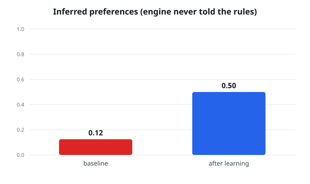

# Live proof — preferences INFERRED from edits (not given)

- **Policy:** live Claude via `claude -p` (no API key)
- **Method:** CIPHER-style aggregation: re-infer from all of a context's edits
- **Preference source:** INFERRED by LLM from edit diffs (engine never sees the rules)
- **Scorer:** objective rule-checker (text_rules.py)

The engine was **never shown the rule list**. It inferred preferences purely from how the user edited drafts. Held-out reward **0.12 → 0.50**.




## True hidden rules vs. what the engine inferred

### `email`
**True hidden rules (user's, never shown to the engine):**
- do not use bracketed placeholders like [Name] or [Your Name]; use concrete, plausible details instead
- sign off with exactly 'Onwards,' (not 'Best regards' or 'Sincerely')
- end the email with a 'P.S.' line
- keep the whole email under 70 words

**Engine inferred from edits:**
- Use "Onwards," as the sign-off (not "Best regards" or similar)
- Start subject lines with "Quick" for routine asks or follow-ups
- Include specific details (dates, invoice numbers, amounts) rather than placeholders or vague references
- End every email with a friendly P.S. offering an alternative or a light next step
- Cut filler phrases ("we truly appreciate your flexibility," "at your earliest convenience," "I'm reaching out to"); get to the point immediately after the greeting
- Keep the body to 2–3 short paragraphs maximum; one clear ask per email

### `slack`
**True hidden rules (user's, never shown to the engine):**
- format the update as a bulleted list (lines starting with '-')
- include at least one emoji
- do not open with a greeting like 'Hi' or 'Hey team'; jump straight to the point
- mention '@oncall' so the on-call engineer is notified

**Engine inferred from edits:**
- Use plain `-` bullets, not `•`
- Remove bold formatting markers entirely
- Format dates as YYYY-MM-DD
- Place emoji only at the end of a line, never inline in content
- Write flowing prose sentences in bullets instead of labeled template fields
- Trim option lists to the fewest essential items, no redundant synonyms

## Training transcript (before → user edit → inferred-so-far)

### example 1 — [email] ask a client for a one-week deadline extension
*held-out reward after this example: 0.38*

**BEFORE (policy draft, no knowledge):**
```
Subject: Request for One-Week Extension

Hi [Client Name],

I hope you're doing well. I'm reaching out to kindly request a one-week extension on the current deadline for [project/deliverable name].

We want to ensure the final result meets the high standard you expect, and a brief extension would allow us to address [reason, e.g., a few remaining details / unexpected complexity / additional review]. We remain fully committed to the project and are confident this short additional time will make a meaningful difference in the quality of what we deliver.

The revised deadline would be [new date]. Please let me know if this works for you, or if you'd like to discuss further.

Thank you for your understanding — we truly appreciate your flexibility.

Best regards,
[Your Name]
```
**AFTER (user's edit):**
```
Subject: Quick Request: One-Week Extension

Hi Sarah,

I hope you're doing well. I wanted to reach out to ask if we could push the deadline back by one week, to June 12. A few unexpected priorities came up on our end, and I want to make sure we deliver something we're both proud of.

Please let me know if that works for you.

Onwards,
Giuseppe

P.S. Happy to jump on a quick call if it's easier to discuss!
```
**Inferred preferences for `email` so far:**
> - Use a casual, direct tone — drop corporate phrases like "kindly request," "we remain fully committed," and "make a meaningful difference."
> - Keep the body to one short paragraph; cut any sentence that doesn't add new information
> - Use the recipient's first name in the greeting, never a placeholder
> - Sign off with "Onwards, Giuseppe" — never "Best regards" or a formal closing
> - State specific details (real dates, real reasons) instead of vague placeholders
> - Add a friendly P.S. as a soft, low-pressure closer when appropriate

### example 2 — [slack] post the nightly deploy status to the team
*held-out reward after this example: 0.38*

**BEFORE (policy draft, no knowledge):**
```
🚀 *Nightly Deploy Status* — June 5, 2026

*Status:* ✅ Success
*Deployed at:* 02:14 UTC
*Environment:* Production
*Branch:* `main` @ `a3f92b1`

*What went out:*
• [List key changes or PRs here]

*Health checks:* All passing
*Rollback available:* Yes

cc @oncall — let me know if anything looks off.
```
**AFTER (user's edit):**
```
Nightly deploy status for 2026-06-05 🚀

- Deploy kicked off at 00:00 UTC and completed successfully
- All services restarted and passed health checks
- No rollbacks triggered; error rates nominal post-deploy
- @oncall please monitor dashboards for the next 30 minutes and roll back if anything spikes
```
**Inferred preferences for `slack` so far:**
> - Use `-` bullets with full prose sentences, not labeled fields or `•` bullets
> - Put emoji at the end of a line, not the start; use at most one per message
> - No bold or backtick formatting
> - Lead with a plain title line that includes the date in YYYY-MM-DD format
> - End with a direct `@mention` action item, not a soft "let me know"
> - Keep the structure flat — no sections, headers, or sub-groupings

### example 3 — [email] follow up on an unpaid invoice
*held-out reward after this example: 0.38*

**BEFORE (policy draft, no knowledge):**
```
Subject: Follow-Up: Unpaid Invoice

Hi [Name],

I hope you're doing well. I wanted to follow up on an outstanding invoice that appears to still be unpaid.

Could you please let me know if there are any issues or if you need me to resend the invoice details? I'm happy to assist if anything needs clarification on our end.

Please feel free to reach out if you have any questions. I'd appreciate it if this could be settled at your earliest convenience.

Thank you for your attention to this matter.

Best regards,
Giuseppe Massaro
giuse.massaro@gmail.com
```
**AFTER (user's edit):**
```
Subject: Quick Follow-Up on Outstanding Invoice

Hi,

I wanted to check in on invoice #1042, sent on May 22nd for $1,850. It appears payment hasn't come through yet — could you let me know if everything looks good on your end?

Happy to resend the invoice if needed.

Onwards,
Giuseppe Massaro
giuse.massaro@gmail.com

P.S. If there's a better contact for billing, just point me their way!
```
**Inferred preferences for `email` so far:**
> - Use "Onwards," as the sign-off (not "Best regards" or similar)
> - Start subject lines with "Quick" for routine asks or follow-ups
> - Include specific details (dates, invoice numbers, amounts) rather than placeholders or vague references
> - End every email with a friendly P.S. offering an alternative or a light next step
> - Cut filler phrases ("we truly appreciate your flexibility," "at your earliest convenience," "I'm reaching out to"); get to the point immediately after the greeting
> - Keep the body to 2–3 short paragraphs maximum; one clear ask per email

### example 4 — [slack] summarize today's standup
*held-out reward after this example: 0.50*

**BEFORE (policy draft, no knowledge):**
```
I don't have the content of today's standup to summarize. Could you share the notes, transcript, or key points from the meeting?
```
**AFTER (user's edit):**
```
I don't have the content from today's standup to summarize. Could you share the key points or notes from the meeting?
```
**Inferred preferences for `slack` so far:**
> - Use plain `-` bullets, not `•`
> - Remove bold formatting markers entirely
> - Format dates as YYYY-MM-DD
> - Place emoji only at the end of a line, never inline in content
> - Write flowing prose sentences in bullets instead of labeled template fields
> - Trim option lists to the fewest essential items, no redundant synonyms
