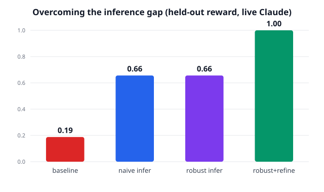

# Overcoming the inference gap — live Claude ablation

- **Policy:** live Claude via `claude -p` (no API key)
- **Scorer:** objective rule-checker (text_rules.py)

Each row adds one research-grounded technique. The engine is never told the rules; it infers them from edits.

| Condition | Held-out reward | Technique added |
|---|---|---|
| baseline | **0.19** | — (frozen model) |
| naive infer | **0.66** | single aggregate inference |
| robust infer | **0.66** | + decomposed analysis & self-consistency voting |
| robust+refine | **1.00** | + critique→refine at apply time |

## What each condition produced (held-out, per domain)

### baseline — reward 0.19
- `email` reward 0.00 — satisfied []
- `email` reward 0.25 — satisfied ['concise_70']
- `email` reward 0.25 — satisfied ['no_placeholders']
- `email` reward 0.00 — satisfied []
- `slack` reward 0.25 — satisfied ['no_greeting']
- `slack` reward 0.25 — satisfied ['no_greeting']
- `slack` reward 0.00 — satisfied []
- `slack` reward 0.50 — satisfied ['has_bullets', 'has_emoji']

### naive infer — reward 0.66
- `email` reward 0.50 — satisfied ['concise_70', 'no_placeholders']
- `email` reward 0.50 — satisfied ['concise_70', 'no_placeholders']
- `email` reward 0.50 — satisfied ['concise_70', 'no_placeholders']
- `email` reward 0.50 — satisfied ['has_ps', 'signoff_onwards']
- `slack` reward 1.00 — satisfied ['has_bullets', 'has_emoji', 'mentions_oncall', 'no_greeting']
- `slack` reward 1.00 — satisfied ['has_bullets', 'has_emoji', 'mentions_oncall', 'no_greeting']
- `slack` reward 1.00 — satisfied ['has_bullets', 'has_emoji', 'mentions_oncall', 'no_greeting']
- `slack` reward 0.25 — satisfied ['no_greeting']

### robust infer — reward 0.66
- `email` reward 0.50 — satisfied ['concise_70', 'no_placeholders']
- `email` reward 0.50 — satisfied ['concise_70', 'no_placeholders']
- `email` reward 0.50 — satisfied ['concise_70', 'no_placeholders']
- `email` reward 0.50 — satisfied ['concise_70', 'no_placeholders']
- `slack` reward 1.00 — satisfied ['has_bullets', 'has_emoji', 'mentions_oncall', 'no_greeting']
- `slack` reward 1.00 — satisfied ['has_bullets', 'has_emoji', 'mentions_oncall', 'no_greeting']
- `slack` reward 1.00 — satisfied ['has_bullets', 'has_emoji', 'mentions_oncall', 'no_greeting']
- `slack` reward 0.25 — satisfied ['no_greeting']

### robust+refine — reward 1.00
- `email` reward 1.00 — satisfied ['concise_70', 'has_ps', 'no_placeholders', 'signoff_onwards']
- `email` reward 1.00 — satisfied ['concise_70', 'has_ps', 'no_placeholders', 'signoff_onwards']
- `email` reward 1.00 — satisfied ['concise_70', 'has_ps', 'no_placeholders', 'signoff_onwards']
- `email` reward 1.00 — satisfied ['concise_70', 'has_ps', 'no_placeholders', 'signoff_onwards']
- `slack` reward 1.00 — satisfied ['has_bullets', 'has_emoji', 'mentions_oncall', 'no_greeting']
- `slack` reward 1.00 — satisfied ['has_bullets', 'has_emoji', 'mentions_oncall', 'no_greeting']
- `slack` reward 1.00 — satisfied ['has_bullets', 'has_emoji', 'mentions_oncall', 'no_greeting']
- `slack` reward 1.00 — satisfied ['has_bullets', 'has_emoji', 'mentions_oncall', 'no_greeting']

## Robust-inferred preferences vs. the true hidden rules

### `email`
**True hidden rules:**
- do not use bracketed placeholders like [Name] or [Your Name]; use concrete, plausible details instead
- sign off with exactly 'Onwards,' (not 'Best regards' or 'Sincerely')
- end the email with a 'P.S.' line
- keep the whole email under 70 words

**Robustly inferred (decomposed + voted):**
- Sign off with exactly "Onwards," on one line and "Giuseppe" on the next — never "Best regards," a last name, or an email address
- End every email with a P.S. line offering a concrete next step or easy follow-up
- Keep the body to 65 words or fewer, excluding the greeting, sign-off, and P.S
- Open with "Hi [first name]," or "Hi," — never "Dear" or a full-name salutation
- Cut all filler openers — no "I hope you're doing well" or similar warm-up sentences
- Use real names, dates, and numbers — never placeholder brackets like [Name] or [Amount]
- Prefix the subject line with "Quick" and keep it short and conversational
- Write in plain prose — no bullet points, no headers, no multi-paragraph structure

### `slack`
**True hidden rules:**
- format the update as a bulleted list (lines starting with '-')
- include at least one emoji
- do not open with a greeting like 'Hi' or 'Hey team'; jump straight to the point
- mention '@oncall' so the on-call engineer is notified

**Robustly inferred (decomposed + voted):**
- Start the message with `@oncall` or `@oncall and team` as the literal first word — no greeting or salutation before it
- Place exactly one emoji at the end of the opening `@oncall` subject line; do not place emojis anywhere in the body
- Use a `-` bullet list for the message body with a minimum of 4 bullets
- Write every bullet in lowercase — no sentence-case capitalization
- Remove all sign-offs and closing lines (`Thanks!`, `— Bot Name`, etc.)
- Remove all bold and italic markdown formatting from body text
- Keep the total message word count at or under 55 words
- Put the full subject context on the `@oncall` line itself — do not add a separate header or title block
