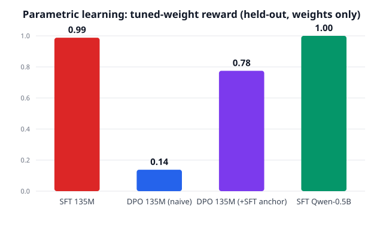

# Parametric path — making the *weights* learn from edits

The rest of this project learns **non-parametrically**: it stores inferred
preferences and injects them into context at inference time. That is real
continual learning, but it is not the headline trajectory.ai sells — *the model
itself getting smarter*. This folder closes that gap: it actually **fine-tunes
model weights** on the mined user-edit signal, then proves the tuned weights carry
the preference with **no rules in context and no refine loop**.

## Pipeline (the full stack)

```
trajectories ──▶ mine preference pairs ──▶ LoRA SFT on edited targets ──▶ tuned weights ──▶ eval
 (telemetry)      (chosen = user edit)      (train_sft.py, CPU)            (out/)         (weights only)
```

| File | Role |
|------|------|
| `data.py` | Build (prompt, chosen, rejected) pairs; `chosen` verified to satisfy the hidden rules, `rejected` to violate them (`text_rules.py`). Writes `train.jsonl` / `eval.jsonl`. |
| `train_sft.py` | LoRA supervised fine-tuning on the edited (`chosen`) targets with completion-only masking. Saves the adapter to `out/`. |
| `eval_weights.py` | Generate from **base vs base+LoRA** on held-out prompts — no in-context rules, no refine — and score with `text_rules.py`. |

This is the supervised half of "learning from user edits" (cf. *Principled
Fine-tuning of LLMs from User-Edits*, [arXiv:2601.19055](https://arxiv.org/abs/2601.19055));
the `(chosen, rejected)` pairs are also exactly the DPO format the non-parametric
miner exports, so the same signal feeds either path.

## Run it

```bash
cd ..                      # repo root has the venv
python -m venv .venv && ./.venv/bin/pip install torch --index-url https://download.pytorch.org/whl/cpu
./.venv/bin/pip install transformers peft datasets accelerate
cd parametric
../.venv/bin/python data.py          # generate the dataset
../.venv/bin/python train_sft.py     # LoRA fine-tune (CPU, a few minutes)
../.venv/bin/python eval_weights.py  # base vs tuned weights, held-out
```

Default base model: `HuggingFaceTB/SmolLM2-135M-Instruct` (tiny, CPU-trainable).
Override with `BASE_MODEL=...`. Small + CPU is deliberate — it proves the
*mechanism*; the same recipe scales to a real model on a GPU.

## Results

Held-out prompts, **weights only** — no rules in context, no refine loop.

| Method / model | base → tuned | email | slack |
|---|---|---|---|
| **SFT, SmolLM2-135M** | 0.19 → **0.99** | 1.00 | 0.97 |
| **SFT, Qwen2.5-0.5B** | 0.12 → **1.00** | 1.00 | 1.00 |
| DPO, SmolLM2-135M (naive) | 0.19 → **0.14** | 0.03 | 0.25 |
| DPO, SmolLM2-135M (+ SFT anchor) | 0.19 → **0.78** | 0.55 | 1.00 |



**SFT is the clean win** at both scales (0.99 / 1.00); Qwen-0.5B also writes
coherent prose, not just rule-satisfying tokens. **Naive DPO from a cold base
collapses** — the loss races to 0 by driving the *chosen* likelihood down too, and
generations degrade (0.19 → 0.14). Adding an **SFT/NLL anchor** to the DPO loss
(`SFT_COEF`, the "preference + supervision medley",
[arXiv:2601.19055](https://arxiv.org/abs/2601.19055)) prevents the collapse and
recovers it to **0.78**. DPO trails SFT here because the task is clean imitation,
which SFT is ideal for; DPO earns its keep on noisier, relative preferences.

The original single-arm chart: 

The base model writes generic/incoherent text and fails the user's idiosyncratic
rules; after LoRA SFT on the edited targets, the **weights alone** produce the
style from a plain prompt:

```
prompt: "Write an email to ask for a one-week deadline extension."
base  (0.25): "Subject: Request for Extended Deadline Extension - Please let me know ... [email where we can be found] ..."
tuned (1.00): "Hi Zoe, quick one — could we move the deadline to Friday? A few priorities shifted this week.

               Onwards,
               Giuseppe

               P.S. Happy to share a quick plan if useful."
```

This is the one thing the in-context/memory path could not show: the preference
is genuinely **in the parameters** (the tuned model carries it with nothing in
context). Full transcript in `../artifacts/parametric/results.md`. The prose is
clumsy — it's a 135M model on CPU — but rule satisfaction, the thing we measure,
transferred into the weights. Loss fell 4.11 → 0.097 over 6 epochs.

## Honest scope

- 135M params on CPU is a proof-of-mechanism, not a frontier post-train. A tiny
  model writes clumsier prose; we score *rule satisfaction*, not eloquence.
- SFT on synthetic edited targets isolates the signal. A production system tunes
  on real, noisy user edits (and would add DPO/reward terms — the `medley`).
- This learns *style/preference* into the weights. It does not claim new
  capabilities — that is the correct, narrow claim for continual learning here.
